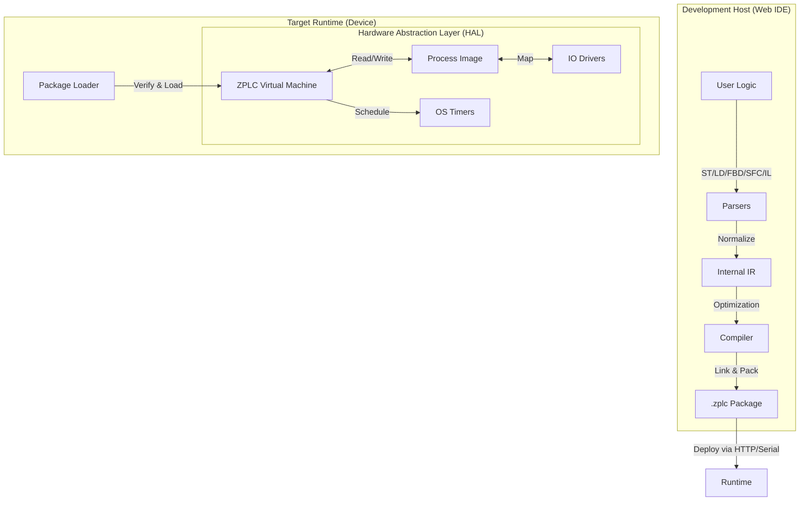

# ZPLC v1.4: Technical Specification & Architecture
**Version:** 1.4.7 (Stable)
**Target:** Open Source Industrial Automation
**Core Philosophy:** One Execution Core, Any Runtime.

## 1. Executive Summary

ZPLC is a portable, deterministic PLC runtime environment powered by Zephyr RTOS for embedded targets and native OS layers for desktop/server hosting. It is designed to bring modern software development practices—including CI/CD pipelines, compact binary deployment, and open interoperability via PLCopen XML—to the industrial floor.

**The "v1.4" Promise:** A fully functional runtime supporting all 5 IEC 61131-3 languages, capable of running real hardware I/O or in-browser simulations, with industrial-grade determinism. Features **multitask scheduling**, **NVS persistence**, **indirect memory access**, and a comprehensive **standard function library**. Now includes a **cross-platform desktop application** based on Electron.

---

## 2. Supported Hardware Targets

ZPLC v1.1 officially supports the following reference boards. CI/CD pipelines must ensure compilation succeeds for all defined targets.

| Board Name | SoC | Zephyr Board ID | Notes |
| :--- | :--- | :--- | :--- |
| **Arduino GIGA R1** | STM32H747XI (Cortex-M7/M4) | `arduino_giga_r1/stm32h747xx/m7` | Dual-core (targeting M7) |
| **ESP32-S3 DevKit-C** | ESP32-S3 (Xtensa LX7) | `esp32s3_devkitc` | WiFi/BLE capable |
| **STM32 Nucleo-H743ZI** | STM32H743ZI (Cortex-M7) | `nucleo_h743zi` | High-perf industrial Ref |
| **Raspberry Pi Pico** | RP2040 (Cortex-M0+) | `rpi_pico` | Low-cost, tested with NVS |
| **QEMU (Simulation)** | Cortex-M3 | `mps2/an385` | CI Default |

---

## 3. High-Level Architecture

The system follows a "Compiler-VM" architecture. The IDE acts as the compiler/linker, producing a hardware-agnostic bytecode package (`.zplc`) which is consumed by the ZPLC Core.

For embedded targets, **Zephyr RTOS is the primary citizen**. ZPLC is designed to be a **Zephyr Module** that can be effortlessly dropped into any board supported by Zephyr.

### 3.1 The Data Flow



---

## 3. The `.zplc` Binary Format

This is the contract between the IDE and the Runtime. It is a compact, serialized binary format.

**Structure Definition:**

| Section | Content | Purpose |
| --- | --- | --- |
| **Header** | `0x5A504C43` (Magic), Version, CRC32, Flags | Validity check and version compatibility. |
| **Meta** | Project Name, Build TS, Compiler Ver, Git Hash | Traceability. |
| **SymTable** | Variable IDs, Types, Scopes (Global/Local), Retentive Flags | Memory layout definition. |
| **TaskMap** | ID, Type (Cyclic/Event), Interval (ms), Priority, Entry Point | Tells the scheduler *when* to run code. |
| **Bytecode** | Linearized VM Instructions (SSA-based) | The executable logic. Unified format for all languages. |
| **IOMap** | Logical ID <-> Abstract Channel | Example: `Var_StartBtn` maps to `DIN_0`. |
| **Debug** | (Optional) Source Line Mapping, Symbol Names | Strippable for production, needed for IDE debugging. |
| **Signature** | (Optional) Crypto Signature | Security verification (v1 Roadmap). |

---

## 4. The ZPLC Core (Runtime)

The Core is ANSI C99, strictly standard-compliant, designed to be compiled as a library (`libzplc_core`).

### 4.1 The Virtual Machine (VM)

* **Instruction Set:** Stack-based, optimized for boolean logic and arithmetic. **75 opcodes** total (including indirect memory access, STRING operations, and PICK for deep stack access).
* **Unified IR:** Structured Text (ST) and Ladder (LD) ultimately compile down to the same JUMP / LOAD / STORE / AND / OR opcodes.
* **Memory Model:**
    * **Process Image:** A contiguous block of memory for I/O snapshots.
    * **Retentive Memory:** A dedicated block backed by HAL storage (NVS / Flash).
    * **Work Memory:** Stack/Heap for temporary calculation (strictly bounded, per-task isolated).
* **STRING Support:** IEC 61131-3 compliant STRING type with bounds-checked operations (STRLEN, STRCPY, STRCAT, STRCMP, STRCLR).

### 4.2 The Scheduler

* **Execution Discipline:** Priority-based preemptive scheduling with configurable task intervals.
* **Task Types:** CYCLIC (periodic) and EVENT (future).
* **Cycle:**
    1. **Input Latch:** Call `HAL_IO_Read()` to update Process Image (IPI).
    2. **Logic Execution:** Run tasks sorted by priority, each with isolated work memory.
    3. **Output Latch:** Call `HAL_IO_Write()` to flush Process Image (OPI).
    4. **Housekeeping:** Handle Comms/Debug messages (time budgeted).

---

## 5. Hardware Abstraction Layer (HAL)

The Core never calls hardware directly. It calls the HAL.

### 5.1 Zephyr Integration Strategy (Primary)

ZPLC integrates with Zephyr as a **Module**.
- **DeviceTree Bindings:** I/O channels are defined in `.dts` overlay files.
- **Kconfig:** All runtime limits (stack size, memory pool) are configurable via Kconfig.
- **Shell:** ZPLC provides a shell module (`zplc load`, `zplc start`, `zplc persist`) for management.

| Function | Zephyr Implementation | Desktop (Linux/macOS) | WASM Implementation |
| --- | --- | --- | --- |
| `zplc_hal_tick()` | `k_uptime_get()` | `clock_gettime` | JS `performance.now()` |
| `zplc_hal_sleep()` | `k_sleep()` | `usleep()` | `Atomics.wait` |
| `zplc_hal_gpio_read()` | `gpio_pin_get_dt()` | Simulated | JS Object |
| `zplc_hal_gpio_write()` | `gpio_pin_set_dt()` | Simulated | JS Object |
| `zplc_hal_persist_save()` | NVS (`nvs_write`) | File | `localStorage` |
| `zplc_hal_persist_load()` | NVS (`nvs_read`) | File | `localStorage` |
| `zplc_hal_persist_delete()` | NVS (`nvs_delete`) | File delete | `localStorage.removeItem` |

---

## 6. Development Environment (Web IDE)

* **Stack:** TypeScript, React (Frontend), Bun (Runtime/Bundler).
* **Project Model:** JSON-based project files (`zplc.json`) with task definitions.
* **Editors:**
    * **ST:** Monaco Editor with syntax highlighting.
    * **Visual (LD/FBD/SFC):** React Flow-based interactive editors.
* **Simulation:**
    * The IDE includes a compiled WASM version of `zplc_core`.
    * "Run Simulation" launches the VM directly in the browser tab.

---

## 7. Connectivity & Security

### 7.1 Communication (Current State)

* **Debug Protocol**: Binary protocol over Serial (implemented) for:
  - Program upload/download
  - Variable watch (read process image)
  - Variable force (write process image)
  - Breakpoint control
  - Step execution

* **Planned Protocols** (see Roadmap Phase 1.5+):
  - Modbus TCP/RTU
  - MQTT v3.1.1/v5.0
  - Cloud integrations (AWS, Azure)
  - OPC UA

### 7.2 Security Strategy (Planned)

* **Authentication:** Token-based auth for network protocols.
* **Role Based Access Control (RBAC):**
    * *Viewer:* Read-only variable monitoring.
    * *Operator:* Read/Write runtime parameters.
    * *Engineer:* Full program upload/download capability.
* **Crypto:** MbedTLS (Zephyr) for TLS transport on network protocols.

---

## 8. Development Roadmap

**Phase 1.0 (Completed)**
* **ISA & VM**: 62 opcodes, 32-bit stack, IEEE 754 float support.
* **Visual IDE**: Reactive editors for LD, FBD, and SFC.
* **TS Compiler**: Structured Text to Bytecode transpilation.
* **WASM Simulation**: In-browser execution of the C core.
* **Serial Loader**: Real-time program injection into Zephyr targets.

**Phase 1.1 (Completed)**
* ✅ **Multitask Scheduler**: Priority-based concurrent task execution with configurable intervals.
* ✅ **Program Persistence**: NVS-backed storage - programs survive power cycles and auto-restore on boot.
* ✅ **Shell Commands**: `zplc persist info/clear` for managing stored programs.
* ✅ **GET_TICKS Opcode**: System tick counter for timing operations.

**Phase 1.2 (Completed)**
* ✅ **Indirect Memory Opcodes**: LOADI8, LOADI16, LOADI32, STOREI8, STOREI16, STOREI32 for computed address access.
* ✅ **STRING Type**: IEC 61131-3 compliant STRING with bounds-checked operations:
  - VM opcodes: STRLEN, STRCPY, STRCAT, STRCMP, STRCLR
  - Compiler: String literal pooling, operator overloading (`=`, `<>` use STRCMP)
  - 14 string functions: LEN, CONCAT, COPY, CLEAR, LEFT, RIGHT, MID, FIND, INSERT, DELETE, REPLACE, STRCMP, EQ_STRING, NE_STRING
* ✅ **Standard Library**: 45 functions + 22 function blocks covering:
  - Math: ABS, SQRT, EXPT, SIN, COS, TAN, ASIN, ACOS, ATAN, ATAN2, LN, LOG, EXP
  - Selection: MAX, MIN, LIMIT, SEL, MUX
  - Bitwise: ROL, ROR, SHL, SHR, AND/OR/XOR/NOT for WORD and DWORD
  - Type Conversion: INT_TO_REAL, REAL_TO_INT, TRUNC, ROUND, NORM_X, SCALE_X
  - Timers: TON, TOF, TP, BLINK, PWM, PULSE
  - Counters: CTU, CTD, CTUD
  - Edge Detection: R_TRIG, F_TRIG
  - Bistables: RS, SR
  - Control: PID_Compact, HYSTERESIS, DEADBAND, LAG_FILTER, RAMP_REAL, INTEGRAL, DERIVATIVE
  - Data Structures: FIFO, LIFO (using indirect memory access)
  - System: UPTIME, CYCLE_TIME, WATCHDOG_RESET

**Phase 1.3 (Completed)**
* ✅ **Retentive Variables**: NVS-backed RETAIN memory region for critical process data.
* ✅ **Debug Protocol**: Binary serial protocol for variable watch, force, and breakpoints.

**Phase 1.4 (Completed)**
* ✅ **Cross-Platform Desktop App**: Electron-based IDE for Windows, macOS, and Linux.
* ✅ **Native Serial Support**: Access to all COM/TTY ports via Node-Serial.
* ✅ **Integrated Simulator**: Improved WebAssembly simulation engine.
* ✅ **Project Management**: Persistent project storage and file system integration.

---

**Phase 1.4.1 - Networking Foundation**

Pre-requisites for industrial communication protocols. Extends the HAL and runtime for network operations.

* **Networking HAL Extension**:
  - `zplc_hal_net_init()`: Initialize network stack
  - `zplc_hal_net_get_ip()`: Get current IP address
  - `zplc_hal_socket_*()`: TCP/UDP socket operations (already defined, needs Zephyr implementation)
  - `zplc_hal_dns_resolve()`: Hostname resolution
  - Zephyr implementation using native networking stack

* **Thread-Safe Process Image**:
  - Mutex protection for Process Image access
  - Protocol threads can safely read/write variables
  - Lock-free read path for time-critical operations
  - `zplc_pi_lock()` / `zplc_pi_unlock()` API

* **Configuration System**:
  - JSON-based device configuration stored in NVS
  - Runtime-accessible via shell commands
  - Categories: Network, Modbus, MQTT, Cloud, Security
  - `zplc_config_get()` / `zplc_config_set()` API

* **Variable Tagging System**:
  - Compiler support for variable attributes: `{publish}`, `{subscribe}`, `{modbus:40001}`
  - Tag table stored in `.zplc` binary (new segment type)
  - Runtime queries tags for protocol bindings

* **Time Synchronization (SNTP)**:
  - Uses Zephyr's native `CONFIG_NET_CONFIG_CLOCK_SNTP`
  - Required for TLS certificate validation
  - Required for Sparkplug B timestamps
  - Fallback to compile-time if no network

---

**Phase 1.5 - Industrial Connectivity Core**

This release adds essential industrial communication protocols using Zephyr's native networking stack.

* **Modbus RTU** (Server + Client):
  - Uses Zephyr's native `CONFIG_MODBUS` subsystem
  - RS-485 half-duplex with automatic direction control
  - Configurable slave ID, baud rate, parity
  - Function codes: FC01-FC06, FC15-FC16 (coils, discrete inputs, holding/input registers)
  - Variable mapping via DeviceTree or runtime configuration

* **Modbus TCP** (Server + Client):
  - TCP listener on configurable port (default 502)
  - Multiple simultaneous client connections
  - Same function code support as RTU
  - Gateway mode: Modbus TCP ↔ RTU bridging

* **MQTT Client** (v3.1.1 / v5.0):
  - Uses Zephyr's native `CONFIG_MQTT_LIB`
  - TLS 1.2/1.3 support via MbedTLS
  - QoS 0, 1, 2 support
  - Publish-on-change for tagged variables
  - Last Will and Testament (LWT) for device status
  - MQTT v5.0 features: User Properties, Reason Codes, Session Expiry

* **AWS IoT Core**:
  - Uses official `aws-iot-device-embedded-c-sdk-for-zephyr`
  - Device Shadows: bidirectional state synchronization
  - Jobs: remote command execution
  - Fleet Provisioning: zero-touch device onboarding
  - X.509 certificate authentication

* **Firmware Libraries**:
  ```
  firmware/lib/
  ├── zplc_modbus/           # Wrapper over Zephyr Modbus
  │   ├── include/zplc_modbus.h
  │   └── src/
  │       ├── zplc_modbus_rtu.c
  │       └── zplc_modbus_tcp.c
  │
  ├── zplc_mqtt/             # Wrapper over Zephyr MQTT
  │   ├── include/zplc_mqtt.h
  │   └── src/zplc_mqtt_client.c
  │
  └── zplc_cloud/            # Cloud provider integrations
      ├── include/zplc_aws_iot.h
      └── src/zplc_aws_iot.c
  ```

* **IDE Integration**:
  - Communication configuration panel in Project Settings
  - Variable tagging for publish/subscribe
  - Connection status monitoring
  - Broker/server configuration with test connection

---

**Phase 1.5.1 - Cloud & IIoT Expansion**

This release adds cloud platform integrations and industrial IoT protocols.

* **Azure IoT Hub**:
  - Uses Azure Embedded C SDK with Zephyr MQTT transport
  - Device Twins: desired/reported property synchronization
  - Direct Methods: remote procedure calls
  - Cloud-to-Device (C2D) messaging
  - Device Provisioning Service (DPS) support
  - SAS token or X.509 certificate authentication

* **MQTT Sparkplug B**:
  - Eclipse Tahu-compatible implementation
  - Protobuf encoding via nanopb (no dynamic allocation)
  - Birth/Death certificates for device lifecycle
  - Metric types: INT8-INT64, UINT8-UINT64, FLOAT, DOUBLE, BOOLEAN, STRING, DATETIME
  - Template definitions for complex data structures
  - Edge Node and Device hierarchy support
  - Compatible with: Ignition, HiveMQ, Cirrus Link

* **Firmware Libraries** (additions):
  ```
  firmware/lib/
  ├── zplc_mqtt/
  │   └── src/
  │       └── zplc_mqtt_sparkplug.c   # Sparkplug B encoding/decoding
  │
  └── zplc_cloud/
      ├── include/zplc_azure_iot.h
      └── src/zplc_azure_iot.c
  ```

* **Protocol Configuration Schema**:
  ```typescript
  interface CloudConfig {
    provider: 'aws' | 'azure' | 'sparkplug' | 'generic';
    endpoint: string;
    clientId: string;
    auth: {
      type: 'certificate' | 'sas' | 'username';
      certPath?: string;
      keyPath?: string;
      sasToken?: string;
    };
    publishInterval: number;  // ms, 0 = on-change only
    variables: VariableBinding[];
  }
  ```

---

**Phase 1.5.2 - Enterprise Protocols**

This release adds enterprise-grade industrial protocols for large-scale deployments.

* **OPC UA Server** (IEC 62541):
  - Based on open62541 library
  - Exposes PLC variables as OPC UA nodes
  - Information model: IEC 61131-3 namespace
  - Security: Sign, Sign&Encrypt with X.509 certificates
  - Discovery: LDS (Local Discovery Server) registration
  - Subscriptions with configurable sampling intervals
  - **Note**: Requires targets with ≥256KB RAM (STM32H7, ESP32-S3)

* **EtherNet/IP Adapter** (CIP):
  - Based on OpENer stack (adapted for Zephyr)
  - Adapter (slave) profile for integration with:
    - Allen-Bradley/Rockwell PLCs
    - Studio 5000 / RSLogix configuration
  - Assembly objects for I/O data exchange
  - Explicit messaging for configuration
  - **Note**: Optional module, significant Flash/RAM footprint

* **PROFINET Device** (Future consideration):
  - Based on p-net stack
  - Device (slave) profile for Siemens ecosystem
  - **Note**: Marked as "experimental" - certification required for commercial use

* **Protocol Support Matrix**:
  | Protocol | Role | Transport | Zephyr Native | RAM Usage | Status |
  |----------|------|-----------|---------------|-----------|--------|
  | Modbus RTU | Server/Client | Serial | ✅ Yes | ~2KB | v1.5 |
  | Modbus TCP | Server/Client | TCP/IP | ✅ Yes | ~4KB | v1.5 |
  | MQTT 3.1.1/5.0 | Client | TCP/TLS | ✅ Yes | ~8KB | v1.5 |
  | AWS IoT Core | Client | MQTT/TLS | ✅ SDK | ~12KB | v1.5 |
  | Azure IoT Hub | Client | MQTT/TLS | 🟡 Wrapper | ~15KB | v1.5.1 |
  | Sparkplug B | Client | MQTT | 🟡 Custom | ~20KB | v1.5.1 |
  | OPC UA | Server | TCP/TLS | ❌ open62541 | ~100KB | v1.5.2 |
  | EtherNet/IP | Adapter | TCP/UDP | ❌ OpENer | ~80KB | v1.5.2 |

---

**Phase 1.6 - Runtime Hardening**

This release focuses on production-readiness: diagnostics, reliability, and operator tooling.

* **Structured Logging System**:
  - Log levels: ERROR, WARN, INFO, DEBUG, TRACE
  - Ring buffer in RAM for recent logs (configurable size)
  - Optional persist to NVS for post-mortem analysis
  - Zephyr LOG integration on embedded, console on POSIX/WASM
  - Remote log streaming via debug protocol
  - `zplc_log(level, fmt, ...)` API

* **Diagnostic Buffer**:
  - Circular buffer of last N errors/events (default 64)
  - Each entry: timestamp, error code, source location, context data
  - Queryable via shell: `zplc diag list`, `zplc diag clear`
  - Exposed via protocols (Modbus diagnostic registers, MQTT status topic)

* **Hardware Watchdog Integration**:
  - Uses Zephyr's native `CONFIG_WDT` subsystem
  - Automatic feed during healthy scan cycles
  - Configurable timeout (default 2x max task interval)
  - Triggers system reset on VM hang or infinite loop
  - Post-reset: logs watchdog event, optional safe-mode boot

* **Status LED Control**:
  - HAL extension: `zplc_hal_led_set(led_id, state)`
  - Standard patterns:
    - Solid green: Running normally
    - Blinking green: Running, no program loaded
    - Solid yellow: Stopped / Configuration mode
    - Blinking red: Error / Fault
    - Fast blink: Communication activity
  - Configurable via DeviceTree or Kconfig

* **Factory Reset Mechanism**:
  - Triggered via: shell command, button hold (configurable GPIO), or debug protocol
  - Clears: stored program, configuration, retentive memory
  - Preserves: firmware, calibration data (if separate partition)
  - Optional: reset to "golden" default program

* **System Information API**:
  - `zplc_sys_get_info()`: firmware version, build date, uptime, free memory
  - `zplc_sys_get_health()`: CPU load, stack usage, memory fragmentation
  - Exposed via shell and protocols

* **Firmware Libraries**:
  ```
  firmware/lib/
  ├── zplc_diag/             # Diagnostics subsystem
  │   ├── include/zplc_diag.h
  │   └── src/
  │       ├── zplc_log.c
  │       └── zplc_diag_buffer.c
  │
  └── zplc_sys/              # System utilities
      ├── include/zplc_sys.h
      └── src/
          ├── zplc_watchdog.c
          ├── zplc_led.c
          └── zplc_factory_reset.c
  ```

---

**Phase 1.7 - Security & Authentication**

This release adds security features required for production deployments.

* **Bytecode Signing**:
  - Ed25519 signature in `.zplc` binary (Signature segment)
  - Public key stored in device (NVS or flash partition)
  - Verification before program load
  - Reject unsigned programs (configurable policy)

* **Debug Protocol Authentication**:
  - Challenge-response authentication
  - Password hash stored in NVS (bcrypt or Argon2)
  - Session tokens with configurable expiry
  - Rate limiting on failed attempts

* **TLS Transport**:
  - MbedTLS integration for Zephyr targets
  - Certificate storage in NVS or dedicated flash partition
  - Client and server certificate support
  - Used by: MQTT, AWS IoT, Azure IoT, debug protocol (optional)

* **Secure Key Storage**:
  - HAL extension for hardware security modules (HSM)
  - STM32: SBSFU secure storage
  - ESP32: eFuse key storage
  - Fallback: encrypted NVS with device-unique key

---

**Phase 2.0 - HMI System**

This major release introduces a fully integrated HMI system.

* **Graphical HMI Designer**:
  - Drag-and-drop HMI editor integrated in the IDE (React Flow based)
  - Industrial widget library: LED, Gauge, Slider, Button, Switch, NumericDisplay, ProgressBar, Charts
  - Variable binding system: bidirectional data flow between PLC variables and HMI widgets
  - Multi-screen support with navigation
  - Code generation: HMI designs compile to native LVGL C code
  - Reference target: STM32F746G-DISCO (480x272 TFT + capacitive touch)

* **LVGL Integration**:
  - LVGL as Zephyr module for embedded targets
  - `lv_subject_t` observer pattern for reactive variable binding
  - HMI Bridge library (`zplc_hmi_bridge`) synchronizes VM Process Image with LVGL subjects
  - Optimized rendering with DMA2D acceleration on STM32

* **Full Firmware Build Pipeline**:
  - IDE manages complete Zephyr SDK (~2-3 GB, auto-download on first use)
  - One-click "Build & Flash": compiles PLC bytecode + HMI C code + runtime into single firmware
  - Uses `west build` and `west flash` under the hood
  - Generated artifacts:
    - `program_data.c`: PLC bytecode as const array
    - `ui_generated.c/h`: LVGL widget creation code
    - `hmi_bindings.c`: Variable-to-subject mapping table

* **Supported HMI Targets**:
  | Board | Display | Touch | Status |
  |-------|---------|-------|--------|
  | STM32F746G-DISCO | 4.3" 480x272 | FT5336 (I2C) | Primary reference |
  | STM32F469I-DISCO | 4" 800x480 | FT6206 (I2C) | Planned |
  | ESP32-S3 + ILI9341 | 2.8" 320x240 | XPT2046 (SPI) | Planned |
  | Custom (via Kconfig) | User-defined | User-defined | Supported |

---

**Phase 2.1 - OTA Updates & Wireless**

This release adds over-the-air update capabilities across multiple transport layers.

* **OTA Update System**:
  - Dual-bank firmware architecture (A/B partitioning) for fail-safe updates
  - Atomic updates: new firmware validated before committing
  - Automatic rollback on boot failure (watchdog-triggered)
  - Update packages:
    - `.zplc` files: PLC program only (hot-reload without reflashing)
    - `.zplc-fw` files: Full firmware (runtime + HMI + PLC program)
  - Cryptographic verification: Ed25519 signatures for all update packages
  - Version management and downgrade protection

* **Update Transports**:
  | Transport | Use Case | Implementation |
  |-----------|----------|----------------|
  | **MicroSD Card** | Field updates, air-gapped systems | FAT32 filesystem, `/ZPLC/update/` folder |
  | **Ethernet** | Factory floor, SCADA integration | HTTP/HTTPS server, CoAP for constrained networks |
  | **WiFi** | Remote access, IoT deployments | Same as Ethernet (ESP32, STM32 + WiFi module) |
  | **Bluetooth LE** | Mobile commissioning, proximity updates | Nordic UART Service (NUS) or custom GATT profile |

* **MicroSD Update Flow**:
  ```
  1. User copies `firmware.zplc-fw` to SD card `/ZPLC/update/`
  2. Device detects file on boot (or via shell command `zplc update check`)
  3. Validates signature and version
  4. Copies to inactive flash bank
  5. Sets boot flag and reboots
  6. Bootloader verifies and switches active bank
  7. On success: deletes update file, clears rollback flag
  8. On failure: rolls back to previous bank
  ```

* **Network Update Flow**:
  ```
  1. Device polls update server (configurable interval) or receives push notification
  2. Downloads manifest.json with available versions
  3. User confirms update via HMI or remote command
  4. Streams firmware chunks with resume support
  5. Same validation and A/B swap as SD card flow
  ```

* **Bluetooth Commissioning App**:
  - Mobile app (React Native) for iOS/Android
  - Scan and connect to ZPLC devices via BLE
  - Configure WiFi credentials, network settings
  - Push small program updates (<64KB) directly
  - Real-time variable monitoring and forcing

* **Security Considerations**:
  - All updates require valid Ed25519 signature from trusted key
  - TLS 1.3 for all network transfers
  - Optional: Hardware security module (HSM) support for key storage
  - Audit log of all update attempts stored in NVS

* **Bootloader Enhancements**:
  - MCUboot integration for secure boot chain
  - Hardware root of trust (STM32 SBSFU or ESP32 Secure Boot v2)
  - Encrypted firmware images (AES-256-GCM) for IP protection

---

**Phase 2.2 - Advanced Features**
* **Redundancy**: Hot-standby support for high-availability systems.
* **Recipe Management**: Parameter sets loadable from SD/network.
* **Data Logging**: High-speed acquisition to SD card with CSV/binary export.
* **Alarm Management**: IEC 62682 compliant alarm system with acknowledgment and history.

---

# Quality Assurance & Verification Plan

## 1. The Infrastructure: "Test First" Environment

* **CI/CD Pipeline (GitHub Actions / GitLab CI):**
    * **Static Analysis:** Run `clang-tidy` (C) and `eslint` (TS) on every commit. Enforce coding standards strictly.
    * **Unit Tests:** Run on host (Linux/Windows) for logic verification.
    * **Simulation Tests:** Run the ZPLC Runtime on a desktop target (POSIX/Win32) to verify behavior without hardware.

* **Hardware-in-the-Loop (HIL) - *The "Real" Test*:**
    * **Setup:** One Zephyr board (e.g., ESP32 or STM32) connected via USB to a runner.
    * **Tooling:** Use **Zephyr’s `twister`** script.
    * **Rule:** Code is not "done" until it runs on the physical board in the pipeline.

## 2. Phase-by-Phase Verification

### Phase 0: Core Skeleton & Build System
* **Cross-Compilation Check:** CI builds for Linux, Windows, Zephyr-STM32, Zephyr-ESP32, and WASM.
* **HAL Contract Test:** Verify `zplc_hal_sleep(100)` waits approximately 100ms.

### Phase 1: ST Compiler & VM Instruction Set
* **Opcode Unit Tests:** Hundreds of tiny C tests checking every VM instruction.
* **Compiler "Golden Files":** Compare generated `.zplc` binary against known "perfect" binary.
* **IEC Compliance Suite (Math):** Implement IEC 61131-3 math examples and assert output.

### Phase 2: Visual Languages
* **Topological Sort Test:** Ensure compiler sorts execution order correctly.
* **Round-Trip Test:** `Import XML` -> `Internal Model` -> `Export XML` parity.

### Phase 3: Runtime Maturity
* **Jitter Test:** Measure variance on GPIO toggle.
* **Power-Loss Test:** Verify retentive memory restoration.
* **Watchdog Test:** Verify detection of infinite loops.

### Phase 4: Connectivity & Security
* **Fuzzing:** Blast protocol ports with garbage data.
* **Network Storm:** Flood network while controlling IO.
* **Authentication Check:** Ensure unauthorized uploads fail.

### Phase 4.1: Networking Foundation (v1.4.1)
* **Socket Test:** TCP connect/send/receive on Zephyr target.
* **SNTP Sync:** Verify time synchronization within 1 second accuracy.
* **Config Persistence:** Save/load configuration survives reboot.
* **Process Image Lock:** Concurrent access from multiple threads is safe.

### Phase 5: Industrial Connectivity (v1.5)
* **Modbus RTU Loopback:** RS-485 master ↔ slave communication test.
* **Modbus TCP Stress:** 10 simultaneous clients reading/writing registers.
* **MQTT Publish/Subscribe:** Verify message delivery with all QoS levels.
* **MQTT Reconnect:** Simulate broker disconnect, verify auto-reconnect and LWT.
* **AWS Shadow Sync:** Update desired state from cloud, confirm reported state matches.
* **AWS Jobs Execution:** Send job document, verify execution and completion status.
* **TLS Handshake:** Verify certificate validation rejects invalid certs.
* **Protocol Coexistence:** Run Modbus TCP + MQTT + AWS simultaneously, verify no interference.

### Phase 5.1: Cloud & IIoT (v1.5.1)
* **Azure Twin Sync:** Update desired properties, verify reported properties update.
* **Azure Direct Method:** Invoke method from cloud, verify response.
* **Sparkplug Birth/Death:** Verify NBIRTH/NDEATH/DBIRTH/DDEATH message flow.
* **Sparkplug Metric Types:** Test all metric types encode/decode correctly.
* **Sparkplug Rebirth:** Simulate Primary Application request, verify REBIRTH response.

### Phase 5.2: Enterprise Protocols (v1.5.2)
* **OPC UA Browse:** Client browses server address space, finds all variables.
* **OPC UA Subscription:** Subscribe to variables, verify notifications on change.
* **OPC UA Security:** Test Sign and SignAndEncrypt security modes.
* **EtherNet/IP Implicit:** Verify I/O data exchange with Rockwell PLC.
* **EtherNet/IP Explicit:** Test CIP messaging for configuration.

### Phase 6: Runtime Hardening (v1.6)
* **Log Buffer Test:** Fill log buffer, verify oldest entries evicted correctly.
* **Diagnostic Query:** Trigger errors, query via shell, verify entries.
* **Watchdog Trigger:** Create infinite loop, verify watchdog reset occurs.
* **LED State Test:** Verify LED patterns match runtime state transitions.
* **Factory Reset Test:** Reset device, verify all user data cleared.

### Phase 6.1: Security (v1.7)
* **Signature Verification:** Reject programs with invalid/missing signature.
* **Auth Brute Force:** Rate limiting prevents password guessing.
* **TLS Handshake:** Verify certificate chain validation.
* **Key Storage:** Secrets not readable via debug protocol.

### Phase 7: HMI System (v2.0)
* **Widget Rendering Test:** Verify all widget types render correctly on reference display.
* **Binding Sync Test:** Confirm VM variable changes reflect in HMI within 50ms.
* **Touch Input Test:** Validate touch coordinates and gesture recognition.
* **Memory Budget Test:** Ensure HMI + VM fit within target RAM (340KB for STM32F746).
* **Build Pipeline Test:** CI builds complete firmware for all supported boards.
* **Code Generation Regression:** Compare generated C code against golden files.

### Phase 8: OTA Updates (v2.1)
* **A/B Bank Switch Test:** Verify successful swap and rollback on corruption.
* **Signature Verification Test:** Reject tampered or unsigned packages.
* **Partial Download Resume:** Simulate network interruption and verify resume works.
* **SD Card Detection Test:** Confirm update detection on boot and hot-insert.
* **Rollback Stress Test:** Force failures at various stages, confirm recovery.
* **BLE Update Test:** Complete firmware transfer via Bluetooth LE.
