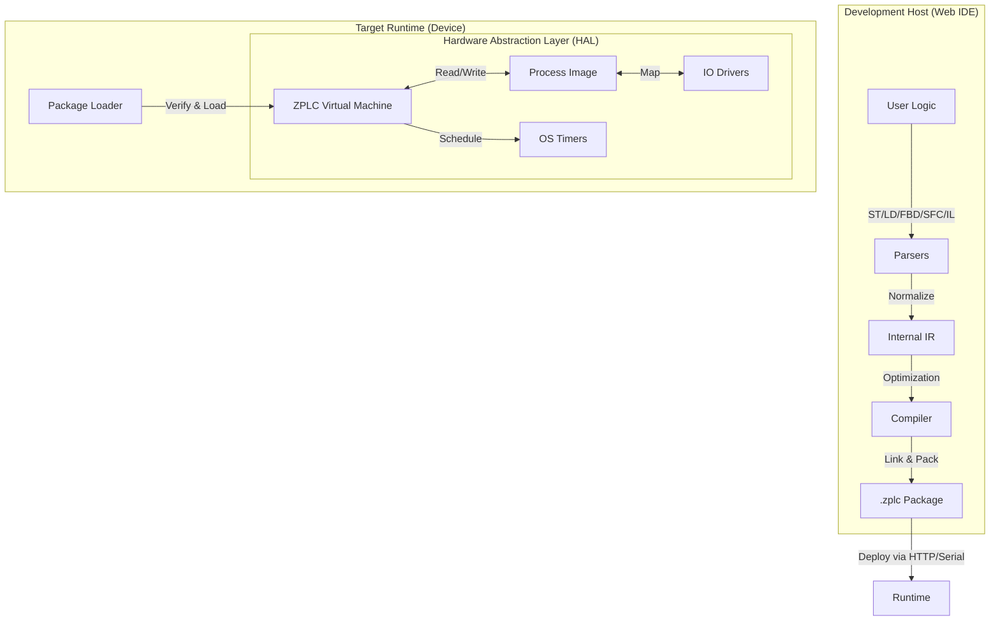

# ZPLC v1.4: Technical Specification & Architecture
**Version:** 1.4.0 (Stable)
**Target:** Open Source Industrial Automation
**Core Philosophy:** One Execution Core, Any Runtime.

## 1. Executive Summary

ZPLC is a portable, deterministic PLC runtime environment powered by Zephyr RTOS for embedded targets and native OS layers for desktop/server hosting. It is designed to bring modern software development practices—including CI/CD pipelines, compact binary deployment, and open interoperability via PLCopen XML—to the industrial floor.

**The "v1.4" Promise:** A fully functional runtime supporting all 5 IEC 61131-3 languages, capable of running real hardware I/O or in-browser simulations, with industrial-grade determinism. Features **multitask scheduling**, **NVS persistence**, **indirect memory access**, **comprehensive standard function library**, and a **Cross-Platform Desktop IDE** (Electron).

---

## 2. Supported Hardware Targets

ZPLC v1.1 officially supports the following reference boards. CI/CD pipelines must ensure compilation succeeds for all defined targets.

| Board Name | SoC | Zephyr Board ID | Notes |
| :--- | :--- | :--- | :--- |
| **Arduino GIGA R1** | STM32H747XI (Cortex-M7/M4) | `arduino_giga_r1/stm32h747xx/m7` | Dual-core (targeting M7) |
| **ESP32-S3 DevKit-C** | ESP32-S3 (Xtensa LX7) | `esp32s3_devkitc` | WiFi/BLE capable |
| **STM32 Nucleo-H743ZI** | STM32H743ZI (Cortex-M7) | `nucleo_h743zi` | High-perf industrial Ref |
| **Raspberry Pi Pico** | RP2040 (Cortex-M0+) | `rpi_pico` | Low-cost, tested with NVS |
| **QEMU (Simulation)** | Cortex-M3 | `mps2/an385` | CI Default |

---

## 3. High-Level Architecture

The system follows a "Compiler-VM" architecture. The IDE acts as the compiler/linker, producing a hardware-agnostic bytecode package (`.zplc`) which is consumed by the ZPLC Core.

For embedded targets, **Zephyr RTOS is the primary citizen**. ZPLC is designed to be a **Zephyr Module** that can be effortlessly dropped into any board supported by Zephyr.

### 3.1 The Data Flow

---

## 3. The `.zplc` Binary Format

This is the contract between the IDE and the Runtime. It is a compact, serialized binary format.

**Structure Definition:**

| Section | Content | Purpose |
| --- | --- | --- |
| **Header** | `0x5A504C43` (Magic), Version, CRC32, Flags | Validity check and version compatibility. |
| **Meta** | Project Name, Build TS, Compiler Ver, Git Hash | Traceability. |
| **SymTable** | Variable IDs, Types, Scopes (Global/Local), Retentive Flags | Memory layout definition. |
| **TaskMap** | ID, Type (Cyclic/Event), Interval (ms), Priority, Entry Point | Tells the scheduler *when* to run code. |
| **Bytecode** | Linearized VM Instructions (SSA-based) | The executable logic. Unified format for all languages. |
| **IOMap** | Logical ID <-> Abstract Channel | Example: `Var_StartBtn` maps to `DIN_0`. |
| **Debug** | (Optional) Source Line Mapping, Symbol Names | Strippable for production, needed for IDE debugging. |
| **Signature** | (Optional) Crypto Signature | Security verification (v1 Roadmap). |

---

## 4. The ZPLC Core (Runtime)

The Core is ANSI C99, strictly standard-compliant, designed to be compiled as a library (`libzplc_core`).

### 4.1 The Virtual Machine (VM)

* **Instruction Set:** Stack-based, optimized for boolean logic and arithmetic. **75 opcodes** total (including indirect memory access, STRING operations, and PICK for deep stack access).
* **Unified IR:** Structured Text (ST) and Ladder (LD) ultimately compile down to the same JUMP / LOAD / STORE / AND / OR opcodes.
* **Memory Model:**
    * **Process Image:** A contiguous block of memory for I/O snapshots.
    * **Retentive Memory:** A dedicated block backed by HAL storage (NVS / Flash).
    * **Work Memory:** Stack/Heap for temporary calculation (strictly bounded, per-task isolated).
* **STRING Support:** IEC 61131-3 compliant STRING type with bounds-checked operations (STRLEN, STRCPY, STRCAT, STRCMP, STRCLR).

### 4.2 The Scheduler

* **Execution Discipline:** Priority-based preemptive scheduling with configurable task intervals.
* **Task Types:** CYCLIC (periodic) and EVENT (future).
* **Cycle:**
    1. **Input Latch:** Call `HAL_IO_Read()` to update Process Image (IPI).
    2. **Logic Execution:** Run tasks sorted by priority, each with isolated work memory.
    3. **Output Latch:** Call `HAL_IO_Write()` to flush Process Image (OPI).
    4. **Housekeeping:** Handle Comms/Debug messages (time budgeted).

---

## 5. Hardware Abstraction Layer (HAL)

The Core never calls hardware directly. It calls the HAL.

### 5.1 Zephyr Integration Strategy (Primary)

ZPLC integrates with Zephyr as a **Module**.
- **DeviceTree Bindings:** I/O channels are defined in `.dts` overlay files.
- **Kconfig:** All runtime limits (stack size, memory pool) are configurable via Kconfig.
- **Shell:** ZPLC provides a shell module (`zplc load`, `zplc start`, `zplc persist`) for management.

| Function | Zephyr Implementation | Desktop (Linux/macOS) | WASM Implementation |
| --- | --- | --- | --- |
| `zplc_hal_tick()` | `k_uptime_get()` | `clock_gettime` | JS `performance.now()` |
| `zplc_hal_sleep()` | `k_sleep()` | `usleep()` | `Atomics.wait` |
| `zplc_hal_gpio_read()` | `gpio_pin_get_dt()` | Simulated | JS Object |
| `zplc_hal_gpio_write()` | `gpio_pin_set_dt()` | Simulated | JS Object |
| `zplc_hal_persist_save()` | NVS (`nvs_write`) | File | `localStorage` |
| `zplc_hal_persist_load()` | NVS (`nvs_read`) | File | `localStorage` |
| `zplc_hal_persist_delete()` | NVS (`nvs_delete`) | File delete | `localStorage.removeItem` |

---

## 6. Development Environment (Web IDE)

* **Stack:** TypeScript, React (Frontend), Bun (Runtime/Bundler).
* **Project Model:** JSON-based project files (`zplc.json`) with task definitions.
* **Editors:**
    * **ST:** Monaco Editor with syntax highlighting.
    * **Visual (LD/FBD/SFC):** React Flow-based interactive editors.
* **Simulation:**
    * The IDE includes a compiled WASM version of `zplc_core`.
    * "Run Simulation" launches the VM directly in the browser tab.

---

## 7. Connectivity & Security (v1.3 Scope)

### 7.1 Communication

* **Modbus TCP Server:** Standard implementation. Map internal vars to Holding Registers/Coils via config.
* **MQTT Client:** "Publish on Change" for tagged variables.
* **Debug Protocol:** proprietary WebSocket protocol for Watch/Force/Upload.

### 7.2 Security Strategy

* **Authentication:** SRP or JWT based auth for the Debug Protocol.
* **Role Based Access Control (RBAC):**
    * *Viewer:* Read-only Watch.
    * *Operator:* Read/Write specific runtime parameters.
    * *Engineer:* Full Upload/Download/Force capability.
* **Crypto:** Use MbedTLS (on Zephyr) or OpenSSL (on Host) for TLS transport.

---

## 8. Development Roadmap

**Phase 1.0 (Completed)**
* **ISA & VM**: 62 opcodes, 32-bit stack, IEEE 754 float support.
* **Visual IDE**: Reactive editors for LD, FBD, and SFC.
* **TS Compiler**: Structured Text to Bytecode transpilation.
* **WASM Simulation**: In-browser execution of the C core.
* **Serial Loader**: Real-time program injection into Zephyr targets.

**Phase 1.1 (Completed)**
* ✅ **Multitask Scheduler**: Priority-based concurrent task execution with configurable intervals.
* ✅ **Program Persistence**: NVS-backed storage - programs survive power cycles and auto-restore on boot.
* ✅ **Shell Commands**: `zplc persist info/clear` for managing stored programs.
* ✅ **GET_TICKS Opcode**: System tick counter for timing operations.

**Phase 1.2 (Completed)**
* ✅ **Indirect Memory Opcodes**: LOADI8, LOADI16, LOADI32, STOREI8, STOREI16, STOREI32 for computed address access.
* ✅ **STRING Type**: IEC 61131-3 compliant STRING with bounds-checked operations:
  - VM opcodes: STRLEN, STRCPY, STRCAT, STRCMP, STRCLR
  - Compiler: String literal pooling, operator overloading (`=`, `<>` use STRCMP)
  - 14 string functions: LEN, CONCAT, COPY, CLEAR, LEFT, RIGHT, MID, FIND, INSERT, DELETE, REPLACE, STRCMP, EQ_STRING, NE_STRING
* ✅ **Standard Library**: 45 functions + 22 function blocks covering:
  - Math: ABS, SQRT, EXPT, SIN, COS, TAN, ASIN, ACOS, ATAN, ATAN2, LN, LOG, EXP
  - Selection: MAX, MIN, LIMIT, SEL, MUX
  - Bitwise: ROL, ROR, SHL, SHR, AND/OR/XOR/NOT for WORD and DWORD
  - Type Conversion: INT_TO_REAL, REAL_TO_INT, TRUNC, ROUND, NORM_X, SCALE_X
  - Timers: TON, TOF, TP, BLINK, PWM, PULSE
  - Counters: CTU, CTD, CTUD
  - Edge Detection: R_TRIG, F_TRIG
  - Bistables: RS, SR
  - Control: PID_Compact, HYSTERESIS, DEADBAND, LAG_FILTER, RAMP_REAL, INTEGRAL, DERIVATIVE
  - Data Structures: FIFO, LIFO (using indirect memory access)
  - System: UPTIME, CYCLE_TIME, WATCHDOG_RESET

**Phase 1.3 (Completed)**
* ✅ **Advanced Debugging**: Watch/Force variables, Breakpoints, and Live Monitoring via WebSocket.
* ✅ **Professional IDE**: Polished UI with resizeable panels, dark/light themes, and improved editor UX.

**Phase 1.4 (Completed)**
* ✅ **Cross-Platform Desktop App**: Electron-based native application for Windows, macOS, and Linux.
* ✅ **Offline Capabilities**: Full functionality without internet connection.
* ✅ **Native Serial Integration**: Direct access to serial ports for flashing and monitoring (no WebSerial limitations).

**Phase 1.5 (Target: Q2 2026)**
* **Industrial Connectivity**: Modbus TCP/RTU server and client.
* **Cloud Integration**: MQTT "Sparkplug B" compliant client.
* **Retentive Variables**: NVS-backed RETAIN memory region for critical process data.
* **Security**: Bytecode signing and encrypted debug transport.

---

# Quality Assurance & Verification Plan

## 1. The Infrastructure: "Test First" Environment

* **CI/CD Pipeline (GitHub Actions / GitLab CI):**
    * **Static Analysis:** Run `clang-tidy` (C) and `eslint` (TS) on every commit. Enforce coding standards strictly.
    * **Unit Tests:** Run on host (Linux/Windows) for logic verification.
    * **Simulation Tests:** Run the ZPLC Runtime on a desktop target (POSIX/Win32) to verify behavior without hardware.

* **Hardware-in-the-Loop (HIL) - *The "Real" Test*:**
    * **Setup:** One Zephyr board (e.g., ESP32 or STM32) connected via USB to a runner.
    * **Tooling:** Use **Zephyr’s `twister`** script.
    * **Rule:** Code is not "done" until it runs on the physical board in the pipeline.

## 2. Phase-by-Phase Verification

### Phase 0: Core Skeleton & Build System
* **Cross-Compilation Check:** CI builds for Linux, Windows, Zephyr-STM32, Zephyr-ESP32, and WASM.
* **HAL Contract Test:** Verify `zplc_hal_sleep(100)` waits approximately 100ms.

### Phase 1: ST Compiler & VM Instruction Set
* **Opcode Unit Tests:** Hundreds of tiny C tests checking every VM instruction.
* **Compiler "Golden Files":** Compare generated `.zplc` binary against known "perfect" binary.
* **IEC Compliance Suite (Math):** Implement IEC 61131-3 math examples and assert output.

### Phase 2: Visual Languages
* **Topological Sort Test:** Ensure compiler sorts execution order correctly.
* **Round-Trip Test:** `Import XML` -> `Internal Model` -> `Export XML` parity.

### Phase 3: Runtime Maturity
* **Jitter Test:** Measure variance on GPIO toggle.
* **Power-Loss Test:** Verify retentive memory restoration.
* **Watchdog Test:** Verify detection of infinite loops.

### Phase 4: Connectivity & Security
* **Fuzzing:** Blast Modbus/Loader ports with garbage data.
* **Network Storm:** Flood network while controlling IO.
* **Authentication Check:** Ensure unauthorized uploads fail.
