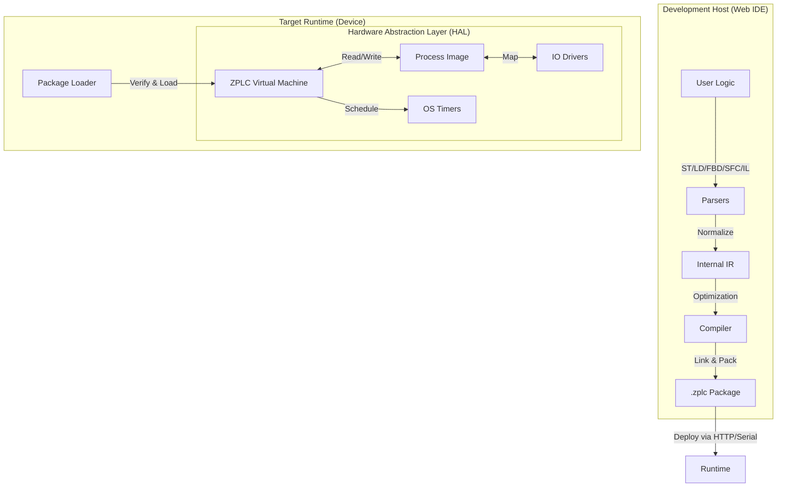

# ZPLC v1.0: Technical Specification & Architecture

**Version:** 1.0 (Draft)
**Target:** Open Source Industrial Automation
**Core Philosophy:** One Execution Core, Any Runtime.

## 1. Executive Summary

ZPLC is a portable, deterministic PLC runtime environment powered by Zephyr RTOS for embedded targets and native OS layers for desktop/server hosting. It is designed to bring modern software development practices—including CI/CD pipelines, compact binary deployment, and open interoperability via PLCopen XML—to the industrial floor.

**The "v1" Promise:** A fully functional runtime supporting all 5 IEC 61131-3 languages, capable of running real hardware I/O or in-browser simulations, with industrial-grade determinism.

---

## 2. High-Level Architecture

The system follows a "Compiler-VM" architecture. The IDE acts as the compiler/linker, producing a hardware-agnostic bytecode package (`.zplc`) which is consumed by the ZPLC Core.

### 2.1 The Data Flow

---

## 3. The `.zplc` Binary Format

This is the contract between the IDE and the Runtime. It is a compact, serialized binary format.

**Structure Definition:**

| Section | Content | Purpose |
| --- | --- | --- |
| **Header** | `0x5A504C43` (Magic), Version, CRC32, Flags | Validity check and version compatibility. |
| **Meta** | Project Name, Build TS, Compiler Ver, Git Hash | Traceability. |
| **SymTable** | Variable IDs, Types, Scopes (Global/Local), Retentive Flags | Memory layout definition. |
| **TaskMap** | ID, Type (Cyclic/Event), Interval (ms), Priority, Entry Point | Tells the scheduler *when* to run code. |
| **Bytecode** | Linearized VM Instructions (SSA-based) | The executable logic. Unified format for all languages. |
| **IOMap** | Logical ID <-> Abstract Channel | Example: `Var_StartBtn` maps to `DIN_0`. |
| **Debug** | (Optional) Source Line Mapping, Symbol Names | Strippable for production, needed for IDE debugging. |
| **Signature** | (Optional) Crypto Signature | Security verification (v1 Roadmap). |

---

## 4. The ZPLC Core (Runtime)

The Core is ANSI C99, strictly standard-compliant, designed to be compiled as a library (`libzplc_core`).

### 4.1 The Virtual Machine (VM)

* **Instruction Set:** Stack-based or Register-based (TBD in Phase 7 detailed view). optimized for boolean logic and arithmetic.
* **Unified IR:** Structured Text (ST) and Ladder (LD) ultimately compile down to the same JUMP / LOAD / STORE / AND / OR opcodes.
* **Memory Model:**
    * **Process Image:** A contiguous block of memory for I/O snapshots.
    * **Retentive Memory:** A dedicated block backed by HAL storage (Battery RAM / Flash).
    * **Work Memory:** Stack/Heap for temporary calculation (strictly bounded).

### 4.2 The Scheduler

* **Execution Discipline:** Preemptive capability (dependent on HAL) but functionally deterministic.
* **Cycle:**
    1. **Input Latch:** Call `HAL_IO_Read()` to update Process Image.
    2. **Logic Execution:** Run tasks sorted by priority.
    3. **Output Latch:** Call `HAL_IO_Write()` to flush Process Image.
    4. **Housekeeping:** Handle Comms/Debug messages (time budgeted).

---

## 5. Hardware Abstraction Layer (HAL)

The Core never calls hardware directly. It calls the HAL.

| Function | Zephyr Implementation | Desktop (Linux/Win) Implementation | WASM Implementation |
| --- | --- | --- | --- |
| `zplc_hal_tick()` | `k_timer` / Hardware RTC | `clock_gettime` / `QueryPerformanceCounter` | JS `performance.now()` |
| `zplc_hal_sleep()` | `k_sleep()` | `usleep()` / `Sleep()` | `Atomics.wait` or async yield |
| `zplc_hal_gpio_read()` | DeviceTree GPIO driver | Read from Shared Mem / Sim Config | Read from JS Object (DOM) |
| `zplc_hal_socket()` | Zephyr Networking Stack | BSD Sockets / Winsock | WebSockets (via JS bridge) |
| `zplc_hal_persist()` | NVS / EEPROM | Local File (`retain.bin`) | `localStorage` / IndexedDB |

---

## 6. Development Environment (Web IDE)

* **Stack:** TypeScript, React/Vue (Frontend), Rust/Go/Node (Backend Service).
* **Project Model:** The "Truth" is strictly **PLCopen XML**.
* **Editors:**
    * **ST:** Monaco Editor with custom language server.
    * **Visual (LD/FBD/SFC):** SVG/Canvas-based implementation utilizing a common graph model.
* **Simulation:**
    * The IDE includes a compiled WASM version of `zplc_core`.
    * "Run Simulation" launches the VM strictly in the browser tab.

---

## 7. Connectivity & Security (v1 Scope)

### 7.1 Communication

* **Modbus TCP Server:** Standard implementation. Map internal vars to Holding Registers/Coils via config.
* **MQTT Client:** "Publish on Change" for tagged variables.
* **Debug Protocol:** proprietary WebSocket protocol for Watch/Force/Upload.

### 7.2 Security Strategy

* **Authentication:** SRP or JWT based auth for the Debug Protocol.
* **Role Based Access Control (RBAC):**
    * *Viewer:* Read-only Watch.
    * *Operator:* Read/Write specific runtime parameters.
    * *Engineer:* Full Upload/Download/Force capability.
* **Crypto:** Use MbedTLS (on Zephyr) or OpenSSL (on Host) for TLS transport.

---

## 8. Roadmap & Milestones

**Phase 0: The Skeleton**
* **Goal:** `zplc_core` compiling on Linux and Zephyr.
* **Deliverable:** A "dummy" runtime that prints "Tick" every 100ms.

**Phase 1: ST & The Virtual Machine**
* **Goal:** Execute Structured Text.
* **Deliverable:** A compiler (JS/TS) that turns simple ST into `.zplc`. A VM that executes it.

**Phase 2: Visual Languages (The Heavy Lift)**
* **Goal:** LD, FBD, SFC.
* **Deliverable:** Visual editors in IDE. Transpilers that convert Graphic -> IEC IR -> Bytecode.

**Phase 3: Real Hardware & IO**
* **Goal:** Blinking an LED on a real Zephyr board.
* **Deliverable:** Zephyr HAL implementation using DeviceTree.

**Phase 4: Connectivity & Polish**
* **Goal:** Modbus, MQTT, and Security.
* **Deliverable:** v1.0 Release Candidate.

---

# Quality Assurance & Verification Plan

## 1. The Infrastructure: "Test First" Environment

* **CI/CD Pipeline (GitHub Actions / GitLab CI):**
    * **Static Analysis:** Run `clang-tidy` (C) and `eslint` (TS) on every commit. Enforce coding standards strictly.
    * **Unit Tests:** Run on host (Linux/Windows) for logic verification.
    * **Simulation Tests:** Run the ZPLC Runtime on a desktop target (POSIX/Win32) to verify behavior without hardware.

* **Hardware-in-the-Loop (HIL) - *The "Real" Test*:**
    * **Setup:** One Zephyr board (e.g., ESP32 or STM32) connected via USB to a runner.
    * **Tooling:** Use **Zephyr’s `twister`** script.
    * **Rule:** Code is not "done" until it runs on the physical board in the pipeline.

## 2. Phase-by-Phase Verification

### Phase 0: Core Skeleton & Build System
* **Cross-Compilation Check:** CI builds for Linux, Windows, Zephyr-STM32, Zephyr-ESP32, and WASM.
* **HAL Contract Test:** Verify `zplc_hal_sleep(100)` waits approximately 100ms.

### Phase 1: ST Compiler & VM Instruction Set
* **Opcode Unit Tests:** Hundreds of tiny C tests checking every VM instruction.
* **Compiler "Golden Files":** Compare generated `.zplc` binary against known "perfect" binary.
* **IEC Compliance Suite (Math):** Implement IEC 61131-3 math examples and assert output.

### Phase 2: Visual Languages
* **Topological Sort Test:** Ensure compiler sorts execution order correctly.
* **Round-Trip Test:** `Import XML` -> `Internal Model` -> `Export XML` parity.

### Phase 3: Runtime Maturity
* **Jitter Test:** Measure variance on GPIO toggle.
* **Power-Loss Test:** Verify retentive memory restoration.
* **Watchdog Test:** Verify detection of infinite loops.

### Phase 4: Connectivity & Security
* **Fuzzing:** Blast Modbus/Loader ports with garbage data.
* **Network Storm:** Flood network while controlling IO.
* **Authentication Check:** Ensure unauthorized uploads fail.
