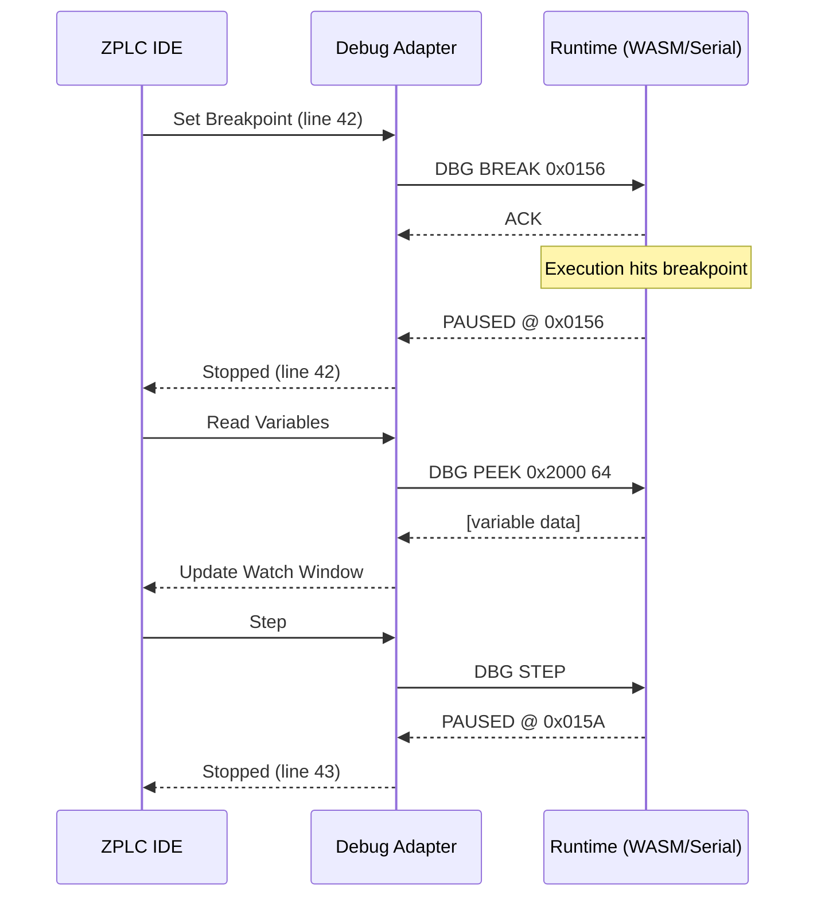
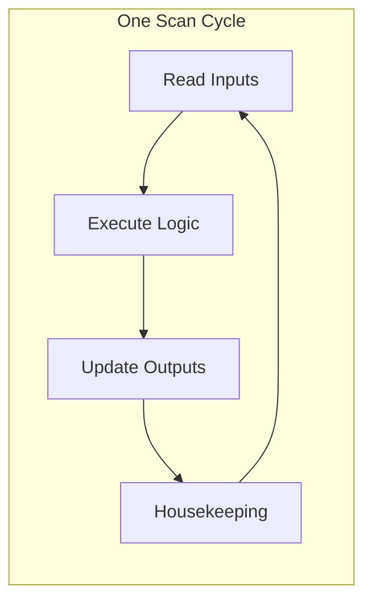

# Debugging Guide

ZPLC provides professional-grade debugging capabilities that work both in simulation (WASM) and on real hardware via serial connection.

## Debug Architecture



---

## Debug Modes

### 1. WASM Simulation (In-Browser)

The fastest way to debug - no hardware required.

**Advantages:**
- Instant startup
- Unlimited breakpoints
- Full memory inspection
- Deterministic timing

**Limitations:**
- No real I/O
- Simulated timers (accelerated)

### 2. Serial Debug (Hardware)

Connect to real hardware via USB serial.

**Advantages:**
- Real I/O
- Actual timing behavior
- Tests real memory constraints

**Limitations:**
- Single breakpoint at a time
- Slower variable updates
- Requires USB connection

---

## Setting Breakpoints

### In the IDE

1. Click the gutter (line number area) to set a breakpoint
2. Red dot indicates active breakpoint
3. Right-click for conditions (conditional breakpoints)

### Breakpoint Types

| Type | Icon | Description |
|------|------|-------------|
| **Line** | 🔴 | Pause when line is reached |
| **Conditional** | 🟡 | Pause when condition is true |
| **Logpoint** | 🔵 | Log message without pausing |

### Conditional Breakpoints

```st
(* Break only when counter reaches specific value *)
counter := counter + 1;  // Breakpoint: counter = 100
```

---

## Watch Variables

### Adding Watches

1. Open the **Watch** panel in the IDE
2. Click **+** to add a variable
3. Type the variable name or drag from editor

### Watch Expression Syntax

```
variable_name           (* Simple variable *)
fb_instance.output      (* Function block output *)
%IX0.0                  (* Direct I/O address *)
array[5]                (* Array element *)
struct.field            (* Structure field *)
```

### Live Updates

When connected to a running program:
- **Green** values: Recently changed
- **White** values: Stable
- **Red** values: Out of range / error

---

## Debug Toolbar

| Button | Shortcut | Action |
|--------|----------|--------|
| ▶️ **Run** | F5 | Start/resume execution |
| ⏸️ **Pause** | F6 | Pause at current cycle |
| ⏹️ **Stop** | Shift+F5 | Stop execution |
| ⏭️ **Step Over** | F10 | Execute one line |
| ⏬ **Step Into** | F11 | Step into function |
| ⏫ **Step Out** | Shift+F11 | Run until function returns |
| 🔄 **Restart** | Ctrl+Shift+F5 | Reset and start again |

---

## Memory Inspector

Access raw memory for advanced debugging.

### Memory Regions

| Region | Address Range | Description |
|--------|---------------|-------------|
| IPI | 0x0000 - 0x0FFF | Input Process Image |
| OPI | 0x1000 - 0x1FFF | Output Process Image |
| Work | 0x2000 - 0x3FFF | Task working memory |
| Retain | 0x4000 - 0x4FFF | Retentive (NVS-backed) |
| Code | 0x5000 - 0xFFFF | Bytecode |

### Shell Commands (Serial Debug)

```bash
# Pause execution
zplc dbg pause

# Resume execution
zplc dbg resume

# Step one cycle
zplc dbg step

# Read memory (hex dump)
zplc dbg peek 0x2000 32
# Output:
# 0x2000: 00 00 00 00 01 00 00 00  ........
# 0x2008: E8 03 00 00 00 00 80 3F  .......?
# 0x2010: 00 00 00 00 00 00 00 00  ........
# 0x2018: FF FF FF FF 00 00 00 00  ........

# Write memory (for forcing values)
zplc dbg poke 0x2000 01
zplc dbg poke 0x2004 E803  # Write 1000 (0x03E8) as little-endian

# Show VM state
zplc dbg info
# Output:
# VM State: PAUSED
# PC: 0x0156
# SP: 4
# Stack[0]: 00000001
# Stack[1]: 000003E8
# Stack[2]: 3F800000
# Stack[3]: 00000000
# Flags: Z=0 N=0 C=0 V=0
```

---

## Forcing Variables

Override variable values during debugging:

### In the IDE

1. Right-click a variable in Watch panel
2. Select **Force Value**
3. Enter new value
4. Variable shows 🔒 icon when forced

### Via Shell

```bash
# Force a BOOL at address 0x2000
zplc dbg poke 0x2000 01

# Force an INT (little-endian) at address 0x2004
zplc dbg poke 0x2004 E803  # 1000 decimal

# Force a REAL (IEEE 754) at address 0x2008
zplc dbg poke 0x2008 00008040  # 4.0 as float
```

### Release Forces

```bash
# In IDE: Right-click → Release Force
# Via shell: Write original value back
```

:::warning Production Safety
**Never force safety-critical values in production!** Forces bypass normal logic and can cause dangerous conditions.
:::

---

## Debug Map (Source Mapping)

The compiler generates debug maps linking bytecode addresses to source lines.

### Debug Map Format

```json
{
  "version": 1,
  "file": "main.st",
  "mappings": [
    { "pc": 0, "line": 5, "column": 1 },
    { "pc": 12, "line": 6, "column": 1 },
    { "pc": 24, "line": 8, "column": 5 },
    ...
  ],
  "variables": [
    { "name": "counter", "address": 8192, "type": "INT", "scope": "global" },
    { "name": "motor_on", "address": 8194, "type": "BOOL", "scope": "global" },
    ...
  ]
}
```

### Enabling Debug Info

```bash
# Compile with debug info
bun run compile --project ./myproject --debug

# Or in IDE: Settings → Compiler → Include Debug Info ✓
```

---

## Cycle-by-Cycle Debugging

### Understanding the Scan Cycle



### Step Modes

| Mode | Behavior |
|------|----------|
| **Step Cycle** | Execute one complete scan cycle |
| **Step Line** | Execute one ST line (may span multiple opcodes) |
| **Step Instruction** | Execute one VM opcode |

### Timing Display

When paused, the IDE shows:
- **Cycle Time**: Last scan duration
- **Cycle Count**: Total scans executed
- **Uptime**: Total runtime

---

## Debugging Multitask Programs

With multiple tasks, debugging requires care:

### Task Selection

- Select which task to debug in the **Tasks** dropdown
- Breakpoints are task-specific
- Watch shows variables from selected task

### Global vs Local Variables

```st
(* Global - visible to all tasks *)
VAR_GLOBAL
    shared_speed : REAL;
END_VAR

(* Local - visible only in this task *)
VAR
    local_counter : INT;
END_VAR
```

### Cross-Task Inspection

1. Pause all tasks: `zplc dbg pause`
2. Switch task in dropdown
3. Inspect that task's variables
4. Resume: `zplc dbg resume`

---

## Performance Profiling

### Cycle Time Histogram

The IDE's **Performance** panel shows:
- Min/Max/Average cycle time
- Histogram of cycle durations
- Overrun count

### Identifying Bottlenecks

```st
(* Add timing markers *)
VAR
    t_start : TIME;
    t_section1 : TIME;
    t_section2 : TIME;
END_VAR

t_start := UPTIME();

(* Section 1: Input processing *)
process_inputs();
t_section1 := UPTIME() - t_start;

(* Section 2: Control logic *)
control_loop();
t_section2 := UPTIME() - t_start - t_section1;
```

---

## Troubleshooting

### Breakpoint Not Hitting

1. Verify code is reachable (check conditions)
2. Ensure debug info is included
3. Check correct task is selected
4. Rebuild with clean compile

### Variables Show Wrong Values

1. Check variable address in debug map
2. Verify correct data type interpretation
3. Check for race conditions in multitask

### Serial Debug Disconnects

1. Reduce Watch variable count
2. Increase serial timeout
3. Check USB cable quality
4. Lower baud rate if noise issues

### WASM Simulation Differs from Hardware

1. Timer behavior differs (WASM is faster)
2. I/O values are simulated
3. Memory layout may differ slightly
4. Always final-test on real hardware
