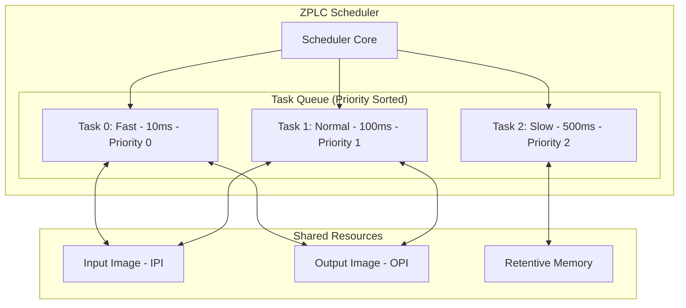
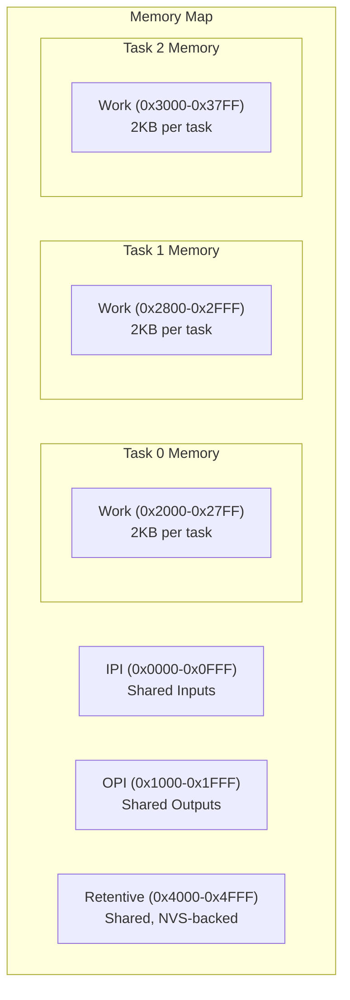

# Multitask Scheduler

ZPLC supports concurrent execution of multiple tasks with independent intervals and priorities. This is essential for industrial applications where you need:

- **Fast loops** for motion control (1-10ms)
- **Normal loops** for process logic (50-100ms)
- **Slow loops** for HMI updates and logging (500ms+)

## Scheduler Architecture



### Execution Model

1. **Priority-Based**: Lower priority number = higher priority
2. **Non-Preemptive**: Tasks run to completion within their cycle
3. **Shared I/O**: All tasks share the same IPI/OPI (synchronized)
4. **Isolated Work Memory**: Each task has its own stack

---

## Defining Tasks

### In Project Configuration (zplc.json)

```json
{
  "name": "MotorControl",
  "version": "1.0.0",
  "target": "rpi_pico",
  "tasks": [
    {
      "name": "FastLoop",
      "file": "fast_control.st",
      "type": "CYCLIC",
      "interval_ms": 10,
      "priority": 0
    },
    {
      "name": "MainLogic", 
      "file": "main.st",
      "type": "CYCLIC",
      "interval_ms": 100,
      "priority": 1
    },
    {
      "name": "Diagnostics",
      "file": "diagnostics.st",
      "type": "CYCLIC",
      "interval_ms": 1000,
      "priority": 5
    }
  ]
}
```

### Task Properties

| Property | Type | Description |
|----------|------|-------------|
| `name` | string | Unique task identifier |
| `file` | string | Source file (.st, .ld.json, .fbd.json) |
| `type` | enum | `CYCLIC` (periodic) or `EVENT` (triggered) |
| `interval_ms` | number | Cycle time in milliseconds |
| `priority` | number | 0 = highest, 255 = lowest |

---

## Example: Multi-Rate Control System

### fast_control.st (10ms - Motor PID)

```st
PROGRAM FastLoop
VAR
    (* Inputs *)
    encoder_count : DINT;
    speed_setpoint : REAL;
    
    (* PID Controller *)
    pid : PID_CONTROLLER;
    
    (* Output *)
    pwm_duty : REAL;
END_VAR

(* Read encoder *)
encoder_count := %ID0;

(* Calculate speed from encoder delta *)
(* ... speed calculation ... *)

(* Run PID *)
pid(
    SETPOINT := speed_setpoint,
    PROCESS_VALUE := actual_speed,
    KP := 1.5,
    KI := 0.1,
    KD := 0.05
);

(* Write PWM output *)
pwm_duty := LIMIT(0.0, pid.OUTPUT, 100.0);
%QD0 := REAL_TO_DINT(pwm_duty * 65535.0 / 100.0);

END_PROGRAM
```

### main.st (100ms - Process Logic)

```st
PROGRAM MainLogic
VAR
    (* State machine *)
    state : INT := 0;
    
    (* Inputs *)
    start_button : BOOL;
    stop_button : BOOL;
    e_stop : BOOL;
    
    (* Shared with FastLoop *)
    speed_setpoint : REAL;  (* Written here, read by FastLoop *)
    
    (* Timers *)
    ramp_timer : TON;
END_VAR

(* Read digital inputs *)
start_button := %IX0.0;
stop_button := %IX0.1;
e_stop := %IX0.2;

(* Emergency stop always takes priority *)
IF e_stop THEN
    state := 0;
    speed_setpoint := 0.0;
    RETURN;
END_IF;

(* State machine *)
CASE state OF
    0: (* IDLE *)
        speed_setpoint := 0.0;
        IF start_button AND NOT stop_button THEN
            state := 1;
            ramp_timer(IN := FALSE);
        END_IF;
        
    1: (* STARTING - Ramp up *)
        ramp_timer(IN := TRUE, PT := T#5s);
        speed_setpoint := 1500.0 * TIME_TO_REAL(ramp_timer.ET) / 5000.0;
        
        IF ramp_timer.Q THEN
            state := 2;
        END_IF;
        
    2: (* RUNNING *)
        speed_setpoint := 1500.0;
        IF stop_button THEN
            state := 3;
            ramp_timer(IN := FALSE);
        END_IF;
        
    3: (* STOPPING - Ramp down *)
        ramp_timer(IN := TRUE, PT := T#3s);
        speed_setpoint := 1500.0 * (1.0 - TIME_TO_REAL(ramp_timer.ET) / 3000.0);
        
        IF ramp_timer.Q THEN
            state := 0;
        END_IF;
END_CASE;

(* Update status outputs *)
%QX0.0 := state >= 1;  (* Motor enabled *)
%QX0.1 := state = 2;   (* Running indicator *)

END_PROGRAM
```

### diagnostics.st (1000ms - Logging)

```st
PROGRAM Diagnostics
VAR
    (* Statistics *)
    run_hours : REAL;
    cycle_count : UDINT;
    max_cycle_time : TIME;
    
    (* Alarms *)
    overspeed_alarm : BOOL;
    overtemp_alarm : BOOL;
END_VAR

(* Update run hours *)
IF state = 2 THEN  (* Running *)
    run_hours := run_hours + 0.001 / 3600.0;  (* 1s in hours *)
    cycle_count := cycle_count + 1;
END_IF;

(* Check alarms *)
overspeed_alarm := actual_speed > 1650.0;  (* 110% of setpoint *)
overtemp_alarm := motor_temp > 80.0;

(* Log to console (debug) *)
(* These would be sent via MQTT in production *)

END_PROGRAM
```

---

## Memory Layout for Multitask

Each task has isolated work memory but shares I/O:



### Inter-Task Communication

Tasks communicate through **shared memory regions**:

1. **I/O Images**: IPI/OPI are updated atomically before/after each scan
2. **Global Variables**: Declare with `VAR_GLOBAL` for cross-task access
3. **Retentive Memory**: Use `VAR_RETAIN` for persistent shared data

```st
(* In a shared header or global declarations *)
VAR_GLOBAL
    speed_setpoint : REAL;  (* Written by MainLogic, read by FastLoop *)
    actual_speed : REAL;    (* Written by FastLoop, read by all *)
    motor_temp : REAL;      (* Written by HAL, read by Diagnostics *)
END_VAR
```

---

## Configuration (Kconfig)

### prj.conf Settings

```ini
# Enable scheduler
CONFIG_ZPLC_SCHEDULER=y

# Maximum concurrent tasks
CONFIG_ZPLC_MAX_TASKS=4

# Scheduler work queue settings
CONFIG_ZPLC_SCHED_WORKQ_STACK_SIZE=2048
CONFIG_ZPLC_SCHED_WORKQ_PRIORITY=5

# Per-task work memory size
CONFIG_ZPLC_WORK_MEMORY_SIZE=8192
```

### Runtime Limits

| Parameter | Default | Range | Notes |
|-----------|---------|-------|-------|
| Max Tasks | 4 | 1-16 | Limited by RAM |
| Min Interval | 1ms | 1ms+ | Zephyr timer resolution |
| Stack per Task | 512 words | 256-2048 | Adjust for deep call stacks |
| Total Work Memory | 8KB | 4-32KB | Shared across tasks |

---

## Shell Commands

Monitor the scheduler via serial shell:

```bash
# Show scheduler status
zplc sched status
# Output:
# Scheduler: RUNNING
# Tasks: 3 active
# Tick: 847234ms
# Overruns: 0

# List all tasks
zplc sched tasks
# Output:
# ID  Name          Interval  Priority  Runs     Last Cycle
# 0   FastLoop      10ms      0         84723    847μs
# 1   MainLogic     100ms     1         8472     1.2ms
# 2   Diagnostics   1000ms    5         847      0.3ms
```

---

## Best Practices

### 1. Keep Fast Tasks Fast

```st
(* BAD: Heavy computation in 10ms task *)
FOR i := 1 TO 1000 DO
    complex_calculation();  (* This will cause overruns! *)
END_FOR;

(* GOOD: Spread computation across cycles *)
IF cycle_index < 100 THEN
    partial_calculation(cycle_index);
    cycle_index := cycle_index + 1;
ELSE
    cycle_index := 0;
END_IF;
```

### 2. Avoid Blocking Operations

- No `DELAY()` or `SLEEP()` inside tasks
- Use state machines with timers instead

### 3. Minimize Shared Data

```st
(* GOOD: Local buffer, copy to shared only when needed *)
VAR
    local_buffer : ARRAY[0..99] OF REAL;
END_VAR

(* Process locally *)
FOR i := 0 TO 99 DO
    local_buffer[i] := process(input[i]);
END_FOR;

(* Single atomic update to shared *)
shared_result := local_buffer[50];
```

### 4. Use Appropriate Priorities

| Priority | Use Case | Typical Interval |
|----------|----------|------------------|
| 0 | Safety interlocks | 1-5ms |
| 1 | Motion control | 5-20ms |
| 2 | Process control | 50-100ms |
| 3-5 | HMI, logging | 200-1000ms |
| 10+ | Background tasks | 5000ms+ |

---

## Troubleshooting

### Task Overruns

**Symptom**: Scheduler reports overruns, timing jitter

**Cause**: Task execution exceeds its interval

**Solution**:
1. Profile with `zplc dbg info` to find slow cycles
2. Move heavy logic to slower task
3. Increase interval if possible
4. Optimize algorithm

### Inter-Task Race Conditions

**Symptom**: Glitches when reading shared variables

**Solution**:
- Use atomic types for shared data
- Read/write complete structures, not individual fields
- Consider double-buffering for arrays
