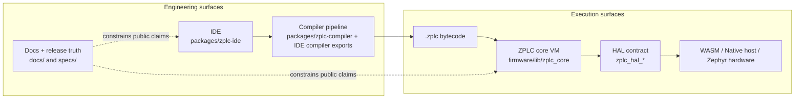
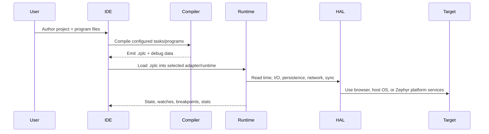

# System Architecture

ZPLC is intentionally split into engineering surfaces and execution surfaces.

That separation is not cosmetic. It is how the project protects deterministic runtime
behavior while still delivering modern IDE, compiler, desktop, and documentation workflows.

## Architecture at a glance

## Primary system boundaries

ZPLC v1.5.0 is easier to understand if you treat it as five boundaries instead of one
big blob:

1. **Authoring boundary** — users work in the IDE and project config files
2. **Compilation boundary** — language-specific authoring converges to a shared `.zplc` contract
3. **Runtime boundary** — the C99 execution core interprets that contract deterministically
4. **Platform boundary** — hardware, persistence, timing, sockets, and OS services stay behind the HAL
5. **Release boundary** — docs and website claims are constrained by repo truth sources and evidence

## The major components

### 1. The IDE (`packages/zplc-ide`)

The IDE is the operator-facing and developer-facing engineering surface.

It owns:

- text authoring for `ST` and `IL`
- visual authoring for `LD`, `FBD`, and `SFC`
- project configuration through `zplc.json`
- compile, simulate, deploy, and debug workflows
- adapter selection between browser simulation, native Electron simulation, and hardware connection

The IDE is allowed to be modern, stateful, and UI-heavy. The runtime is not.
That is the whole point of the separation.

### 2. The compiler contract

The compiler normalizes all claimed IEC language paths into the same bytecode/runtime
contract.

- `LANGUAGE_WORKFLOW_SUPPORT` in the IDE compiler currently exposes release-facing workflows for `ST`, `IL`, `LD`, `FBD`, and `SFC`
- visual and alternate authoring paths converge into the same compiler/runtime contract
- the output is `.zplc` bytecode plus related debug information

This is why ZPLC can claim “one execution core, many authoring paths” without lying.

### 3. The runtime core (`firmware/lib/zplc_core`)

The runtime is the execution boundary.

Its public headers show three important ideas:

- **shared memory regions** exist for IPI, OPI, work, retain, and code
- **VM instances** hold private execution state per task
- **scheduler APIs** manage task registration, loading, control, statistics, and synchronization

`zplc_core.h` documents the instance-based VM model, and `zplc_scheduler.h` documents the
multitask scheduler API built around IEC task concepts.

### 4. The HAL contract

The HAL is the only sanctioned bridge between the deterministic core and the outside world.

`zplc_hal.h` authorizes platform implementations for:

- timing (`zplc_hal_tick`, `zplc_hal_sleep`)
- digital and analog I/O
- persistence
- networking and sockets
- mutexes and synchronization
- logging and initialization/shutdown

If code bypasses that boundary, it is not just ugly architecture — it weakens portability and
breaks the public contract.

### 5. Target runtimes

The same core contract is surfaced in different execution environments:

- **WASM** for browser-side simulation
- **native host runtime** for Electron-backed native simulation
- **Zephyr runtime application** at `firmware/app` for supported hardware

Those targets are siblings, not separate products.

## Working principles

### Principle 1: author once, execute through one runtime contract

Whatever the language entry point, the system wants one downstream contract: `.zplc` plus the
public runtime headers.

### Principle 2: keep platform code out of the core

The core must never talk directly to MCU registers, Zephyr drivers, browser APIs, or desktop
APIs. That all goes through the HAL or the runtime adapter layer.

### Principle 3: multi-task execution uses shared memory + private VM state

`zplc_core.h` explicitly describes:

- shared IPI/OPI/code regions
- shared work/retain coordination by address
- private PC/stack/call-stack state per VM instance

That model lets multiple tasks share process data while preserving per-task execution context.

### Principle 4: public claims are evidence-constrained

The website and docs are part of the product architecture because they define what the project is
allowed to promise publicly.

For v1.5.0, public claims must stay aligned with:

- public runtime headers
- supported-board manifest
- IDE/compiler/runtime source exports
- release evidence artifacts

## End-to-end flow

## Where to go next

- [Platform Overview](/platform-overview) for the product-level map
- [Getting Started](/getting-started) for the first working path
- [Runtime Overview](/runtime) for runtime responsibilities and subsystems
- [Integration & Deployment](/integration) for supported hardware deployment expectations
