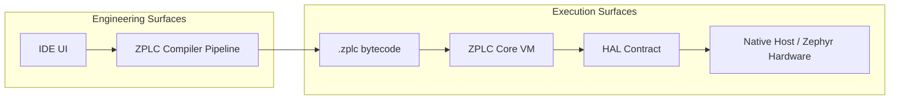

# System Architecture

ZPLC is intentionally split into engineering surfaces and execution surfaces.

This separation protects deterministic runtime behavior in the underlying control hardware while still delivering modern IDE, compiler, and simulation workflows.

## Architecture at a Glance

## Primary System Boundaries

ZPLC is easier to understand if you treat it as four boundaries instead of one monolithic application:

1. **Authoring Boundary** — Users work in the IDE, manipulating `.st`, `.ld`, or visual models.
2. **Compilation Boundary** — Language-specific authoring converges to a canonical ST transpilation, generating the shared `.zplc` bytecode.
3. **Runtime Boundary** — The C99 execution core interprets the bytecode deterministically on the target hardware.
4. **Platform Boundary** — Hardware, persistence, timers, sockets, and OS services stay behind the Hardware Abstraction Layer (HAL).

## The Major Components

### 1. The IDE

The IDE is the operator-facing and developer-facing engineering surface. It manages text authoring for Structured Text and Instruction List, visual authoring for Ladder Logic, FBD, and SFC, and project orchestration (compilation, deployment, debugging).

### 2. The Compiler

The compiler normalizes all IEC language paths into the same bytecode/runtime contract. The unified `.zplc` output means that ZPLC provides "one execution core, many authoring paths" without inconsistencies in runtime behavior.

### 3. The Runtime Core

The runtime (`libzplc_core`) is the execution boundary written in strict C99. It relies on standard operational models:
- **Shared memory regions** globally defined for Inputs (IPI), Outputs (OPI), Work, Retain, and Code.
- **VM instances** holding private execution states (stack pointers, registers) per task.
- **Scheduler APIs** managing task registration, polling, and cyclical timing.

### 4. The HAL Contract

The Hardware Abstraction Layer (HAL) is the bridge between the deterministic core and the physical microcontrollers.
To port ZPLC to a new architecture, a developer only needs to implement `zplc_hal.h`:
- Timing (`zplc_hal_tick`, `zplc_hal_sleep`)
- Digital and analog I/O manipulation
- NVS Persistence
- Networking and Sockets 
- Logging Initialization

By restricting everything to the HAL, ZPLC guarantees deep portability.

## Working Principles

1. **Keep platform code out of the core**: The core must never talk directly to MCU registers or Zephyr drivers. All hardware requests go through the generic HAL.
2. **Deterministic execution**: Memory allocation is static at compilation time. The runtime parses and executes bytecode within guaranteed bounds.
3. **Multi-task execution**: The system isolates the execution context of individual programs while safely exposing shared global data blocks (like Modbus tags or physical Inputs).

## Where to Go Next

- [Platform Overview](../platform-overview/index.md)
- [Runtime Overview](../runtime/index.md)
- [Integration & Deployment](../integration/index.md)
