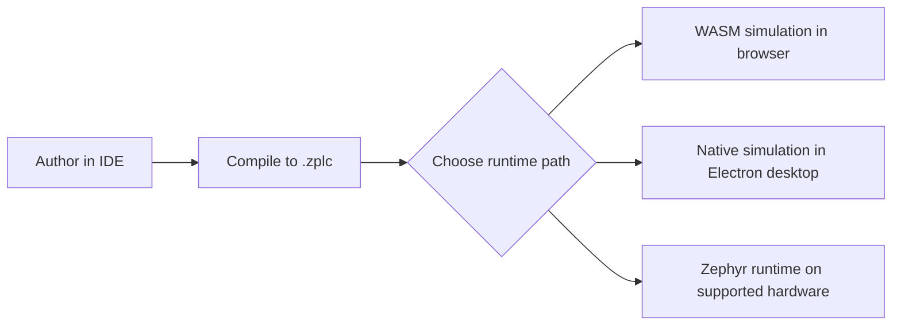

# Getting Started

Use this page to validate the real ZPLC v1.5.0 workflow from a clean checkout.
It covers the install flow, the first project shape, the simulation/runtime choices,
and the supported hardware path without claiming more than the repository can prove.

## What you are setting up

ZPLC v1.5.0 is one product made of four release-facing surfaces:

- the **documentation site** (`docs/`)
- the **IDE** (`packages/zplc-ide`)
- the **compiler** (`packages/zplc-compiler` and IDE compiler exports)
- the **runtime** (embedded Zephyr runtime plus host/native simulation paths)



## 1. Install the repository dependencies

```bash
bun install
```

This installs the workspace dependencies for the docs and IDE.

If you plan to use embedded hardware, also make sure you already have:

- a Zephyr SDK/toolchain
- `west` in your environment
- an activated Zephyr environment with `ZEPHYR_BASE` available

See [Zephyr Workspace Setup](/reference/zephyr-workspace-setup) for the canonical
workspace shape used by the v1.5 docs.

## 2. Know the supported boards before you target hardware

The only canonical v1.5 board list is:

- `firmware/app/boards/supported-boards.v1.5.0.json`

At the time of this rewrite, the published release-facing targets are:

| Board | IDE ID | Zephyr target | Network class |
|---|---|---|---|
| Raspberry Pi Pico (RP2040) | `rpi_pico` | `rpi_pico/rp2040` | Serial-focused |
| Arduino GIGA R1 (STM32H747 M7) | `arduino_giga_r1` | `arduino_giga_r1/stm32h747xx/m7` | Serial-focused |
| ESP32-S3 DevKitC | `esp32s3_devkitc` | `esp32s3_devkitc/esp32s3/procpu` | Network-capable (Wi-Fi) |
| STM32F746G Discovery | `stm32f746g_disco` | `stm32f746g_disco` | Network-capable (Ethernet) |
| STM32 Nucleo-H743ZI | `nucleo_h743zi` | `nucleo_h743zi` | Network-capable (Ethernet) |

Use [Supported Boards](/reference/boards) for the detailed build commands and support assets.

## 3. Validate the docs truth sources without building the site

```bash
bun --cwd docs run validate:v1.5-docs
```

This is the correct non-build validation for the documentation surface in this repo. It
checks canonical manifest coverage, English/Spanish slug parity, generated-page freshness,
and board summary drift.

## 4. Start the IDE

Choose the engineering surface you want:

### Browser workflow

```bash
bun --cwd packages/zplc-ide run dev
```

Use the browser workflow when you want quick simulation and iteration.

### Electron desktop workflow

```bash
bun --cwd packages/zplc-ide run electron:dev
```

Use the desktop workflow when you want the Electron shell and the native simulation bridge.
The desktop preload exposes `window.electronAPI.nativeSimulation`, and the IDE prefers that
native adapter when it is available.

## 5. Create a first project

The project contract is a `zplc.json` file with at least:

- a project name and version
- a target board
- one or more tasks
- one or more program files assigned to each task

The schema in `packages/zplc-ide/zplc.schema.json` currently authorizes these release-facing
board IDs:

- `rpi_pico`
- `arduino_giga_r1`
- `stm32f746g_disco`
- `esp32s3_devkitc`
- `nucleo_h743zi`

The sample `packages/zplc-ide/projects/blinky/zplc.json` shows the shape:

```json
{
  "name": "Blinky",
  "version": "1.0.0",
  "target": {
    "board": "esp32s3_devkitc"
  },
  "tasks": [
    {
      "name": "MainTask",
      "trigger": "cyclic",
      "interval_ms": 10,
      "priority": 1,
      "programs": ["main.sfc"]
    }
  ]
}
```

For a first project, keep it boring on purpose:

1. create one cyclic task
2. assign one program file
3. compile to `.zplc`
4. validate the logic in simulation first

## 6. Choose a runtime path

### Path A — browser simulation

Use this when you want the fastest feedback loop.

- The IDE falls back to the WASM runtime adapter when the native Electron bridge is not available.
- This is ideal for logic iteration, watch inspection, and breakpoint-driven debugging in the browser.
- It is useful, but it does **not** replace desktop or hardware evidence for release sign-off.

### Path B — native desktop simulation

Use this when you run the Electron desktop app.

- The IDE creates a native simulation adapter when `window.electronAPI.nativeSimulation` exists.
- Electron starts a host-side native runtime session through the preload/main-process IPC bridge.
- This path gives you a closer host runtime validation loop than plain browser-only simulation.

### Path C — hardware runtime

Use this when you need a real Zephyr target.

- The runtime application lives at `firmware/app`.
- The IDE hardware connection uses the serial adapter / WebSerial workflow for shell-driven upload and debug.
- Claims about network-capable boards still come from the supported-board manifest and release evidence, not from wishful thinking.

## 7. Run the first project in simulation

The minimal honest workflow is:

1. open or create a project in the IDE
2. author logic in `ST`, `IL`, `LD`, `FBD`, or `SFC`
3. compile the project to `.zplc`
4. start simulation
5. inspect watch values, breakpoints, and execution state

The IDE compiler exports workflow support for all five release-facing languages and normalizes
them to the same bytecode/runtime contract.

## 8. Move to supported hardware

When you are ready for embedded validation:

1. put the repo in a Zephyr workspace as documented in [Zephyr Workspace Setup](/reference/zephyr-workspace-setup)
2. build `firmware/app` with the canonical board command from the board manifest
3. flash using the board-appropriate flow (`west flash` for many boards, UF2 copy for RP2040-class flows)
4. connect from the IDE and upload the compiled `.zplc` program

Example canonical build command:

```bash
west build -b rpi_pico/rp2040 firmware/app --pristine
```

## 9. Understand what counts as release-ready evidence

For v1.5.0, code presence alone is not enough.

- supported boards must match the board manifest
- language and IDE workflow claims must match the packages and exported adapters
- docs claims must remain aligned with the [Source of Truth](/reference/source-of-truth)
- desktop smoke and hardware-in-the-loop validation still require evidence under `specs/008-release-foundation/artifacts/`

## Related pages

- [Platform Overview](/platform-overview)
- [Integration & Deployment](/integration)
- [System Architecture](/architecture)
- [Runtime Overview](/runtime)
- [Supported Boards](/reference/boards)
