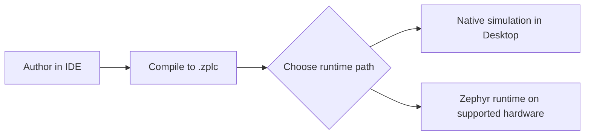

# Getting Started

Use this page to validate the real ZPLC v1.5.0 workflow.
It covers the install flow, the first project shape, the native simulation,
and the supported hardware path without claiming more than the repository can prove.

## What you are setting up

ZPLC v1.5.0 provides a complete industrial programming environment via two main components:

- the **IDE** (Desktop application)
- the **runtime** (embedded Zephyr runtime plus native SoftPLC simulation on host)



## 1. Download and Install the IDE

ZPLC v1.5 focuses on the release binary workflow. You do not need to build the IDE from source to use it.

1. Go to the [ZPLC GitHub Releases](https://github.com/eduardojvieira/ZPLC/releases) page.
2. Download the installer for your platform (Windows `.exe`, macOS `.dmg` or `.pkg`, Linux `.AppImage` or `.deb`).
3. Run the installer to install the ZPLC IDE.

## 2. Set up the Zephyr Environment (For Hardware)

If you plan to use embedded hardware instead of just the Desktop simulation, you must set up Zephyr RTOS.

1. Install the Zephyr SDK and requirements by following the [official Zephyr Getting Started Guide](https://docs.zephyrproject.org/latest/develop/getting_started/index.html).
2. Ensure you have `west` available in your path.
3. Initialize the ZPLC Zephyr workspace:
   ```bash
   # Create a workspace folder
   mkdir zplc-workspace && cd zplc-workspace
   
   # Initialize with the ZPLC manifest
   west init -m https://github.com/eduardojvieira/ZPLC --mr main
   west update
   ```
4. Export your Zephyr environment variables (`source zephyr/zephyr-env.sh` on Linux/macOS, or `.venv\Scripts\activate` on Windows).

See [Zephyr Workspace Setup](../reference/zephyr-workspace-setup.md) for more details.

## 3. Know the supported boards

At the time of this rewrite, the published release-facing targets are:

| Board | IDE ID | Zephyr target | Network class |
|---|---|---|---|
| Raspberry Pi Pico (RP2040) | `rpi_pico` | `rpi_pico/rp2040` | Serial-focused |
| Arduino GIGA R1 (STM32H747 M7) | `arduino_giga_r1` | `arduino_giga_r1/stm32h747xx/m7` | Serial-focused |
| ESP32-S3 DevKitC | `esp32s3_devkitc` | `esp32s3_devkitc/esp32s3/procpu` | Network-capable (Wi-Fi) |
| STM32F746G Discovery | `stm32f746g_disco` | `stm32f746g_disco` | Network-capable (Ethernet) |
| STM32 Nucleo-H743ZI | `nucleo_h743zi` | `nucleo_h743zi` | Network-capable (Ethernet) |

Use [Supported Boards](../reference/boards.md) for the detailed build commands and support assets.

## 4. Create a first project

Launch the ZPLC IDE application. The project contract is saved as a `zplc.json` file. Create a new "Blinky" project:

```json
{
  "name": "Blinky",
  "version": "1.0.0",
  "target": {
    "board": "esp32s3_devkitc"
  },
  "tasks": [
    {
      "name": "MainTask",
      "trigger": "cyclic",
      "interval_ms": 10,
      "priority": 1,
      "programs": ["main.sfc"]
    }
  ]
}
```

For a first project:
1. create one cyclic task.
2. assign one program file (e.g., `main.st` or `main.sfc`).
3. click **Compile** to generate bytecode.
4. click **Start Simulation** to validate the logic locally.

## 5. Validate in Native Simulation

To test logic without hardware, use the Desktop Simulation workflow.

- The Desktop IDE includes a bundled native runtime bridge (`window.electronAPI.nativeSimulation`).
- Clicking `Start Simulation` runs the `.zplc` bytecode on your host processor using the native POSIX runtime.
- You can inspect logic execution, watch variables, step through breakpoints, and force values visually.

## 6. Move to supported hardware

When you are ready for embedded validation in physical boards:

1. Open your Zephyr workspace terminal (see Step 2).
2. Build `firmware/app` with the canonical board command:
   ```bash
   west build -b esp32s3_devkitc/esp32s3/procpu firmware/app --pristine
   ```
   *(Replace with your board target from the supported boards table).*
3. Flash the firmware onto the board via USB:
   ```bash
   west flash
   ```
4. **Connect from the IDE**: 
   - Open the ZPLC IDE.
   - Select your target board and click **Connect**.
   - Select the respective Serial port matching your board.
   - The IDE will pair with the Zephyr runtime, and you can now **Upload** the compiled `.zplc` program.

## Related pages

- [IDE Features and Interfaces](../ide/features.md)
- [Language Support Overview](../languages/index.md)
- [System Architecture](../architecture/index.md)
- [Runtime API Reference](../runtime/stdlib.md)
- [Supported Boards](../reference/boards.md)
