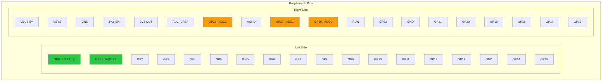
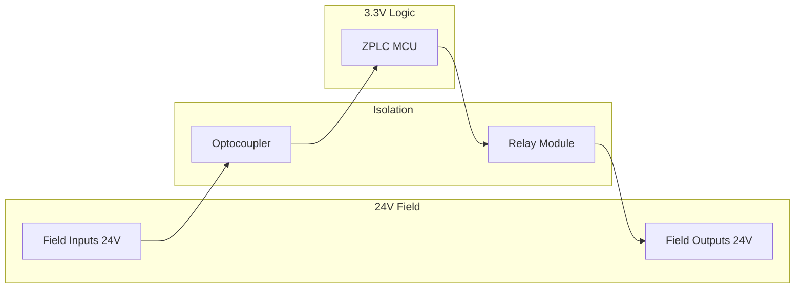

# Supported Hardware

ZPLC officially supports the following reference boards. The architecture is designed to work with any of the 500+ boards supported by Zephyr RTOS.

## Quick Compatibility Matrix

| Board | MCU | Flash | RAM | GPIO | ADC | DAC | Tested |
|-------|-----|-------|-----|------|-----|-----|--------|
| **Raspberry Pi Pico** | RP2040 | 2MB | 264KB | 26 | 3 | - | ✅ |
| **STM32 Nucleo-H743ZI** | STM32H743 | 2MB | 1MB | 140+ | 24 | 2 | ✅ |
| **Arduino GIGA R1** | STM32H747 | 2MB | 1MB | 76 | 16 | 2 | ✅ |
| **ESP32-S3 DevKit** | ESP32-S3 | 8MB | 512KB | 45 | 20 | - | ✅ |
| **QEMU (mps2/an385)** | Cortex-M3 | Sim | Sim | Sim | - | - | ✅ CI |

---

## Raspberry Pi Pico (RP2040)

The Pico is the recommended board for beginners due to its low cost (~$4) and simple flashing procedure.

### Specifications
- **MCU**: Dual-core ARM Cortex-M0+ @ 133 MHz
- **Flash**: 2MB (QSPI)
- **RAM**: 264KB
- **GPIO**: 26 multi-function pins
- **ADC**: 3 channels (12-bit)

### Pinout Diagram



### I/O Mapping (Default)

| ZPLC Address | Pin | Function | Description |
|--------------|-----|----------|-------------|
| `IPI[0].0` | GP2 | Digital Input | Start Button |
| `IPI[0].1` | GP3 | Digital Input | Stop Button |
| `IPI[0].2` | GP4 | Digital Input | Sensor 1 |
| `IPI[0].3` | GP5 | Digital Input | Sensor 2 |
| `OPI[0].0` | GP6 | Digital Output | Motor Relay |
| `OPI[0].1` | GP7 | Digital Output | Status LED |
| `OPI[0].2` | GP8 | Digital Output | Alarm |
| `IPI[4-5]` | GP26 | Analog Input | ADC0 (12-bit) |
| `IPI[6-7]` | GP27 | Analog Input | ADC1 (12-bit) |

### Flashing

#### Option 1: BOOTSEL Mode (Drag & Drop)
1. Hold **BOOTSEL** button while plugging USB
2. Pico mounts as a USB drive
3. Copy `build/zephyr/zephyr.uf2` to the drive
4. Pico reboots automatically

#### Option 2: West Flash
```bash
west build -b rpi_pico $ZEPLC_PATH/apps/zephyr_app --pristine
west flash
```

#### Option 3: IDE Upload
1. Connect Pico via USB
2. In IDE, click **Connect** → select serial port
3. Click **Upload** → program transfers via serial

### Wiring Example: Basic Motor Control

```
┌─────────────────────────────────────────────────────────────┐
│                      WIRING DIAGRAM                         │
├─────────────────────────────────────────────────────────────┤
│                                                             │
│   [24V PSU]                                                 │
│      │                                                      │
│      ├────[Start PB]────┬────────────> GP2 (IPI[0].0)      │
│      │                  │                                   │
│      ├────[Stop PB]─────┼────────────> GP3 (IPI[0].1)      │
│      │                  │                                   │
│      └────[E-Stop]──────┘                                   │
│                                                             │
│   [Pico GP6]──────[Relay Module]────[Motor Contactor]      │
│                                                             │
│   [Pico GP7]──────[LED Driver]──────[Status LED]           │
│                                                             │
│   NOTE: Use optocouplers for 24V inputs!                   │
│                                                             │
└─────────────────────────────────────────────────────────────┘
```

:::warning 24V I/O Isolation
The Pico operates at 3.3V logic. **Never connect 24V industrial signals directly!** Use:
- **Inputs**: Optocouplers (e.g., PC817) or industrial input modules
- **Outputs**: Relay modules or solid-state relays
:::

---

## STM32 Nucleo-H743ZI

Industrial-grade performance with Ethernet and extensive I/O.

### Specifications
- **MCU**: ARM Cortex-M7 @ 480 MHz
- **Flash**: 2MB (dual-bank)
- **RAM**: 1MB (multiple banks)
- **GPIO**: 140+ pins
- **ADC**: 3 × 16-bit ADC (24 channels total)
- **DAC**: 2 × 12-bit
- **Ethernet**: 10/100 Mbit (onboard)

### I/O Mapping (Default)

| ZPLC Address | Pin | Arduino Header | Function |
|--------------|-----|----------------|----------|
| `IPI[0].0` | PE3 | D0 | Digital Input |
| `IPI[0].1` | PF3 | D1 | Digital Input |
| `OPI[0].0` | PB0 | D3 | Digital Output |
| `OPI[0].1` | PB7 | D4 | Digital Output |
| `IPI[4-5]` | PA3 | A0 | Analog Input (16-bit) |

### Flashing

```bash
# Using West (requires ST-LINK)
west build -b nucleo_h743zi $ZEPLC_PATH/apps/zephyr_app --pristine
west flash

# Using STM32CubeProgrammer
# Connect via ST-LINK and flash the .hex file
```

---

## Arduino GIGA R1 (STM32H747)

Dual-core powerhouse with professional form factor.

### Specifications
- **MCU**: Dual-core ARM Cortex-M7 (480MHz) + M4 (240MHz)
- **Flash**: 2MB
- **RAM**: 1MB
- **GPIO**: 76 pins
- **ADC**: 16 channels (16-bit)
- **DAC**: 2 channels (12-bit)
- **Connectivity**: WiFi, BLE, USB-C

:::info Dual-Core Note
ZPLC targets the M7 core only. The M4 core is available for custom applications.
:::

### Flashing

```bash
west build -b arduino_giga_r1/stm32h747xx/m7 $ZEPLC_PATH/apps/zephyr_app --pristine
west flash
```

---

## ESP32-S3 DevKitC

WiFi-enabled controller for IoT applications.

### Specifications
- **MCU**: Dual-core Xtensa LX7 @ 240 MHz
- **Flash**: 8MB (QSPI)
- **PSRAM**: 2MB (optional)
- **GPIO**: 45 pins
- **ADC**: 2 × 12-bit (20 channels)
- **WiFi**: 802.11 b/g/n
- **BLE**: Bluetooth 5.0

### Flashing

```bash
west build -b esp32s3_devkitc $ZEPLC_PATH/apps/zephyr_app --pristine
west flash
```

---

## Custom Board Support

To add support for a new Zephyr board:

### Step 1: Create Board Overlay

Create `apps/zephyr_app/boards/your_board.overlay`:

```dts
/ {
    chosen {
        zplc,storage = &storage_partition;
    };
};

&flash0 {
    partitions {
        compatible = "fixed-partitions";
        #address-cells = <1>;
        #size-cells = <1>;

        storage_partition: partition@1f0000 {
            label = "storage";
            reg = <0x1f0000 0x10000>;
        };
    };
};
```

### Step 2: Configure GPIO in prj.conf

```ini
CONFIG_GPIO=y
CONFIG_ZPLC_DIN_COUNT=8
CONFIG_ZPLC_DOUT_COUNT=8
CONFIG_ZPLC_AIN_COUNT=4
```

### Step 3: Build & Test

```bash
west build -b your_board $ZEPLC_PATH/apps/zephyr_app --pristine
west flash
```

---

## Power Supply Considerations

### Voltage Rails

| Rail | Typical Use | Max Current |
|------|-------------|-------------|
| 3.3V | Logic, sensors | 500mA |
| 5V (USB) | Board power | 500mA |
| 24V DC | Industrial I/O | External PSU |

### Isolation Requirements

For industrial applications, isolate:
- **Digital Inputs**: Optocouplers or isolated input modules
- **Digital Outputs**: Relay modules or solid-state relays
- **Analog Inputs**: Isolated ADC modules for high voltage
- **Communications**: Isolated RS-485 transceivers



---

## Troubleshooting

### Board Not Detected

1. Check USB cable (use data cable, not charge-only)
2. Install drivers (STM32: ST-LINK, ESP32: CP2102)
3. Try different USB port

### Flash Fails

1. Erase flash: `west flash --erase`
2. Check write protection
3. Verify power supply

### I/O Not Working

1. Check pin assignment in overlay file
2. Verify GPIO direction (input/output)
3. Check pull-up/pull-down configuration
4. Measure voltage levels with multimeter
