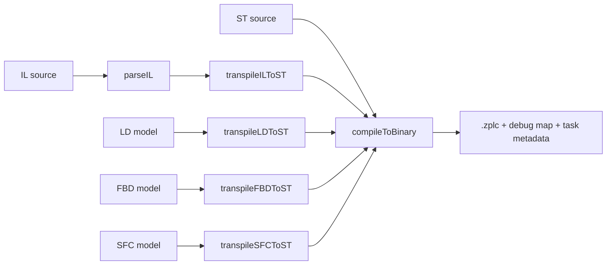

# Compiler Workflow

The IDE compiler layer is built around one core rule for v1.5:

> there is **one executable backend contract**, not five unrelated compilers.

That rule is visible in `packages/zplc-ide/src/compiler/index.ts`.

## Canonical pipeline

## What `compileProject()` actually does

`compileProject()` follows two stages:

1. **Normalize to ST when required**
2. **Compile the resulting ST to bytecode**

That means:

- `ST` goes directly to the shared backend
- `IL` is parsed and transpiled to ST first
- `LD`, `FBD`, and `SFC` are loaded as models and transpiled to ST first

This is why the public release claim is a **workflow parity claim**, not a claim that each language owns a fully separate backend.

## Language workflow support flags

The IDE exports explicit workflow support flags for every claimed language:

| Language | Author | Compile | Simulate | Deploy | Debug |
|---|---|---|---|---|---|
| `ST` | yes | yes | yes | yes | yes |
| `IL` | yes | yes | yes | yes | yes |
| `LD` | yes | yes | yes | yes | yes |
| `FBD` | yes | yes | yes | yes | yes |
| `SFC` | yes | yes | yes | yes | yes |

Those flags live in `LANGUAGE_WORKFLOW_SUPPORT`, and `languageWorkflow.test.ts` verifies the declared support matrix and the canonical compile path.

## Single-file and multi-task outputs

The compiler surface used by the IDE can generate:

- **single-file programs** with an automatically generated task segment
- **multi-task project binaries** with merged bytecode and debug maps

`compileMultiTaskProject()` also ties together:

- program entry points
- task definitions
- communication tag injection
- merged debug map information for the debugger

## Standard library resolution

The compiler stdlib registry in `packages/zplc-compiler/src/compiler/stdlib/index.ts` is the authoritative source for built-in functions and function blocks.

High-value categories exposed there include:

- timers (`TON`, `TOF`, `TP`)
- counters (`CTU`, `CTD`, `CTUD`)
- edge and bistable blocks
- string functions
- math, logic, scaling, and system functions
- communication FB definitions such as Modbus and MQTT blocks

See [Languages Standard Library](/languages/stdlib) for the release-facing summary.

## String handling in the compiler/runtime contract

Strings matter because they cross compiler and runtime boundaries.

- the compiler stdlib defines string helpers in `stdlib/strings.ts`
- the ISA header defines the fixed `STRING` layout in `zplc_isa.h`
- the runtime uses dedicated string opcodes such as `STRLEN`, `STRCPY`, `STRCAT`, `STRCMP`, and `STRCLR`

That is why string support belongs to the compiler/runtime contract, not to ad-hoc IDE-only behavior.

## Release guidance

For v1.5.0, the compiler docs should claim only what the repo currently exports and tests:

- language workflow support is declared and tested
- visual and IL paths converge into the same backend
- `.zplc` output, task metadata, and debug maps are part of the same compile result

Human release sign-off for end-to-end language parity is still tracked separately under `REL-002`.
