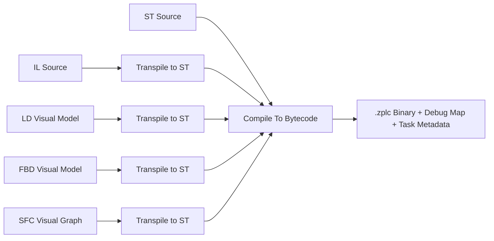

# Compiler Workflow

ZPLC radically simplifies industrial automation compilation by employing a **single unified compiler backend** for all IEC 61131-3 languages.

## The Unified Compilation Pipeline

Instead of maintaining brittle, completely separate parsing engines for every visual and textual language, ZPLC transpiles all graphical models directly into canonical Structured Text (ST) before executing the final compilation to bytecode.

## Parity Guarantee

This architecture guarantees true feature parity across all languages. Because a Ladder Diagram (LD) circuit eventually passes through the exact same ST compiler engine, you never have to worry about subtle execution discrepancies, missing mathematical functions, or disparate runtime behaviors depending on the language you chose.

## Multi-Task Projects

The ZPLC compiler engine does more than just generate executable `.zplc` bytecode. A single compilation pass produces a multi-task project payload that includes:

1. **Merged Bytecode**: The logic from multiple programs consolidated into one executable block.
2. **Task Metadata**: The cycle speeds, triggers, and execution priorities defined in `zplc.json`.
3. **Communication Tags**: Network injection variables for Modbus or MQTT protocols.
4. **Debug Maps**: Source-mapping artifacts linking the compiled processor opcodes back to the exact lines in your ST files or graphical nodes, enabling precise step-by-step debugging.

## Built-In Standard Library Support

During compilation, ZPLC intrinsically resolves calls to the IEC Standard Library (`stdlib`). This encompasses complex logic routines implemented deeply within the runtime:
- Timers (`TON`, `TOF`, `TP`)
- Counters (`CTU`, `CTD`, `CTUD`)
- Edge detectors and Bistable latches
- Advanced Math, Trignometry, and Bitwise logic
- Asynchronous Network operations (`MB_READ_HREG`, `MQTT_PUBLISH`, etc.)

Strings also pass across this compiler/runtime boundary organically, supported by dedicated underlying byte-level opcodes (`STRLEN`, `STRCPY`, etc.) ensuring memory safety.
