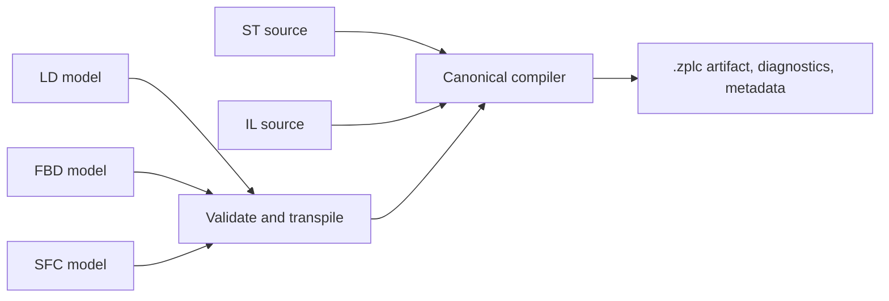

# Compiler Workflow

ZPLC uses a canonical compiler path for source and supported visual models.

## Quick path

1. Compile the folder-backed project.
2. Read diagnostics and the produced artifact identity.
3. Run temporal tests and native POSIX simulation against that artifact.
4. Only then consider the separate human hardware flow.

## Pipeline

```mermaid
flowchart LR
  ST[ST source] --> Compile[Canonical compiler]
  IL[IL source] --> Compile
  LD[LD model] --> Transpile[Validate and transpile]
  FBD[FBD model] --> Transpile
  SFC[SFC model] --> Transpile
  Transpile --> Compile
  Compile --> Artifact[.zplc artifact, diagnostics, metadata]
```

## Scope, not parity promise

The same backend is useful only for features accepted by the relevant editor,
transpiler, and compiler contracts. It does not establish universal language
parity, runtime parity, or identical debug behavior. Use the compiler output
and scenario result for the exact project as the evidence.

## Artifact boundary

The artifact is verified before runtime loading. A successful host compile does
not prove a board can flash, restore, meet timing, or drive an output. Those
