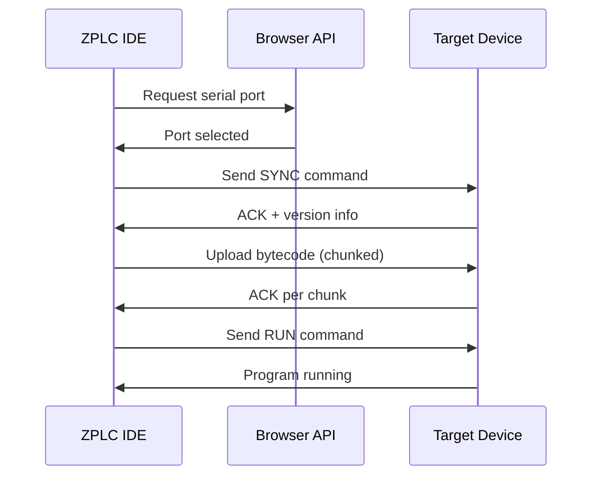
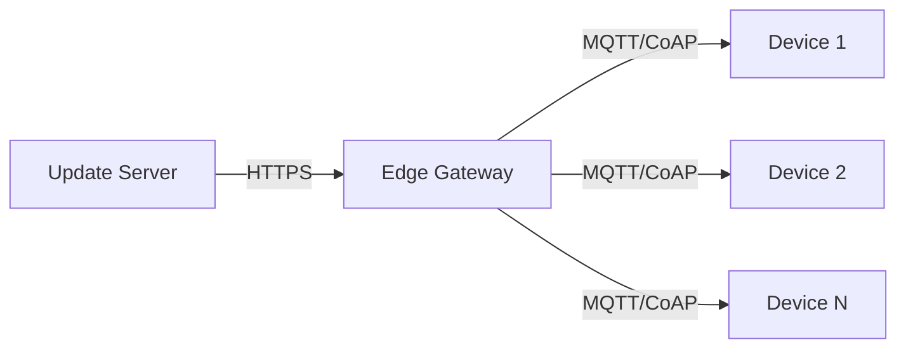

# Deployment

This guide covers how to deploy your compiled ZPLC program to target hardware.

## Deployment Methods

ZPLC supports multiple deployment methods depending on your target platform and connectivity:

| Method | Connection | Use Case |
|--------|------------|----------|
| WebSerial | USB | Direct connection from browser |
| Network | TCP/IP | Remote deployment over LAN/WAN |
| File Transfer | SD Card/USB | Offline deployment |
| OTA | WiFi/Cellular | Field updates |

---

## WebSerial Deployment

The most common method for development. Requires a Chromium-based browser (Chrome, Edge, Brave).

### Prerequisites

1. Target hardware connected via USB
2. Appropriate USB drivers installed (if needed)
3. ZPLC runtime flashed to the device

### Steps

1. **Compile your program** (F5 or Build button)
2. Click **Deploy** in the IDE toolbar
3. Select **Serial Port** when prompted
4. Choose the correct COM port
5. Wait for upload confirmation



### Serial Protocol

The upload uses a simple ACK-based protocol:

| Command | Byte | Description |
|---------|------|-------------|
| SYNC | `0x55` | Synchronization |
| UPLOAD | `0x01` | Start upload |
| CHUNK | `0x02` | Data chunk (256 bytes) |
| RUN | `0x03` | Start execution |
| STOP | `0x04` | Stop execution |
| ACK | `0x06` | Acknowledgment |
| NAK | `0x15` | Error/retry |

### Baud Rate

Default: **115200 bps** (configurable in device settings)

---

## Network Deployment

For devices with Ethernet or WiFi connectivity.

### Prerequisites

1. Device connected to network
2. Known IP address or hostname
3. Port 5000 open (default ZPLC debug port)

### Steps

1. **Compile your program**
2. Click **Deploy** → **Network**
3. Enter device IP address and port
4. Authenticate if required
5. Upload and run

### Security Considerations

- Use TLS for production deployments
- Enable authentication on the debug protocol
- Restrict access via firewall rules

---

## File-Based Deployment

For offline or air-gapped systems.

### Export Binary

1. Compile your program
2. Click **Export** → **Binary (.zplc)**
3. Save to removable media

### Load on Device

**Option A: SD Card**
1. Copy `.zplc` file to SD card root
2. Insert into device
3. Device auto-loads on boot (if configured)

**Option B: USB Mass Storage**
1. Connect device in bootloader mode
2. Device appears as USB drive
3. Copy `.zplc` to the drive
4. Eject and reset device

**Option C: Shell Command**
```bash
zplc load /path/to/program.zplc
zplc run
```

---

## OTA (Over-the-Air) Updates

For deployed field devices with network connectivity.

### Architecture



### Update Process

1. New binary uploaded to update server
2. Server notifies devices of available update
3. Device downloads binary in background
4. Integrity check (CRC32 + signature verification)
5. Device schedules restart at safe time
6. New program loads after reboot

### Rollback

If the new program fails to start:
1. Watchdog triggers after timeout
2. Bootloader restores previous version
3. Device reports rollback to server

---

## Deployment Verification

After deploying, verify the program is running correctly:

### Status Check

In the IDE, the status bar shows:
- **Connected**: Communication established
- **Running**: Program executing
- **Cycle Time**: Current scan time
- **Errors**: Any runtime errors

### Variable Watch

1. Open the **Watch** panel
2. Add variables to monitor
3. Verify values update in real-time

### Diagnostic Commands

Via serial shell:
```bash
zplc status      # Show runtime status
zplc stats       # Show cycle timing statistics
zplc vars        # List all variables
zplc watch VAR   # Continuously print variable value
```

---

## Troubleshooting

### Serial Port Not Found

- Check USB cable connection
- Verify drivers are installed
- Try a different USB port
- Check if another application is using the port

### Upload Fails

- Reduce baud rate to 9600 and retry
- Check for firmware version compatibility
- Ensure sufficient flash space on device
- Verify CRC matches after upload

### Program Doesn't Run

- Check for runtime errors in console
- Verify I/O configuration matches hardware
- Ensure all required function blocks are available
- Check memory usage doesn't exceed limits

### Network Connection Refused

- Verify IP address is correct
- Check firewall settings
- Ensure device is not in fault state
- Verify authentication credentials
