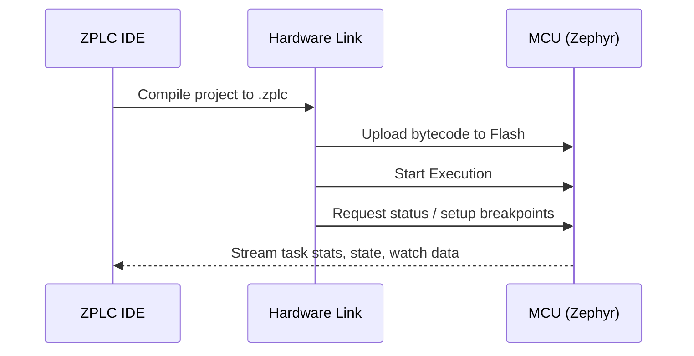

# Deployment & Runtime Sessions

This page covers the workflow for deploying and debugging logic from the ZPLC IDE to active runtimes.

## Execution Targets

ZPLC offers two primary execution execution environments:

| Target | Adapter Used | Typical Use |
|---|---|---|
| **Native SoftPLC Simulation** | `NativeAdapter` | Validating automation logic locally on your PC. |
| **Physical Controller** | `SerialAdapter` | Uploading, running, and debugging directly on Zephyr hardware. |

## Desktop Simulation Workflow

When running the ZPLC IDE as a desktop application, clicking **Start Simulation** spins up a native POSIX SoftPLC process in the background. The IDE connects to this process via an internal bridge, allowing you to debug your IEC 61131-3 logic instantly without needing to flash a microcontroller or wire up physical components.

This is the fastest way to validate timers, logic flows, state machines, and mathematical formulas.

## Hardware Deployment Workflow

When moving to production, the `SerialAdapter` manages the physical connection to your microcontroller over USB Serial.

Its responsibilities include:
- Managing baud rates, connections, and port discovery.
- Compiling the project and transmitting the raw `.zplc` bytecode to the board's flash memory.
- Provisioning runtime configuration details.
- Polling the board to stream real-time watch variables, cycle statistics, and debug information back to the IDE.
- Forwarding user interactions (e.g., pause, step, force value) to the embedded runtime.

### The Deployment Lifecycle

```mermaid
sequenceDiagram
  participant IDE as ZPLC IDE
  participant Adapter as Hardware Link
  participant Device as MCU (Zephyr)

  IDE->>Adapter: Compile project to .zplc
  Adapter->>Device: Upload bytecode to Flash
  Adapter->>Device: Start Execution
  Adapter->>Device: Request status / setup breakpoints
  Device-->>IDE: Stream task stats, state, watch data
```

## Troubleshooting Deployments

When a deploy or debug session fails to connect to hardware, check the following:
1. **Target Verification** — Ensure the selected board in `zplc.json` matches the physical MCU plugged into your computer.
2. **Serial Port** — Verify that the correct COM/TTY port is selected and that no other terminal programs are blocking access.
3. **Firmware Base** — Ensure the MCU has been flashed with the underlying ZPLC Zephyr firmware before attempting to upload bytecode from the IDE.
