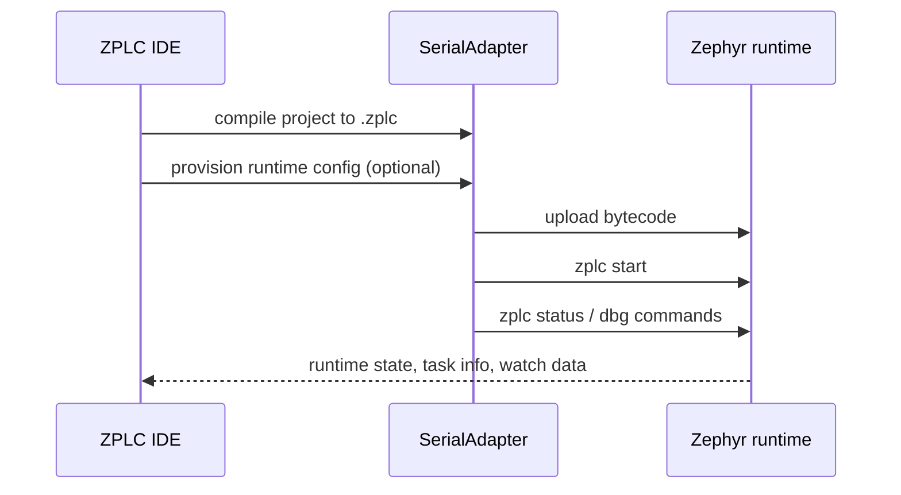

# Deployment & Runtime Sessions

This page covers the real deployment-facing surfaces exposed by the IDE in v1.5.0.

## Three practical execution targets

| Target | Primary adapter | Typical use |
|---|---|---|
| WASM simulation | `WASMAdapter` | quick browser-side validation |
| Native desktop simulation | `NativeAdapter` | release-facing host runtime debugging |
| Physical controller | `SerialAdapter` | upload, run, inspect, and debug on Zephyr hardware |

## Native desktop workflow

The desktop application is the only IDE surface that can expose the Electron native simulation bridge.

Repository evidence for that path includes:

- Electron build scripts in `packages/zplc-ide/package.json`
- preload/main bridge types in `packages/zplc-ide/src/types/index.ts`
- native runtime session handling in `packages/zplc-ide/src/runtime/nativeAdapter.ts`

In other words: desktop is not just a wrapper around the browser UI. It unlocks the native runtime simulation path.

## Browser workflow

The browser path remains important for:

- File System Access API projects when the browser supports it
- quick simulation through the WASM runtime
- serial/WebSerial hardware sessions where the browser and operator environment allow it

But the browser path is **not** a substitute for desktop evidence when a release gate explicitly requires desktop validation.

## Hardware deployment path

The hardware-oriented adapter is `SerialAdapter`.

Its responsibilities include:

- serial connection management
- bytecode upload through `uploadBytecode(...)`
- project configuration provisioning
- polling runtime status and reading debug information
- issuing runtime commands such as pause, resume, step, peek, poke, and force operations

## Serial deployment lifecycle

```mermaid
sequenceDiagram
  participant IDE as ZPLC IDE
  participant Adapter as SerialAdapter
  participant Device as Zephyr runtime

  IDE->>Adapter: compile project to .zplc
  IDE->>Adapter: provision runtime config (optional)
  Adapter->>Device: upload bytecode
  Adapter->>Device: zplc start
  Adapter->>Device: zplc status / dbg commands
  Device-->>IDE: runtime state, task info, watch data
```

## Board-aware configuration before deploy

The IDE uses the supported-board manifest to understand whether a board is:

- serial-focused
- Wi-Fi capable
- Ethernet capable

That board awareness feeds:

- target selection in project settings
- network configuration shape
- communication expectations for Modbus and MQTT pages

## Release boundary for deployment claims

Deployment claims in v1.5 are only credible when all of these agree:

1. the board exists in `supported-boards.v1.5.0.json`
2. the IDE exposes a matching configuration/runtime path
3. the runtime actually supports the claimed flow
4. the release evidence gate for that surface is not still pending human validation

That is why the docs distinguish between:

- **implemented engineering surfaces** in the repo
- **final sign-off evidence** still tracked in the release matrix

## Useful runtime-side commands surfaced by the IDE/hardware flow

The Zephyr runtime README documents the shell contract the IDE depends on:

- `zplc start`, `zplc stop`, `zplc reset`, `zplc status`
- `zplc dbg pause`, `resume`, `step`, `peek`, `poke`, `info`, `watch`
- `zplc sched status`, `zplc sched tasks`
- `zplc persist info`, `zplc persist clear`

## Troubleshooting priorities

When a deploy or debug session fails, check in this order:

1. **target truth** — selected board matches the supported-board manifest
2. **project truth** — `zplc.json` task, I/O, network, and communication settings are sane
3. **adapter truth** — are you using WASM, native simulation, or serial hardware?
4. **release truth** — is the missing behavior actually signed off, or still pending?
