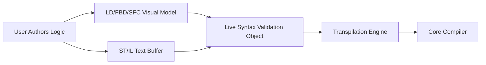

# Visual and Text Editors

The ZPLC IDE provides dedicated, high-performance editors for all supported IEC 61131-3 languages, bridging the gap between traditional electrical models and modern textual programming.

## Text-Based Editors

For developers comfortable with code, the IDE provides a robust text editor tailored for:
- **Structured Text (ST)**
- **Instruction List (IL)**

These editors feature real-time syntax highlighting, autocompletion for standard library functions, and inline error validation that connects directly to the compiler's diagnostic engine.

## Visual Model Editors

For automation engineers accustomed to graphical design, ZPLC provides intuitive drag-and-drop model editors for:
- **Ladder Diagram (LD)**
- **Function Block Diagram (FBD)**
- **Sequential Function Chart (SFC)**

These are not just drawing tools. The visual editors maintain strict semantic models of your circuits, states, and flows. 

When you click "Compile", the IDE automatically transpiles these visual models into underlying Structured Text (ST) before generating bytecode. This guarantees that your visual logic behaves exactly like textual code.

## Unified Editor Architecture

### Ladder Diagram (LD)
The LD editor allows you to construct logic using classic relay paradigms (Contacts, Coils). The editor natively understands rung topology and symbol bindings, ensuring variables map correctly during the compilation phase.

### Function Block Diagram (FBD)
The FBD editor supports block placement and node wiring. It acts as the orchestration layer for instancing Standard Library blocks (`TON`, `CTU`, etc.) and wiring them against global or local variables. 

### Sequential Function Chart (SFC)
The SFC editor models state machines via Steps, Transitions, and Action bodies. This allows machine builders to visually orchestrate complex, multi-stage sequences while letting the runtime handle the underlying step tracking smoothly.

## Standardized Integration

No matter which editor you prefer, they all interact deeply with the IDE's core features:
- **Unified Variables**: A tag created in an LD diagram can be seamlessly referenced in a separate ST program.
- **Offline Project Model**: All files are saved predictably to disk.
- **Online Debugging**: The visual editors animate during simulation or hardware debugging, highlighting active paths and displaying live variable values directly on the diagrams.
