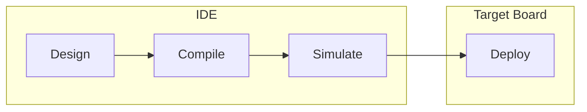

# ZPLC IDE: Engineering Environment

The ZPLC IDE is a modern, high-performance engineering environment designed for industrial automation professionals. Unlike traditional heavyweight PLCs, ZPLC is built on modern web technologies (TypeScript/React) and delivered as a **Native Desktop Application** for Windows, macOS, and Linux.

## Core Editions

While the **Desktop App (Electron)** is the primary tool for production engineering, a **Web Edition** is available for rapid simulation and testing without installation.

| Feature | Desktop App (Recommended) | Web App (Alternative) |
|---|---|---|
| **OS** | Windows, macOS, Linux | Chrome / Edge |
| **I/O Access** | Native Serial (Node-Serial) | WebSerial API |
| **Files** | Local File System (Git-friendly) | Browser Sandbox |
| **Determinism** | High-performance Electron Shell | Browser Threading |

## Key Features

- **Unified Engineering**: Write in ST, parity with visual LD/FBD/SFC in the same project.
- **Git-Native Persistence**: Every project is a simple folder with `zplc.json`. No proprietary binary blobs—version control works exactly as it should.
- **Hardware Agnostic**: Transpile to portable bytecode. Deploy to an ESP32 or a High-End Industrial PC without changing a line of code.
- **WASM High-Speed Simulation**: Test cycle-accurate logic instantly using a WebAssembly version of the C runtime.
- **Live Diagnostics**: Remote variable monitoring, force injection, and cycle jitter analysis via the Debug Protocol.

## Engineering Workflow

1.  **Design**: Compose logic using visual editors or Structured Text.
2.  **Compile**: Transpile into `.zplc` bytecode with static analysis.
3.  **Simulate**: Run on the WASM engine to verify logic and state machines.
4.  **Deploy**: Upload to physical hardware via Serial/USB or Network (v1.5).
