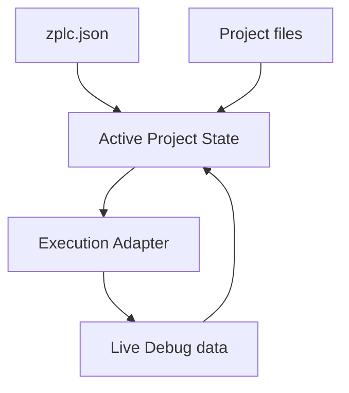

# IDE Architecture & Project Model

The ZPLC IDE relies on a strict separation of concerns to provide a highly responsive, modern development experience.

## Package Boundaries

The ZPLC tooling is divided into two distinct logical areas under the hood:
- **`@zplc/ide`** — The user interface, project state management, code editors, simulation adapters, and deployment flows.
- **`@zplc/compiler`** — The underlying engine handling parsing, transpilation of visual languages to ST, bytecode emission, standard library resolution, and debug-map generation.

This separation ensures the compiler can be run headlessly in CI/CD pipelines while the IDE handles the visual orchestration.

## Application State Model

The IDE uses a robust, reactive state architecture internally to manage complex industrial projects smoothly.

```mermaid
flowchart TD
  Config[zplc.json]
  Files[Project files]
  Store[Active Project State]
  Runtime[Execution Adapter]
  Debug[Live Debug data]

  Config --> Store
  Files --> Store
  Store --> Runtime
  Runtime --> Debug
  Debug --> Store
```

## Project Configuration: `zplc.json`

The `zplc.json` file is the heart of any ZPLC project. It declaratively defines the entire automation scope:

- `target` — Hardware board selection, CPU, and required clock constraints.
- `network` — Wi-Fi credentials or Ethernet IP settings.
- `io` — Hardcoded mappings between physical pins and logical variables.
- `communication` — MQTT broker settings, Modbus node IDs, and tag routing.
- `tasks` — Declaration of Cyclic/Event tasks, interval speeds, priorities, and bound executable programs.

## Contextual Project Editing

The IDE can handle projects across multiple environments:
- **Local Directory Mode**: Reads and writes files directly to your hard drive (typical desktop workflow).
- **Virtual / Memory Mode**: Allows testing code snippets, viewing examples, and interacting with ZPLC in environments without a filesystem.

## Target Auto-Awareness

When you select a hardware target in the project settings, the IDE automatically imports the board's capability manifest. 
This means you cannot accidentally assign Ethernet configurations to a Serial-only Arduino board, or map an ESP32-S3 pin that doesn't exist. All I/O and networking options are dynamically filtered to match real hardware specifications.
