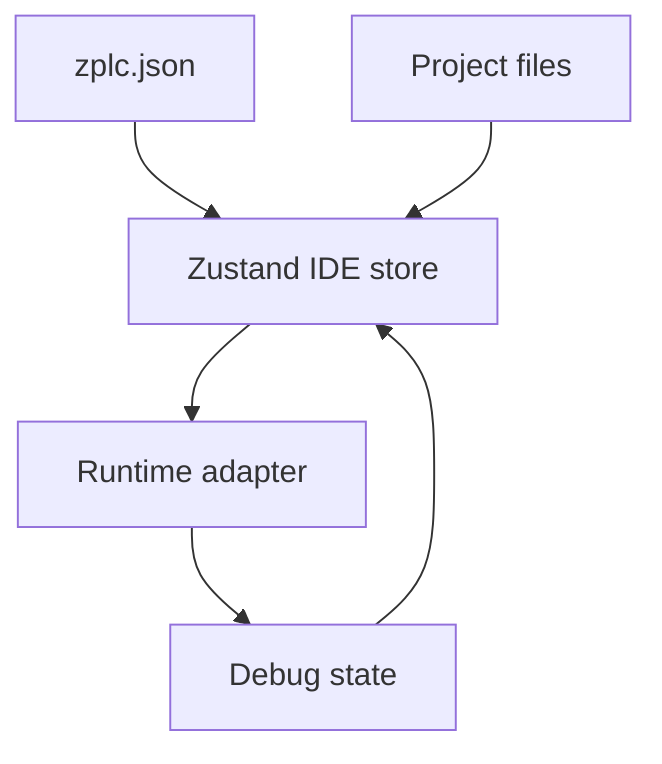
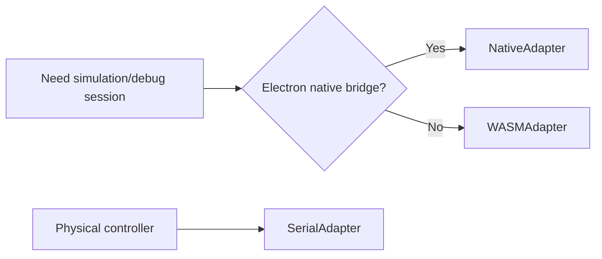

# IDE Architecture & Project Model

This page explains how the IDE is structured today, using repository sources rather than marketing language.

## Package boundaries

The active implementation is split across two main packages:

- `packages/zplc-ide` — UI, project state, editor surfaces, runtime adapters, deployment flows
- `packages/zplc-compiler` — parser, transpilers, bytecode generation, stdlib registry, debug-map generation

That split is important: the IDE is the orchestration layer, while the compiler and runtime define the executable contract.

## Project state model

`useIDEStore.ts` shows the real working model used by the application.

```mermaid
flowchart TD
  Config[zplc.json]
  Files[Project files]
  Store[Zustand IDE store]
  Runtime[Runtime adapter]
  Debug[Debug state]

  Config --> Store
  Files --> Store
  Store --> Runtime
  Runtime --> Debug
  Debug --> Store
```

The store keeps:

- loaded project files and open tabs
- current connection state
- controller/runtime status
- debug map, breakpoints, watch variables, and forced values
- editor layout and UI state

## What lives in `zplc.json`

The shared project types define the public project configuration shape.

High-value sections for v1.5:

- `target` — selected board, CPU, optional clock metadata
- `network` — Wi-Fi or Ethernet configuration when the board profile supports it
- `io` — mapped inputs and outputs
- `communication` — MQTT, Modbus, and tag/binding metadata
- `tasks` — IEC task configuration and assigned program list

That makes the IDE project model portable, git-friendly, and inspectable.

## Browser, desktop, and virtual projects

The IDE supports three practical project contexts:

| Context | Backing behavior | Why it exists |
|---|---|---|
| Real folder project | File System Access API | persistent browser editing against a real directory |
| Virtual/example project | in-memory state | fallback for unsupported browsers and bundled examples |
| Desktop project | Electron + local filesystem | strongest release-facing engineering workflow |

## Target awareness from the board manifest

`packages/zplc-ide/src/config/boardProfiles.ts` imports
`firmware/app/boards/supported-boards.v1.5.0.json` directly.

That means target selection, board labels, and network capabilities in the IDE are supposed to stay aligned with the supported-board manifest instead of drifting into a second handwritten source.

## Runtime session model

The runtime integration layer currently exports three major adapters:

- `WASMAdapter`
- `NativeAdapter`
- `SerialAdapter`

And the runtime factory chooses between them like this:

```mermaid
flowchart LR
  Start[Need simulation/debug session]
  Start --> Check{Electron native bridge?}
  Check -->|Yes| Native[NativeAdapter]
  Check -->|No| Wasm[WASMAdapter]
  Hardware[Physical controller] --> Serial[SerialAdapter]
```

## Capability-aware debugging

The IDE does not assume every session can do everything equally well.

- native sessions expose a **capability profile**
- hardware sessions derive state from runtime status and shell/debug commands
- legacy WASM sessions expose degraded capability metadata for pause/resume/step/breakpoints

This is the right architectural stance for an industrial tool: be explicit about what is authoritative.

## Where to look next

- [Visual and Text Editors](./editors.md)
- [Compiler Workflow](./compiler.md)
- [Deployment & Runtime Sessions](./deployment.md)
