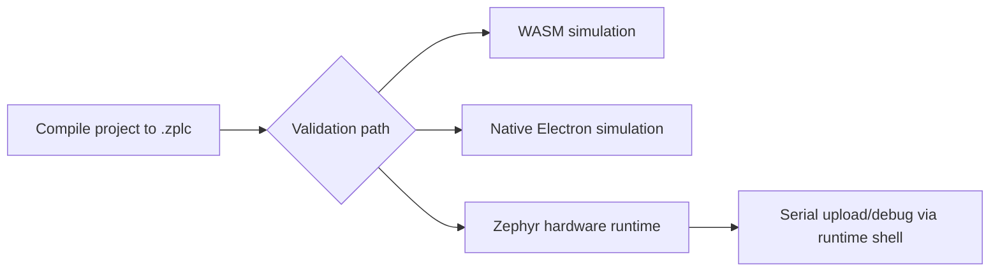

# Integration & Deployment

This page connects the quickstart story to the real runtime integration story.

It answers one practical question: once you have a `.zplc` program, how does it move into an
actual runtime target without pretending unsupported boards or transports are already release-ready?

## Platform Support

ZPLC remains portable, but v1.5 support claims are intentionally narrower than “anything
Zephyr can build.”

Use the supported-board manifest and reference pages for the actual v1.5 claim set.

## Integration flow

## Embedding ZPLC

Integrating ZPLC into a custom Zephyr board involves:

1.  **Including the Library**: Add `libzplc_core` to your CMake build.
2.  **Implementing the HAL**: Provide specific implementations for the required hardware interfaces (`zplc_hal_*`) defined in `docs/docs/runtime/hal-contract.md`.
3.  **Initializing the Core**: Call the initialization functions from your Zephyr `main()` application.

For the reference runtime shipped by this repository, you do not start from scratch. You start
from `firmware/app`, which already packages the core, scheduler, shell workflow, persistence
support, and board-specific configuration assets.

## Deployment Workflows

Once the runtime is embedded on a device, deploying logic is managed via the IDE:

1.  **Serial Deployment**: For local development, the IDE can transfer compiled `.zplc` files directly over a serial connection when the selected board/runtime path exposes that serial flow.
2.  **Network Deployment**: Treat network-oriented deployment as board- and evidence-specific, not as a blanket v1.5 promise for every target.

More concretely, the current repo truth says:

- browser/hardware connection uses the serial adapter / WebSerial flow
- Electron desktop adds a native simulation bridge, not a magical new hardware transport contract
- hardware runtime program management and debug control are exposed through the Zephyr shell commands documented in `firmware/app/README.md`

*Note: For detailed HAL implementation guides, refer to the [Runtime Documentation](../runtime/index.md).*

## Truth Rule for Integrators

If a board, transport, or deployment path is not present in the release evidence and the
supported-board list, treat it as out of scope for v1.5.

## Protocol Configuration Expectations

- use MQTT only on boards whose supported profile exposes a real network workflow;
- use Modbus TCP only when the board profile and runtime support network transport;
- use Modbus RTU only when the target board and firmware expose the required serial path;
- keep protocol docs, project settings, and release evidence aligned.

Representative human HIL proof for serial and network paths is still tracked outside the public claim set.

## Flashing and board-specific reality

Build commands are canonicalized in the supported-board manifest. Flashing is still board-specific.

- many boards can use `west flash`
- RP2040-class targets may require copying a generated UF2 artifact to the board volume

That is why the docs split the responsibilities:

- [Supported Boards](../reference/boards.md) owns board facts and support assets
- [Zephyr Workspace Setup](../reference/zephyr-workspace-setup.md) owns the canonical workspace/build shape
- this page owns the handoff between project output and runtime target
