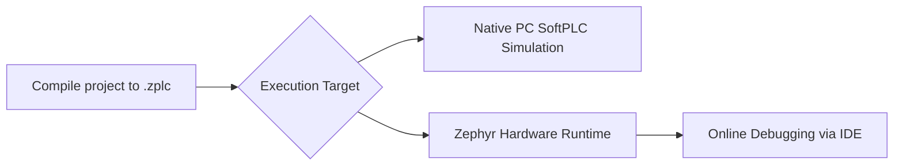

# Integration & Deployment

This page outlines the processes for migrating functional ZPLC applications into real-world Zephyr hardware targets, addressing both standard deployments and deep custom OEM integrations.

## Target Execution

Once the compiler emits a `.zplc` bytecode payload, it is routed immediately to the selected execution target:

## Integrating ZPLC into Custom Firmwares

If you are manufacturing custom hardware or using a board not built into the standard ZPLC Zephyr images, you must embed the ZPLC core manually. Integrating ZPLC into a proprietary Zephyr setup involves:

1. **Including the Core Library**: Link the ZPLC C99 Engine to your CMake build tree.
2. **Implementing the HAL Contract**: Supply concrete C functions for `zplc_hal_tick`, `zplc_hal_io_read`, etc. specific to your target's GPIO layout and driver framework. 
3. **Starting the Scheduler**: Call `zplc_scheduler_init()` and register an execution loop within your Zephyr `main()` thread.

By conforming to the HAL, you can port ZPLC onto virtually any microcontroller supporting POSIX or Zephyr footprints.

## Protocol Capabilities

When deploying automation logic across networks, ensure your hardware platform supports the underlying physical layers:

- **MQTT**: Requires a board manifesting an active Wi-Fi or Ethernet stack in Zephyr.
- **Modbus TCP**: Operates seamlessly over standard Ethernet sockets.
- **Modbus RTU**: Requires at least one capable UART/RS-485 transceiver physically implemented on the board.

Because ZPLC handles the protocol logic abstractly inside the VM engine, configuration across different MCU families relies solely on matching the appropriate HAL I/O paths internally.

## Flashing the Hardware

To bootstrap a new microcontroller, you must flash the core ZPLC Zephyr firmware before the IDE can safely transmit `.zplc` bytecode over serial. 

Generally speaking, ZPLC leans on standardized Zephyr flash processes:
- Many ARM-based boards accept direct ST-Link or J-Link flashing via `west flash`.
- Standard development boards (like ESP32) can flash natively over USB.
- Custom RP2040 pipelines may specify dragging UF2 generated binaries to mounted storage drives.
