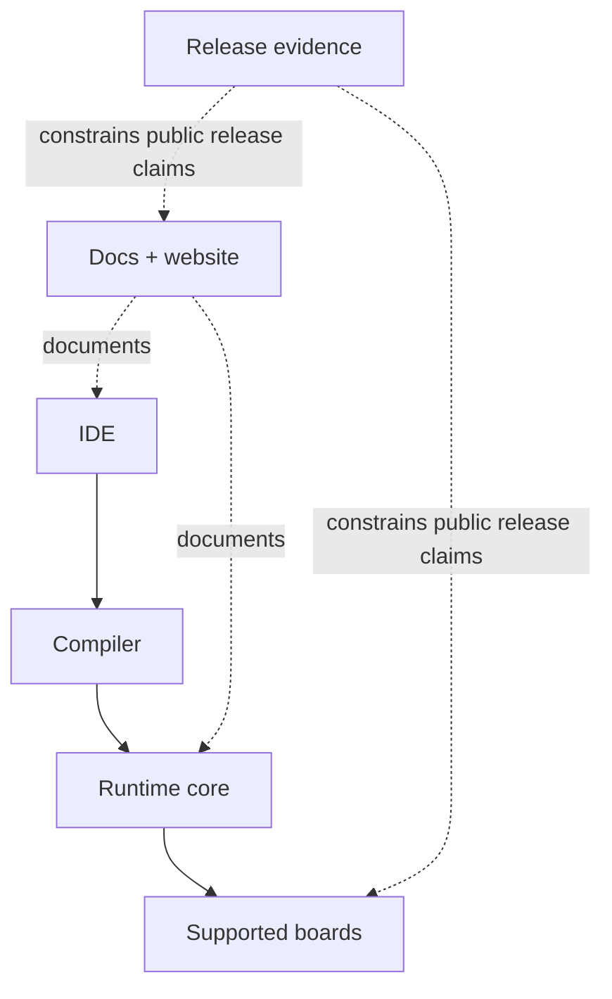

# Platform Overview

ZPLC (Zephyr PLC) is a deterministic IEC 61131-3-oriented platform that combines a portable
execution core with a modern engineering toolchain.

For v1.5.0, the important mindset is simple: ZPLC is not just “a VM” and not just “an IDE”.
It is the combined system of docs, compiler, IDE, runtime, board support, and release evidence.

## Product map

## Core Concepts

- **Determinism**: Predictable execution time is non-negotiable. The runtime remains
  bounded, static-memory, and task-oriented.
- **Portability**: One execution core, multiple runtimes. The VM stays separated from the
  platform through a strict HAL contract.
- **Truthful scope**: v1.5 only claims what the repository, docs, CI, and human evidence
  can actually prove.
- **Modern engineering workflow**: IDE, compiler, CI, and docs are treated as one product
  surface instead of disconnected demos.

## Product Boundaries

ZPLC consists of several distinct subsystems:

1.  **Core VM (`firmware/lib/zplc_core`)**: The C99 bytecode interpreter. It handles scheduling, task management, and executing the compiled logic. It has zero dependencies on specific hardware.
2.  **Hardware Abstraction Layer (HAL)**: The contract that allows the Core VM to run on various targets (e.g., STM32, ESP32, POSIX).
3.  **Compiler (`packages/zplc-compiler`)**: Translates IEC language paths into `.zplc`
    bytecode.
4.  **IDE (`packages/zplc-ide`)**: Authoring, compiling, simulation, deployment, and
    debugging for the claimed language workflows.
5.  **Target Runtimes**: Specific firmware builds that combine the Core VM, a HAL implementation, and an RTOS (usually Zephyr).

## How users move through the platform

The highest-value user path is usually:

1. understand the release-facing boundaries in docs
2. create or open a `zplc.json` project in the IDE
3. author logic in one of the supported language workflows
4. compile to `.zplc`
5. validate in WASM or native simulation
6. move to supported hardware when hardware proof is needed

## v1.5 Release Boundaries

The release foundation is considered real only when:

- supported boards come from one canonical manifest;
- claimed language workflows have matching automation and docs;
- protocol features have runtime, compiler, IDE, and docs evidence;
- desktop and HIL claims have human proof, not only code presence.

## Why ZPLC?

Traditional PLCs often lock users into proprietary ecosystems and outdated development tools. ZPLC provides an open, modern alternative that leverages standard microcontrollers while adhering to the established IEC 61131-3 standard for automation logic.

## Continue with

- [Getting Started](../getting-started/index.md)
- [System Architecture](../architecture/index.md)
- [Runtime Overview](../runtime/index.md)
- [Integration & Deployment](../integration/index.md)
