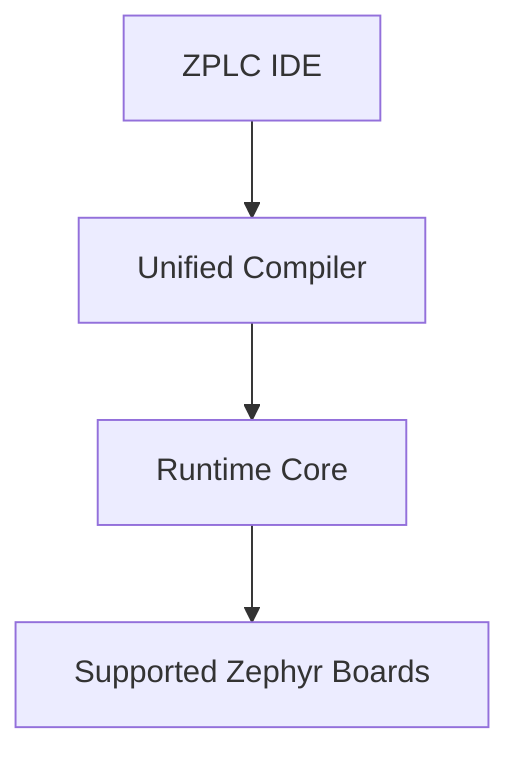

# Platform Overview

ZPLC (Zephyr PLC) is a deterministic IEC 61131-3 compatible logical platform that combines a portable execution core written in C99 with a modern, browser/desktop-based engineering toolchain.

## The ZPLC Ecosystem

ZPLC represents a full suite of tightly integrated automation tooling ranging from high-level visual editing down to bare-metal hardware registers.

## Core Principles

- **Determinism**: Predictable execution time is non-negotiable for industrial machinery. The runtime uses bounded, pre-allocated static memory with hard real-time scheduling.
- **Portability**: ZPLC features "One execution core, multiple runtimes." The core VM stays strictly separated from the platform hardware through a strict HAL contract.
- **No Vendor Lock-In**: Because ZPLC leverages standard open-source technologies (Zephyr RTOS), it can run on everything from low-cost ESP32 chips to standard industrial STM32 hardware without exorbitant licensing fees.

## Product Boundaries

The platform consists of several distinct subsystems:

1. **Core VM (`libzplc_core`)**: The C99 bytecode interpreter. It handles multi-task scheduling, logical execution, memory bounds checking, and standards-compliant IEC processing. It has zero dependencies on specific hardware.
2. **Hardware Abstraction Layer (HAL)**: The mapping contract that allows the Core VM to communicate securely with underlying interfaces: timers, EEPROM/Flash storage, I/O pins, and TCP/UDP networking.
3. **Compiler**: Takes user project files (Structured Text, Ladder Diagram) and translates everything into standard `.zplc` bytecode optimized for embedded space.
4. **IDE**: The graphical user interface responsible for visual code authoring, real-time debugging, online monitoring, forcing variables, and project management.

## Project Workflow

The standard operational path for an automation engineer looks like this:

1. Open the ZPLC IDE and configure a new project target in `zplc.json`.
2. Author your machine logic via Structured Text or graphical diagrams (FBD/LD/SFC).
3. Execute a validation compile to generate `.zplc` code.
4. Launch the Native Simulation to debug mathematical logic and flows directly on your PC.
5. Deploy over USB/Serial to physically wired Zephyr-based microcontrollers, monitoring sensors in real-time.

## Continue With

- [Getting Started](../getting-started/index.md)
- [Language Suite Examples](../languages/examples/v1-5-language-suite.md)
- [System Architecture](../architecture/index.md)
