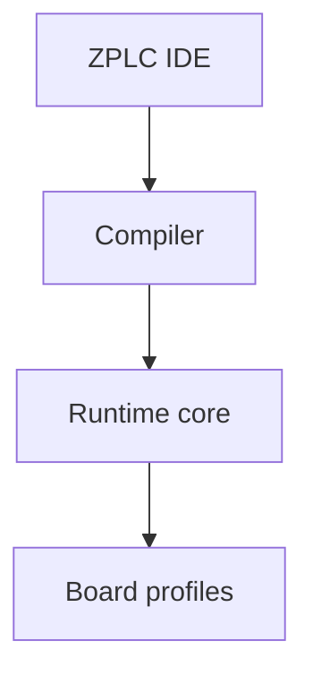

# Platform Overview

ZPLC (Zephyr PLC) combines a portable ANSI C99 execution core with TypeScript engineering tools. Its capabilities are evidence-gated: host simulation, target builds, and HIL results answer different questions.

## The ZPLC ecosystem

```mermaid
flowchart TB
  IDE[ZPLC IDE]
  Compiler[Compiler]
  Runtime[Runtime core]
  Boards[Board profiles]

  IDE --> Compiler
  Compiler --> Runtime
  Runtime --> Boards
```

## Core principles

- **Bounded runtime memory**: the C99 core uses defined memory boundaries; validation remains part of every target profile.
- **HAL separation**: the core and hardware adapters are separate so platform behavior can be inspected and tested independently.
- **Evidence before claims**: scheduler timing, I/O behavior, persistence, protocols, and board support are stated only for the profile/revision with matching evidence.

## Product boundaries

1. **Core VM (`libzplc_core`)**: C99 bytecode interpreter, program validation, runtime state, and scheduler interfaces.
2. **Hardware Abstraction Layer (HAL)**: adapters for platform facilities such as clocks, storage, I/O, and configured transports.
3. **Compiler**: turns supported project workflows—centered on Structured Text—into `.zplc` bytecode.
4. **IDE**: desktop engineering surface for authoring, diagnostics, and capability-aware runtime workflows.

## Typical workflow

1. Select a project target and inspect its board/capability profile.
2. Author logic in a supported language workflow, then compile it to `.zplc`.
3. Use native POSIX simulation for repeatable host-side logical checks within its declared capabilities.
4. Build firmware, flash it, deploy the PLC program, and operate it as separate human actions.
5. Use target or HIL evidence from the exact board/revision before relying on timing or physical behavior.

## Continue with

- [Getting Started](../getting-started/index.md)
- [Language Suite Examples](../languages/examples/v1-5-language-suite.md)
- [System Architecture](../architecture/index.md)
