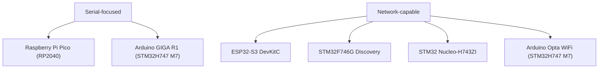

# Supported Boards

> [!IMPORTANT]
> This page is generated from `firmware/app/boards/supported-boards.v1.5.0.json`. Update the JSON or rerun `python3 tools/docs/generate_board_reference.py` instead of editing this file manually.

## Topology

```mermaid
flowchart TD
  serial["Serial-focused"]
  network["Network-capable"]
  b1["Raspberry Pi Pico (RP2040)"]
  serial --> b1
  b2["Arduino GIGA R1 (STM32H747 M7)"]
  serial --> b2
  b3["ESP32-S3 DevKitC"]
  network --> b3
  b4["STM32F746G Discovery"]
  network --> b4
  b5["STM32 Nucleo-H743ZI"]
  network --> b5
  b6["Arduino Opta WiFi (STM32H747 M7)"]
  network --> b6
```

## Board matrix

| Display name | Board ID | IDE ID | Zephyr target | Network | Evidence tier | HIL evidence |
| --- | --- | --- | --- | --- | --- | --- |
| Raspberry Pi Pico (RP2040) | `rpi-pico-rp2040` | `rpi_pico` | `rpi_pico/rp2040` | Serial-focused | cross-build | 0 refs |
| Arduino GIGA R1 (STM32H747 M7) | `arduino-giga-r1-m7` | `arduino_giga_r1` | `arduino_giga_r1/stm32h747xx/m7` | Serial-focused | cross-build | 0 refs |
| ESP32-S3 DevKitC | `esp32-s3-devkitc` | `esp32s3_devkitc` | `esp32s3_devkitc/esp32s3/procpu` | Network-capable (Wi-Fi) | cross-build | 0 refs |
| STM32F746G Discovery | `stm32f746g-disco` | `stm32f746g_disco` | `stm32f746g_disco/stm32f746xx` | Network-capable (Ethernet) | cross-build | 0 refs |
| STM32 Nucleo-H743ZI | `nucleo-h743zi` | `nucleo_h743zi` | `nucleo_h743zi/stm32h743xx` | Network-capable (Ethernet) | cross-build | 0 refs |
| Arduino Opta WiFi (STM32H747 M7) | `arduino-opta-wifi-m7` | `arduino_opta_wifi` | `arduino_opta/stm32h747xx/m7` | Network-capable (Wi-Fi) | cross-build | 0 refs |

## Board details

### Raspberry Pi Pico (RP2040)

- **Board ID:** `rpi-pico-rp2040`
- **IDE ID:** `rpi_pico`
- **Zephyr target:** `rpi_pico/rp2040`
- **Variant:** `rp2040`
- **Network:** Serial-focused
- **Evidence tier:** cross-build
- **HIL evidence:** 0 references
- **Build command:** `west build -b rpi_pico/rp2040 firmware/app --pristine`
- **Reference anchor:** `docs/docs/reference/index.md#supported-boards`
- **Support assets:**
  - `firmware/app/boards/rpi_pico_rp2040.conf`
  - `firmware/app/boards/rpi_pico_rp2040.overlay`

### Arduino GIGA R1 (STM32H747 M7)

- **Board ID:** `arduino-giga-r1-m7`
- **IDE ID:** `arduino_giga_r1`
- **Zephyr target:** `arduino_giga_r1/stm32h747xx/m7`
- **Variant:** `stm32h747xx/m7`
- **Network:** Serial-focused
- **Evidence tier:** cross-build
- **HIL evidence:** 0 references
- **Build command:** `west build -b arduino_giga_r1/stm32h747xx/m7 firmware/app --pristine`
- **Reference anchor:** `docs/docs/reference/index.md#supported-boards`
- **Support assets:**
  - `firmware/app/boards/arduino_giga_r1_stm32h747xx_m7.conf`
  - `firmware/app/boards/arduino_giga_r1_stm32h747xx_m7.overlay`

### ESP32-S3 DevKitC

- **Board ID:** `esp32-s3-devkitc`
- **IDE ID:** `esp32s3_devkitc`
- **Zephyr target:** `esp32s3_devkitc/esp32s3/procpu`
- **Variant:** `esp32s3/procpu`
- **Network:** Network-capable (Wi-Fi)
- **Evidence tier:** cross-build
- **HIL evidence:** 0 references
- **Build command:** `west build -b esp32s3_devkitc/esp32s3/procpu firmware/app --pristine`
- **Reference anchor:** `docs/docs/reference/index.md#supported-boards`
- **Support assets:**
  - `firmware/app/boards/esp32s3_devkitc_esp32s3_procpu.conf`
  - `firmware/app/boards/esp32s3_devkitc_esp32s3_procpu.overlay`

### STM32F746G Discovery

- **Board ID:** `stm32f746g-disco`
- **IDE ID:** `stm32f746g_disco`
- **Zephyr target:** `stm32f746g_disco/stm32f746xx`
- **Variant:** `stm32f746xx`
- **Network:** Network-capable (Ethernet)
- **Evidence tier:** cross-build
- **HIL evidence:** 0 references
- **Build command:** `west build -b stm32f746g_disco/stm32f746xx firmware/app --pristine`
- **Reference anchor:** `docs/docs/reference/index.md#supported-boards`
- **Support assets:**
  - `firmware/app/boards/stm32f746g_disco.conf`
  - `firmware/app/boards/stm32f746g_disco.overlay`

### STM32 Nucleo-H743ZI

- **Board ID:** `nucleo-h743zi`
- **IDE ID:** `nucleo_h743zi`
- **Zephyr target:** `nucleo_h743zi/stm32h743xx`
- **Variant:** `stm32h743xx`
- **Network:** Network-capable (Ethernet)
- **Evidence tier:** cross-build
- **HIL evidence:** 0 references
- **Build command:** `west build -b nucleo_h743zi/stm32h743xx firmware/app --pristine`
- **Reference anchor:** `docs/docs/reference/index.md#supported-boards`
- **Support assets:**
  - `firmware/app/boards/nucleo_h743zi.conf`
  - `firmware/app/boards/nucleo_h743zi.overlay`

### Arduino Opta WiFi (STM32H747 M7)

- **Board ID:** `arduino-opta-wifi-m7`
- **IDE ID:** `arduino_opta_wifi`
- **Zephyr target:** `arduino_opta/stm32h747xx/m7`
- **Variant:** `stm32h747xx/m7`
- **Network:** Network-capable (Wi-Fi)
- **Evidence tier:** cross-build
- **HIL evidence:** 0 references
- **Build command:** `west build -b arduino_opta/stm32h747xx/m7 firmware/app --pristine`
- **Reference anchor:** `docs/docs/reference/index.md#supported-boards`
- **Support assets:**
  - `firmware/app/boards/arduino_opta_stm32h747xx_m7.conf`
  - `firmware/app/boards/arduino_opta_stm32h747xx_m7.overlay`
