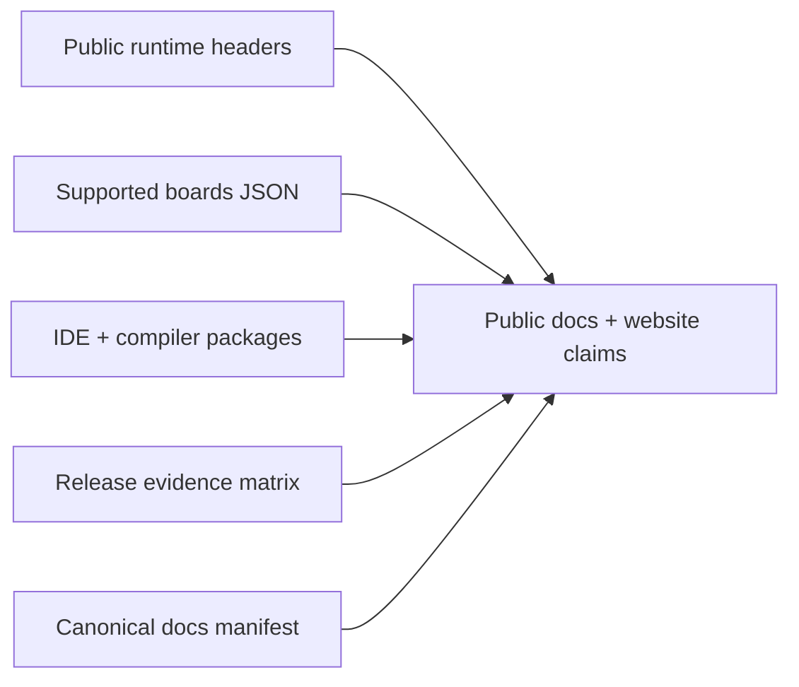

# Source of Truth

This page defines where ZPLC v1.5.0 documentation is allowed to get its facts.

## Claim pipeline

## Canonical sources by claim area

| Claim area | Canonical source | Repository anchors | Primary docs surfaces | Notes |
|---|---|---|---|---|
| Runtime API and memory/scheduler behavior | Public C headers | `firmware/lib/zplc_core/include/zplc_core.h`, `zplc_scheduler.h`, `zplc_hal.h`, `zplc_isa.h`, `zplc_loader.h`, `zplc_debug.h`, `zplc_comm_dispatch.h` | `docs/docs/runtime/*`, `docs/docs/reference/runtime-api.md` | If a runtime behavior is not visible in public headers or verified implementation/evidence, do not claim it in v1.5.0. |
| Supported boards | Canonical board manifest | `firmware/app/boards/supported-boards.v1.5.0.json` | `docs/docs/reference/boards.md`, `docs/docs/reference/index.md`, landing page board section | Board names, IDE IDs, Zephyr targets, network class, and validation level must match the JSON exactly. |
| IDE workflow, language support, and release version | IDE package and exported workflows | `packages/zplc-ide/package.json`, `packages/zplc-ide/src/compiler/index.ts`, `packages/zplc-ide/src/runtime/index.ts` | `docs/docs/ide/*`, `docs/docs/languages/*`, landing page IDE section | Language claims must match what the IDE/compiler packages actually export and test. |
| Release readiness and human-owned gates | Release evidence contract | `specs/008-release-foundation/artifacts/release-evidence-matrix.md` | `docs/docs/release-notes/index.md`, `docs/docs/reference/v1-5-canonical-docs-manifest.md`, `docs/docs/reference/source-of-truth.md` | Docs may describe pending gates, but final release notes must not promote them as complete until evidence exists. |
| Release-blocking page inventory | Canonical docs manifest | `docs/docs/reference/v1-5-canonical-docs-manifest.md` | sidebar IA, docs parity validation, release planning | This file defines which EN/ES pages must exist before sign-off. |

## Header-level mapping

| Header | What it authorizes docs to say |
|---|---|
| `zplc_core.h` | VM instance model, shared/private memory responsibilities, code loading, lifecycle APIs |
| `zplc_scheduler.h` | IEC task model, scheduler states, task statistics, task registration/loading lifecycle |
| `zplc_hal.h` | HAL contract, timing, GPIO/ADC/DAC, persistence, and platform-owned services |
| `zplc_isa.h` | `.zplc` file/version constants, memory layout, stack limits, breakpoint limits, ISA contract |
| `zplc_loader.h` | Loader semantics for `.zplc` binaries and error codes |
| `zplc_comm_dispatch.h` | Communication FB kinds and status vocabulary for Modbus/MQTT/Azure/AWS/Sparkplug integration surfaces |
| `zplc_debug.h` | HIL debug modes, trace protocol, and runtime-controllable debug claims |

## Board claim rules

Use `firmware/app/boards/supported-boards.v1.5.0.json` for all of the following:

- board display names
- IDE IDs
- Zephyr board targets
- support assets
- network class and interface
- validation level

Do not maintain a second handwritten board list on the website.

## IDE and compiler claim rules

Use the following repo anchors when documenting the developer workflow:

- `packages/zplc-ide/package.json` for the published release version and desktop/web scripts
- `packages/zplc-ide/src/compiler/index.ts` for claimed language workflow support (`ST`, `IL`, `LD`, `FBD`, `SFC`)
- `packages/zplc-ide/src/runtime/index.ts` for exported runtime adapters and simulation/runtime integration surfaces

## Release evidence rule

Release notes, board support statements, and workflow claims must be cross-checked against:

- `specs/008-release-foundation/artifacts/release-evidence-matrix.md`

If the evidence matrix says a gate is pending, docs may describe it as pending or blocked — never as complete.

## Update procedure

1. Change the source artifact first.
2. Update or generate the affected docs page.
3. Update the canonical docs manifest if the release-blocking surface changed.
4. Keep English and Spanish pages structurally aligned.
5. Only then update the landing page or release-facing summaries.
