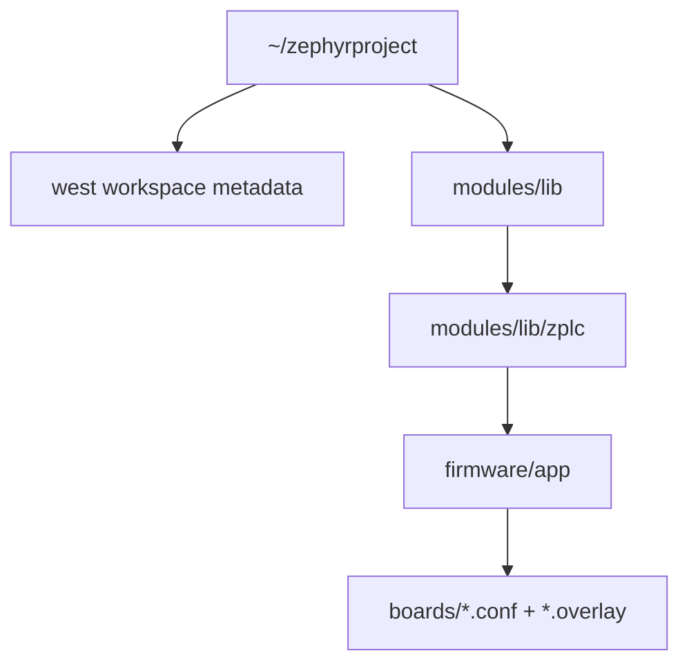

# Zephyr Workspace Setup

This page documents the canonical v1.5 workspace model for building the ZPLC runtime with Zephyr.

Authoritative repo anchors for this page:

- `firmware/app/CMakeLists.txt`
- `firmware/app/README.md`
- `firmware/app/boards/supported-boards.v1.5.0.json`
- `docs/docs/reference/source-of-truth.md`

## What this page is for

Use this setup when you want to build the embedded runtime against Zephyr-supported boards. The canonical board list and per-board build commands come from `firmware/app/boards/supported-boards.v1.5.0.json`.

## Canonical workspace shape



The important detail is simple: the Zephyr application shipped by this repo lives at `firmware/app`.

## Prerequisites

Before building ZPLC firmware, make sure you already have:

1. a Zephyr SDK/toolchain installation
2. `west` available in your environment
3. the Zephyr environment activated so `ZEPHYR_BASE` is set

That environment requirement is not optional: `firmware/app/CMakeLists.txt` calls `find_package(Zephyr REQUIRED HINTS $ENV{ZEPHYR_BASE})`.

## Bootstrap the workspace

Create or reuse a Zephyr workspace, then fetch the Zephyr dependencies:

```bash
west init ~/zephyrproject
cd ~/zephyrproject
west update
```

How you activate the environment depends on your Zephyr installation method. After activation, confirm `west` and the Zephyr toolchain are available before building ZPLC.

## Place ZPLC in the workspace

Add this repository under the workspace module tree:

```text
~/zephyrproject/modules/lib/zplc
```

You can do that either by:

- cloning/copying the repository into `modules/lib/zplc`, or
- adding it to your `west.yml` manifest as a module checkout

## Build from the repository root

Once the repo is located at `~/zephyrproject/modules/lib/zplc`, run the canonical board builds from the ZPLC repository root:

```bash
cd ~/zephyrproject/modules/lib/zplc
west build -b rpi_pico/rp2040 firmware/app --pristine
```

That command shape matches the v1.5 board manifest. Prefer the manifest over older collateral when commands disagree.

## Canonical v1.5 board targets

These are the current release-facing Zephyr targets published by `supported-boards.v1.5.0.json`:

| Board | IDE ID | Zephyr target | Canonical build command |
|---|---|---|---|
| Raspberry Pi Pico (RP2040) | `rpi_pico` | `rpi_pico/rp2040` | `west build -b rpi_pico/rp2040 firmware/app --pristine` |
| Arduino GIGA R1 (STM32H747 M7) | `arduino_giga_r1` | `arduino_giga_r1/stm32h747xx/m7` | `west build -b arduino_giga_r1/stm32h747xx/m7 firmware/app --pristine` |
| ESP32-S3 DevKitC | `esp32s3_devkitc` | `esp32s3_devkitc/esp32s3/procpu` | `west build -b esp32s3_devkitc/esp32s3/procpu firmware/app --pristine` |
| STM32F746G Discovery | `stm32f746g_disco` | `stm32f746g_disco` | `west build -b stm32f746g_disco firmware/app --pristine` |
| STM32 Nucleo-H743ZI | `nucleo_h743zi` | `nucleo_h743zi` | `west build -b nucleo_h743zi firmware/app --pristine` |

## Flashing notes

Build commands are canonicalized in the board manifest. Flash procedures are board-specific:

- many boards can use `west flash`
- RP2040-class UF2 flows may require copying the generated artifact to the board volume

When you need board-specific flash details, pair this page with the board assets listed in the supported-board manifest and with the runtime app README.

## Why this page prefers the board manifest

The docs source-of-truth rule for v1.5 is explicit: supported board claims and public build commands must come from `firmware/app/boards/supported-boards.v1.5.0.json`.

So for release-facing docs:

- use the manifest for board names, IDE IDs, Zephyr targets, and build commands
- use `firmware/app` as the application path
- do not promote older alternate app paths as canonical for v1.5

## Related pages

- [Supported Boards](./boards.md)
- [Source of Truth](./source-of-truth.md)
- [Runtime API](./runtime-api.md)
