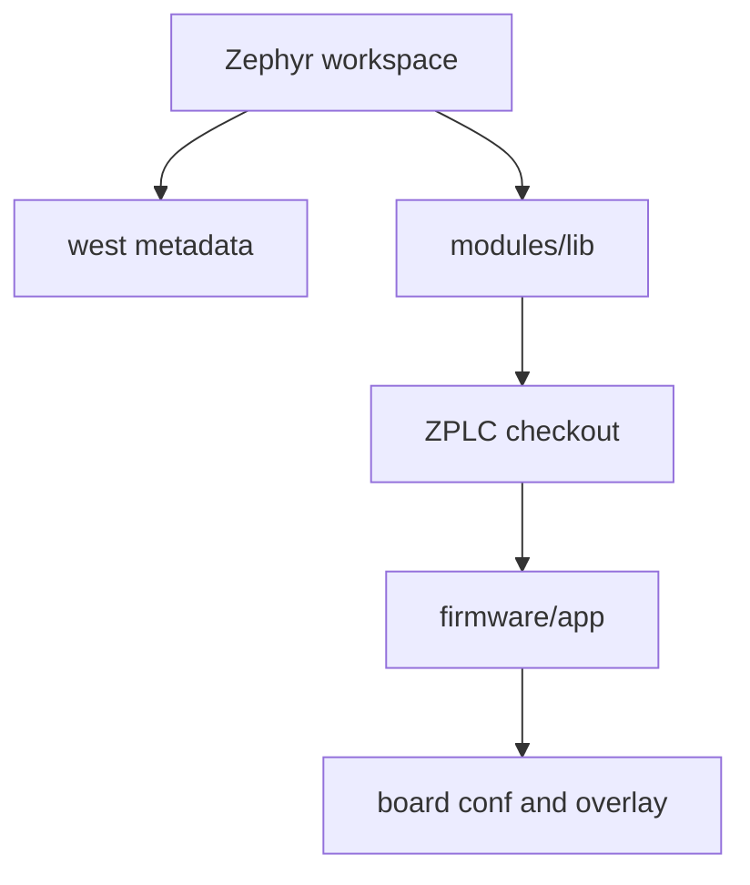

# Zephyr Workspace Setup

Build the embedded runtime from the repository’s pinned Zephyr workspace inputs.
A successful cross-build proves only that the profile builds; it does not prove
flash, boot, I/O, timing, persistence, or HIL behavior.

## Quick path

1. Install the Zephyr SDK/toolchain and make `west` available.
2. Activate the Zephyr environment so `ZEPHYR_BASE` is set.
3. Place ZPLC in the workspace as a module checkout or clone.
4. Run the exact build command from the generated [Board profiles](./boards.md) page.

## Repository anchors

- `west.yml`
- `firmware/app/CMakeLists.txt`
- `firmware/app/README.md`
- `firmware/app/boards/supported-boards.v1.5.0.json` (historical filename)
- [Source of Truth](./source-of-truth.md)

## Workspace shape


```mermaid
flowchart TD
  ROOT[Zephyr workspace]
  ROOT --> WEST[west metadata]
  ROOT --> MODULES[modules/lib]
  MODULES --> ZPLC[ZPLC checkout]
  ZPLC --> APP[firmware/app]
  APP --> BOARDS[board conf and overlay]
```

## Build

After environment activation, invoke the generated profile command from the
repository root. For example:

```bash
west build -b rpi_pico/rp2040 firmware/app --pristine
```

The generated board page is the one current matrix: it contains all six
profiles, their exact targets, build commands, evidence tiers, and HIL-reference
counts. Every current entry is `cross-build` with zero HIL evidence references.

## Flash and recovery boundary

Build, flash, program deploy, and RUN/debug are distinct operations. Use the
exact board/runner procedure before flashing. Do not infer that a cross-build
makes `west flash`, recovery, or program persistence safe on an untested
device. See [Recovery Boundaries](../operations/recovery.md).

## Related pages

- [Board profiles](./boards.md)
- [Capabilities and Evidence](./capabilities-evidence.md)
