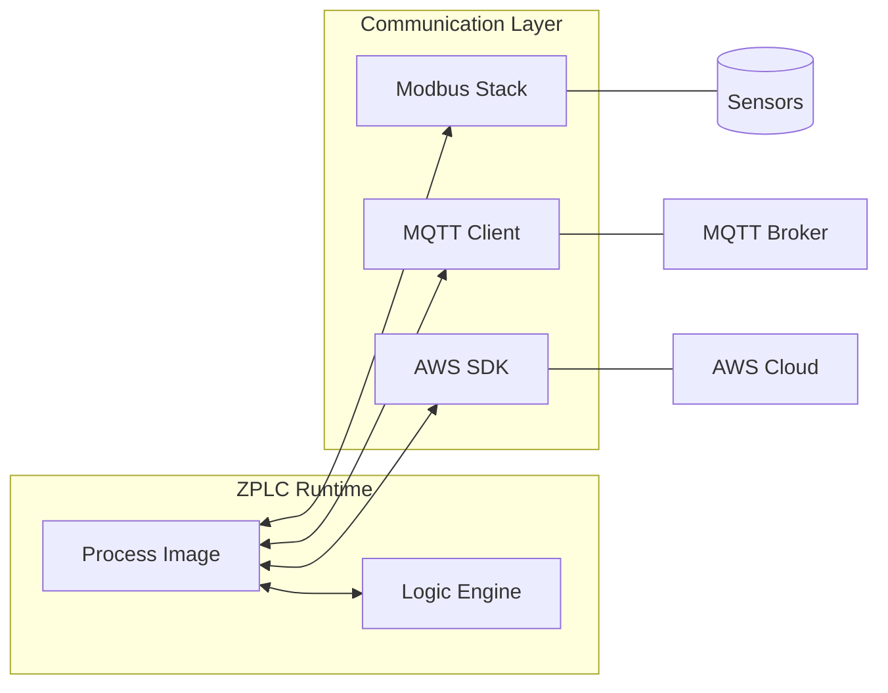

# Industrial Connectivity (Phase 1.5)

Industrial protocols are the nervous system of automation. ZPLC is designed to support the "Standard 3" of modern IIoT and legacy automation: **Modbus**, **MQTT**, and **OPC UA**.

:::important
Connectivity features are currently in **Phase 1.5 Development**. Many of these features require the Native Networking HAL extension.
:::

## 1. Modbus (RTU & TCP)
Modbus is the universal language of industrial devices. ZPLC implements Modbus using the native Zephyr stack for maximum reliability.

*   **Modbus RTU**: RS-485 half-duplex communication for local sensors and VFDs.
*   **Modbus TCP**: High-speed communication over Ethernet.
*   **Mapping**: Variables are tagged in Structured Text or the I/O Map and automatically exposed as Coils or Holding Registers.

```st
VAR
    // @modbus:holding:40001
    MotorSpeed : INT; 
END_VAR
```

## 2. IIoT: MQTT & Sparkplug B
For modern data architectures, ZPLC provides a memory-safe MQTT client.

*   **MQTT v5.0**: Support for user properties and session expiry.
*   **Sparkplug B**: Implements the Eclipse Tahu specification for a Unified Namespace.
*   **Payloads**: Uses `nanopb` for Protobuf encoding, ensuring zero dynamic memory allocation during message construction.

## 3. Cloud Integration: AWS IoT Core
Direct integration with AWS IoT Core via the official Embedded C SDK.

*   **Device Shadows**: Synchronize PLC state with the cloud automatically.
*   **Security**: X.509 certificate-based authentication managed via the ZPLC Shell.

## 4. Connectivity Architecture



## 5. Security & Isolation
To maintain real-time determinism, all connectivity stacks run in low-priority Zephyr threads. Access to the **Process Image** is protected by mutexes, ensuring that a slow network connection never affects the 1ms control loop jitter.
