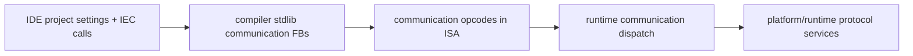

# Connectivity

This page describes the connectivity surface that is visible in the current repo and relevant to the v1.5.0 release.

## Truth sources for connectivity claims

Connectivity claims should be grounded in three places:

- IDE configuration types in `packages/zplc-ide/src/types/index.ts`
- compiler communication stdlib definitions in `packages/zplc-compiler/src/compiler/stdlib/communication.ts`
- runtime communication dispatch vocabulary in `firmware/lib/zplc_core/include/zplc_comm_dispatch.h`

## Board capability boundary

Connectivity is not only a protocol question. It is also a **board capability** question.

The supported-board manifest marks boards as:

- serial-focused with no network interface
- network-capable with Wi-Fi
- network-capable with Ethernet

That board truth is imported directly into the IDE board profiles.

## IDE-facing connectivity configuration

`zplc.json` can currently express configuration for:

- Modbus RTU and Modbus TCP
- MQTT profiles such as Sparkplug B, generic broker, AWS IoT Core, Azure IoT Hub, and Azure Event Grid MQTT
- communication tags/bindings that associate symbols with publish/subscribe/Modbus metadata

That means the IDE surface is broader than the final signed-off release claim.

## Runtime/compiler contract

At the public contract level, communication flows through three layers:

```mermaid
flowchart LR
  IDE[IDE project settings + IEC calls] --> Compiler[compiler stdlib communication FBs]
  Compiler --> ISA[communication opcodes in ISA]
  ISA --> Dispatch[runtime communication dispatch]
  Dispatch --> Services[platform/runtime protocol services]
```

## Modbus and MQTT in release scope

The release evidence matrix currently treats **Modbus RTU/TCP and MQTT product behavior** as the protocol-completion gate under `REL-003`.

That is the honest v1.5 line:

- these protocols are part of the intended release-facing product scope
- the repo contains IDE/compiler/runtime surfaces for them
- final sign-off still depends on matching automated and human evidence

## What to avoid claiming too strongly

The project configuration types already include AWS/Azure-oriented options, and the compiler/runtime surfaces already include cloud-wrapper block names.

That does **not** automatically mean those flows should be marketed as fully signed-off v1.5 capabilities.

If the release evidence gate is still pending, the docs should say so plainly.
