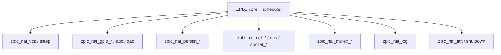

# Hardware Abstraction Layer (HAL) Contract

`firmware/lib/zplc_core/include/zplc_hal.h` is the public contract between the ZPLC core and any concrete platform.

That includes:

- Zephyr targets
- host/POSIX runtimes
- browser/WASM shims
- any future board-specific port

## Core rule

The portable core must not reach directly into platform APIs.

If a behavior belongs to GPIO, timing, persistence, networking, sockets, or synchronization,
the core should consume it through `zplc_hal_*` instead.

## HAL surface by responsibility



## Timing

- `zplc_hal_tick()` supplies the runtime scheduler clock in milliseconds
- `zplc_hal_sleep()` provides blocking sleep for timing control outside logic execution

This is the contract the scheduler depends on for cycle timing and uptime-driven behavior.

## Digital and analog I/O

The current public I/O surface is channel-based:

- `zplc_hal_gpio_read()`
- `zplc_hal_gpio_write()`
- `zplc_hal_adc_read()`
- `zplc_hal_dac_write()`

That means docs should talk about **logical channels** and runtime mappings, not pretend the core owns raw board-pin semantics.

## Persistence

The HAL owns persistence through:

- `zplc_hal_persist_save()`
- `zplc_hal_persist_load()`
- `zplc_hal_persist_delete()`

This is how the portable core can rely on retain/program persistence without being tied to one storage backend.

## Networking and sockets

The public networking-facing HAL surface includes:

- `zplc_hal_net_init()`
- `zplc_hal_net_get_ip()`
- `zplc_hal_dns_resolve()`
- `zplc_hal_socket_connect()`
- `zplc_hal_socket_send()`
- `zplc_hal_socket_recv()`
- `zplc_hal_socket_close()`

This is the correct place to document network responsibility boundaries for Modbus TCP, MQTT,
and related runtime services.

## Synchronization

Because the runtime also exposes shared-memory and multitask behavior, the HAL contract includes mutex primitives:

- `zplc_hal_mutex_create()`
- `zplc_hal_mutex_lock()`
- `zplc_hal_mutex_unlock()`

Those matter when the runtime path needs platform-owned synchronization for safe concurrent access.

## Logging and lifecycle

The public lifecycle endpoints are:

- `zplc_hal_init()`
- `zplc_hal_shutdown()`
- `zplc_hal_log()`

## Practical documentation rule

If a runtime page describes platform behavior that bypasses this header contract, the claim is probably in the wrong layer.

The portable core owns execution semantics. The HAL owns platform integration.

## Related pages

- [Runtime Overview](./index.md)
- [Memory Model](./memory-model.md)
- [Connectivity](./connectivity.md)

```c
#include "zplc_hal.h"
#include <stdio.h>
#include <time.h>

void zplc_hal_init(void) {
    printf("POSIX HAL Initialized.\n");
}

uint64_t zplc_hal_get_time_ms(void) {
    struct timespec ts;
    clock_gettime(CLOCK_MONOTONIC, &ts);
    return (uint64_t)(ts.tv_sec * 1000) + (ts.tv_nsec / 1000000);
}
// ... further implementations
```
