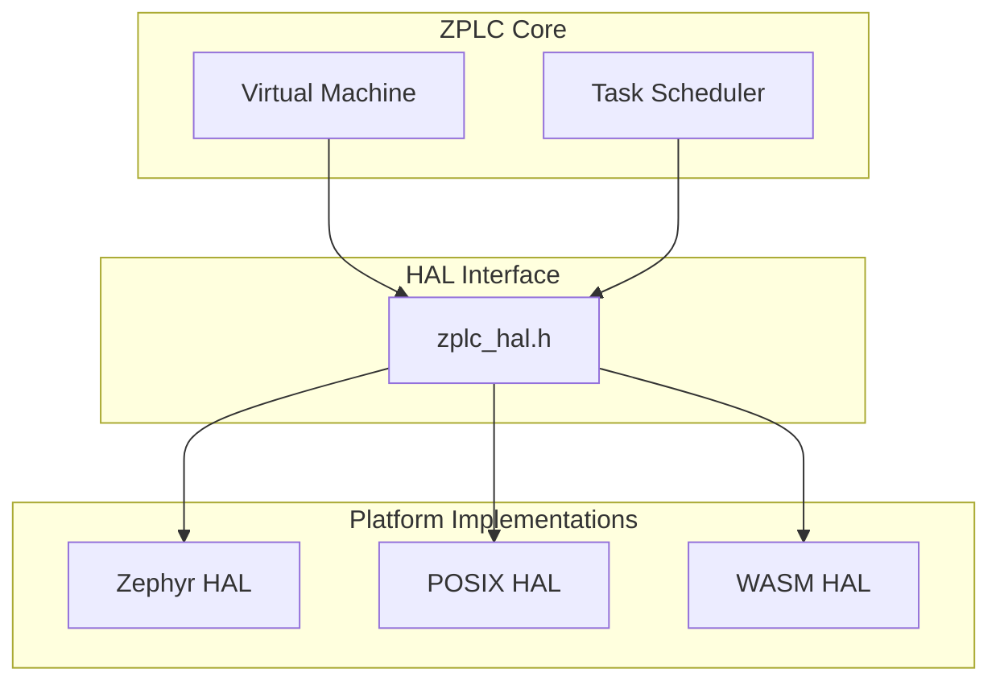

# Hardware Abstraction Layer (HAL)

The ZPLC Hardware Abstraction Layer provides a portable interface between the VM core and the underlying platform. This design allows the same bytecode to run on embedded RTOS, desktop operating systems, and web browsers.

## Architecture



## HAL Functions

The HAL defines a contract of functions that each platform must implement:

### Lifecycle

| Function | Description |
|----------|-------------|
| `zplc_hal_init()` | Initialize the HAL (called once at startup) |
| `zplc_hal_shutdown()` | Clean shutdown of HAL resources |

### Timing

| Function | Description |
|----------|-------------|
| `zplc_hal_tick()` | Returns current system time in milliseconds |
| `zplc_hal_sleep(ms)` | Sleeps for the specified duration |

### GPIO (Digital I/O)

| Function | Description |
|----------|-------------|
| `zplc_hal_gpio_read(channel)` | Read digital input state (0 or 1) |
| `zplc_hal_gpio_write(channel, value)` | Write digital output state |

### Analog I/O

| Function | Description |
|----------|-------------|
| `zplc_hal_adc_read(channel)` | Read analog input (12-bit typical) |
| `zplc_hal_dac_write(channel, value)` | Write analog output |

### Persistence (NVS)

| Function | Description |
|----------|-------------|
| `zplc_hal_persist_save(key, data, len)` | Save data to non-volatile storage |
| `zplc_hal_persist_load(key, data, len)` | Load data from non-volatile storage |
| `zplc_hal_persist_delete(key)` | Delete key from non-volatile storage |

### Logging

| Function | Description |
|----------|-------------|
| `zplc_hal_log(level, msg)` | Output a log message |

## Platform Implementations

### Zephyr RTOS (Primary Target)

The Zephyr HAL leverages Zephyr's device driver model and kernel services:

```c
// Timing uses Zephyr kernel
uint32_t zplc_hal_tick(void) {
    return k_uptime_get_32();
}

void zplc_hal_sleep(uint32_t ms) {
    k_sleep(K_MSEC(ms));
}

// GPIO uses DeviceTree bindings
int zplc_hal_gpio_read(uint8_t channel) {
    return gpio_pin_get_dt(&io_channels[channel]);
}

// Persistence uses NVS directly
zplc_hal_result_t zplc_hal_persist_save(const char *key, const void *data, size_t len) {
    uint16_t id = key_to_id(key);  // "code_len"->1, "code"->2, "retain"->3
    int rc = nvs_write(&nvs_fs, id, data, len);
    return (rc >= 0) ? ZPLC_HAL_OK : ZPLC_HAL_ERROR;
}
```

**Configuration via Kconfig:**

```ini
# Enable ZPLC module
CONFIG_ZPLC=y

# Memory configuration
CONFIG_ZPLC_STACK_DEPTH=256
CONFIG_ZPLC_WORK_MEMORY_SIZE=8192
CONFIG_ZPLC_RETAIN_MEMORY_SIZE=4096

# I/O channel count
CONFIG_ZPLC_GPIO_CHANNELS=16
CONFIG_ZPLC_ADC_CHANNELS=8

# Persistence (NVS)
CONFIG_FLASH=y
CONFIG_FLASH_PAGE_LAYOUT=y
CONFIG_FLASH_MAP=y
CONFIG_NVS=y
```

**DeviceTree Overlay (with storage partition):**

```dts
/ {
    zplc {
        compatible = "zplc,runtime";
        digital-inputs = <&gpio0 0>, <&gpio0 1>, <&gpio0 2>;
        digital-outputs = <&gpio1 0>, <&gpio1 1>;
        analog-inputs = <&adc0 0>, <&adc0 1>;
    };
};

&flash0 {
    partitions {
        compatible = "fixed-partitions";
        #address-cells = <1>;
        #size-cells = <1>;

        storage_partition: partition@1f0000 {
            label = "storage";
            reg = <0x1f0000 0x10000>;  /* 64KB */
        };
    };
};
```

### POSIX (Linux/macOS/Windows)

The POSIX HAL is designed for development and testing:

```c
uint32_t zplc_hal_tick(void) {
    struct timespec ts;
    clock_gettime(CLOCK_MONOTONIC, &ts);
    return (ts.tv_sec * 1000) + (ts.tv_nsec / 1000000);
}

void zplc_hal_sleep(uint32_t ms) {
    usleep(ms * 1000);
}

// GPIO is simulated via shared memory or file
int zplc_hal_gpio_read(uint8_t channel) {
    return simulated_inputs[channel];
}

// Persistence uses file system
zplc_hal_result_t zplc_hal_persist_save(const char *key, const void *data, size_t len) {
    char filename[64];
    snprintf(filename, sizeof(filename), "zplc_%s.bin", key);
    FILE *f = fopen(filename, "wb");
    if (!f) return ZPLC_HAL_ERROR;
    fwrite(data, 1, len, f);
    fclose(f);
    return ZPLC_HAL_OK;
}
```

### WebAssembly (Browser)

The WASM HAL interfaces with JavaScript:

```c
// Imported from JavaScript environment
extern uint32_t js_performance_now(void);
extern void js_set_output(uint8_t channel, int value);
extern int js_get_input(uint8_t channel);

uint32_t zplc_hal_tick(void) {
    return js_performance_now();
}

int zplc_hal_gpio_read(uint8_t channel) {
    return js_get_input(channel);
}
```

## Adding a New Platform

To port ZPLC to a new platform:

1. **Create HAL implementation file:**
   ```
   src/hal/myplatform/zplc_hal_myplatform.c
   ```

2. **Implement all HAL functions:**
   - Start with timing (`tick`, `sleep`)
   - Add GPIO support
   - Add persistence if needed

3. **Update build system:**
   - Add platform detection
   - Link correct HAL implementation

4. **Test with the POSIX test suite:**
   ```bash
   make test HAL=myplatform
   ```

## Implementation Status

| HAL | Timing | GPIO | Analog | Persist | Network |
|-----|--------|------|--------|---------|---------|
| Zephyr | ✅ Complete | ✅ Complete | Stub | ✅ NVS | Planned |
| POSIX | ✅ Complete | Simulated | Simulated | ✅ File | Planned |
| WASM | ✅ Complete | ✅ JS Bridge | JS Bridge | Stub | WebSocket |
