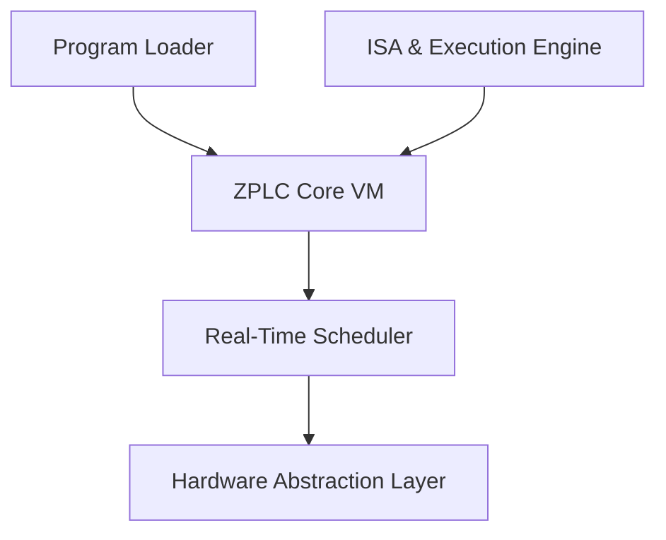

# ZPLC Runtime Engine

The ZPLC internal runtime is the execution core of the platform. Designed specifically for deterministic performance on embedded systems, it safely executes `.zplc` bytecode, manages memory, schedules automation tasks, and integrates with platform-specific hardware.

## Core Responsibilities

The ZPLC runtime provides a comprehensive virtual environment tailored for IEC 61131-3 task execution. Its responsibilities include:
- Loading `.zplc` bytecode programs and their metadata.
- Instantiating Virtual Machines (VMs) with isolated execution contexts.
- Enforcing structural memory boundaries (Process Images, internal Work memory, retained data).
- Scheduling and orchestrating Cyclic/Event-based PLC tasks.
- Yielding physical I/O, networking, and storage operations to the underlying Hardware Abstraction Layer (HAL).

## Subsystem Architecture

## Shared Memory Model

To guarantee both safety and performance in resource-constrained ICs, the ZPLC Runtime Memory Contract defines strict bounds for runtime elements:
- **IPI** (Input Process Image): Isolated memory mapped buffer for safe physical input reading.
- **OPI** (Output Process Image): Buffer mapping logic results to hardware outputs.
- **Work Memory**: Dynamic volatile execution stack allocated during runtime execution.
- **Retain Memory**: Persisted state memory (non-volatile) tracking block metadata and `RETAIN` values.

## Target Portability 

By ensuring that the internal runtime delegates bare-metal concerns to a strictly defined HAL, ZPLC easily runs on multiple architectures:
- **Zephyr RTOS**: The primary execution platform for hardware edge controllers. Runs the firmware app natively on bare-metal hardware.
- **Host Native Simulation**: Provides SoftPLC desktop simulation by adapting HAL primitives natively mapping to Windows, macOS, or Linux filesystems and processes.
