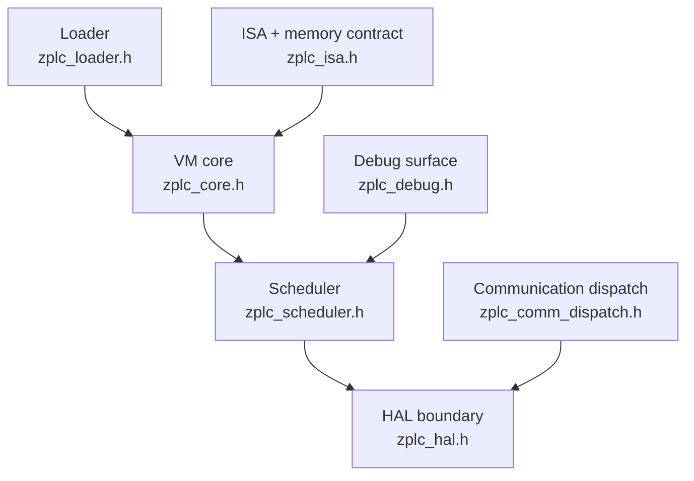
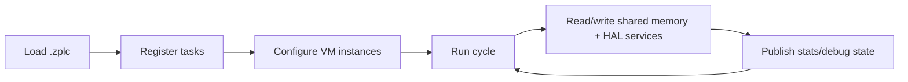

# Runtime & Embedded

The ZPLC runtime is the execution core behind every honest v1.5.0 claim.

It is where `.zplc` bytecode is loaded, tasks are scheduled, shared memory is coordinated,
and platform services are consumed through the HAL instead of being hardwired into the core.

## Runtime responsibilities

At the public-contract level, the runtime is responsible for:

- loading `.zplc` programs and their task definitions
- providing VM instances that execute bytecode cycles
- coordinating shared memory regions such as IPI, OPI, work, retain, and code
- scheduling PLC tasks with statistics, pause/resume, and stepping support
- delegating hardware, timing, persistence, and networking to the HAL

## Major subsystems

## VM model

`zplc_core.h` exposes an instance-based VM model.

- each `zplc_vm_t` carries private execution state such as `pc`, `sp`, flags, call depth, breakpoints, and stacks
- code can be shared across VM instances
- task identity and priority are attached to the VM by the scheduler

That gives ZPLC a clean split between **shared process data** and **private execution context**.

## Execution model

At a high level, runtime execution follows this loop:

1. initialize shared runtime memory
2. load `.zplc` code and task metadata
3. configure one or more VM instances for task entry points
4. schedule task cycles according to interval and priority
5. interact with time, I/O, persistence, and network services through the HAL
6. expose debug state, statistics, and memory inspection to higher-level tooling

## Shared memory model

The ISA header defines the runtime memory contract.

- **IPI** starts at `0x0000`
- **OPI** starts at `0x1000`
- **Work memory** starts at `0x2000`
- **Retain memory** starts at `0x4000`
- **Code segment** starts at `0x5000`

The important architectural point is not the raw numbers. It is the contract:

- process-image and runtime memory regions are explicit
- retain memory is a first-class part of the VM contract
- code memory is loaded and shared instead of being baked into a single monolithic execution state

## Scheduler model

`zplc_scheduler.h` exposes the public scheduler lifecycle:

- `zplc_sched_init()` / `zplc_sched_shutdown()`
- `zplc_sched_load()` for loading multi-task `.zplc` binaries
- `zplc_sched_start()`, `stop()`, `pause()`, `resume()`, and `step()`
- statistics and task inspection APIs
- explicit lock/unlock APIs for shared memory access outside task context

The scheduler header also documents the current Zephyr-oriented architecture:

- timers fire at task intervals
- callbacks submit work items to priority-based work queues
- work queue threads execute PLC cycles
- shared memory is protected by synchronization primitives

## Supported Targets

The runtime stays portable because the core talks to the outside world through the HAL.

Validation targets in v1.5:

- **Zephyr RTOS**: primary embedded execution target
- **native host runtime**: Electron-backed native simulation path
- **WASM**: IDE browser simulation path

Concrete board claims are not defined here. They come from the supported-board manifest and
the reference section.

## What the runtime does not own

The runtime does **not** own:

- editor UX
- project authoring ergonomics
- release marketing claims
- hardware-specific driver policy outside the HAL/runtime app boundary

Those concerns live in the IDE, docs, and target runtime application layers.

## Detailed references

- [Hardware Abstraction Layer](./hal-contract.md)
- [Memory Model](./memory-model.md)
- [Scheduler](./scheduler.md)
- [Connectivity](./connectivity.md)
- [Communication Function Blocks](./communication-function-blocks.md)
- [Instruction Set Architecture (ISA)](./isa.md)
- [Persistence & Retain Memory](./persistence.md)
- [Native Zephyr C in the Runtime](./native-c.md)
