# ZPLC v1.1: Technical Specification & Architecture
**Version:** 1.1.0 (Stable)
**Target:** Open Source Industrial Automation
**Core Philosophy:** One Execution Core, Any Runtime.

## 1. Executive Summary

ZPLC is a portable, deterministic PLC runtime environment powered by Zephyr RTOS for embedded targets and native OS layers for desktop/server hosting. It is designed to bring modern software development practices—including CI/CD pipelines, compact binary deployment, and open interoperability via PLCopen XML—to the industrial floor.

**The "v1.1" Features:** A fully functional runtime supporting all 5 IEC 61131-3 languages, capable of running real hardware I/O or in-browser simulations, with industrial-grade determinism. Now includes **multitask scheduling** and **NVS persistence**.

---

## 2. Supported Hardware Targets

ZPLC v1.1 officially supports the following reference boards. CI/CD pipelines must ensure compilation succeeds for all defined targets.

| Board Name | SoC | Zephyr Board ID | Notes |
| :--- | :--- | :--- | :--- |
| **Arduino GIGA R1** | STM32H747XI (Cortex-M7/M4) | `arduino_giga_r1/stm32h747xx/m7` | Dual-core (targeting M7) |
| **ESP32-S3 DevKit-C** | ESP32-S3 (Xtensa LX7) | `esp32s3_devkitc` | WiFi/BLE capable |
| **STM32 Nucleo-H743ZI** | STM32H743ZI (Cortex-M7) | `nucleo_h743zi` | High-perf industrial Ref |
| **Raspberry Pi Pico** | RP2040 (Cortex-M0+) | `rpi_pico` | Low-cost, tested target |
| **QEMU (Simulation)** | Cortex-M3 | `mps2/an385` | CI Default |

---

## 3. High-Level Architecture

The system follows a "Compiler-VM" architecture. The IDE acts as the compiler/linker, producing a hardware-agnostic bytecode package (`.zplc`) which is consumed by the ZPLC Core.

For embedded targets, **Zephyr RTOS is the primary citizen**. ZPLC is designed to be a **Zephyr Module** that can be effortlessly dropped into any board supported by Zephyr.

### 3.1 The Data Flow


---

## 4. The `.zplc` Binary Format

This is the contract between the IDE and the Runtime. It is a compact, serialized binary format.

**Structure Definition:**

| Section | Content | Purpose |
| --- | --- | --- |
| **Header** | `0x5A504C43` (Magic), Version, CRC32, Flags | Validity check and version compatibility. |
| **Meta** | Project Name, Build TS, Compiler Ver, Git Hash | Traceability. |
| **SymTable** | Variable IDs, Types, Scopes (Global/Local), Retentive Flags | Memory layout definition. |
| **TaskMap** | ID, Type (Cyclic/Event), Interval (μs), Priority, Entry Point | Tells the scheduler *when* to run code. |
| **Bytecode** | Linearized VM Instructions (SSA-based) | The executable logic. Unified format for all languages. |
| **IOMap** | Logical ID ↔ Abstract Channel | Example: `Var_StartBtn` maps to `DIN_0`. |
| **Debug** | (Optional) Source Line Mapping, Symbol Names | Strippable for production, needed for IDE debugging. |
| **Signature** | (Optional) Crypto Signature | Security verification (v1.2 Roadmap). |

---

## 5. The ZPLC Core (Runtime)

The Core is ANSI C99, strictly standard-compliant, designed to be compiled as a library (`libzplc_core`).

### 5.1 The Virtual Machine (VM)

* **Instruction Set:** Stack-based, optimized for boolean logic and arithmetic. **75 opcodes** total (including indirect memory access, STRING operations, and PICK for deep stack access).
* **Unified IR:** Structured Text (ST) and Ladder (LD) ultimately compile down to the same JUMP / LOAD / STORE / AND / OR opcodes.
* **Memory Model:**
    * **Process Image:** A contiguous block of memory for I/O snapshots.
    * **Retentive Memory:** A dedicated block backed by HAL storage (NVS / Flash).
    * **Work Memory:** Stack/Heap for temporary calculation (strictly bounded, per-task).

#### Memory Map

```
┌─────────────────────────────────────────────────────────────────────┐
│                    ZPLC Memory Map (64KB Total)                     │
├─────────────┬─────────────┬───────────────┬─────────────────────────┤
│     IPI     │     OPI     │  Work Memory  │      Retentive          │
│ 0x0000-0x0FFF│ 0x1000-0x1FFF│ 0x2000-0x3FFF │    0x4000-0x4FFF        │
│    4 KB     │    4 KB     │     8 KB      │       4 KB              │
│   (Inputs)  │  (Outputs)  │   (per-task)  │  (NVS-backed)           │
├─────────────┴─────────────┴───────────────┴─────────────────────────┤
│                        Code Segment                                 │
│                      0x5000-0xFFFF (44 KB)                          │
└─────────────────────────────────────────────────────────────────────┘
```

| Region | Base | Size | Description |
|--------|------|------|-------------|
| **IPI** | 0x0000 | 4 KB | Input Process Image - snapshot of all inputs at cycle start |
| **OPI** | 0x1000 | 4 KB | Output Process Image - buffered outputs flushed at cycle end |
| **Work** | 0x2000 | 8 KB | Per-task temporary variables and call stack |
| **Retain** | 0x4000 | 4 KB | NVS-backed persistent variables (survives power loss) |
| **Code** | 0x5000 | 44 KB | Bytecode storage |

### 5.2 The Scheduler (v1.1+)

* **Execution Discipline:** Priority-based preemptive scheduling with configurable task intervals.
* **Task Types:** CYCLIC (periodic) and EVENT (future).
* **Cycle:**
    1. **Input Latch:** Call `HAL_IO_Read()` to update Process Image (IPI).
    2. **Logic Execution:** Run tasks sorted by priority, each with isolated work memory.
    3. **Output Latch:** Call `HAL_IO_Write()` to flush Process Image (OPI).
    4. **Housekeeping:** Handle Comms/Debug messages (time budgeted).

#### Scan Cycle Visualization

```mermaid
graph LR
    subgraph "One Scan Cycle (10-100ms typical)"
        direction LR
        A["📥 Input Scan\n< 100μs"] --> B["⚙️ Logic Execution\n< 10ms"]
        B --> C["📤 Output Update\n< 100μs"]
        C --> D["🔧 Housekeeping\n< 1ms"]
    end
    D --> A
    
    style A fill:#22d3ee,color:#000
    style B fill:#a855f7,color:#fff
    style C fill:#27ca40,color:#000
    style D fill:#64748b,color:#fff
```



**Timing Guarantees:**
- Input/Output phases complete in microseconds
- Logic execution is deterministic (same input = same output)
- Jitter < 1ms on Zephyr RTOS targets

### 5.3 Program Persistence (v1.1+)

* **Auto-Save:** Programs are saved to NVS when `zplc start` is called.
* **Auto-Restore:** On boot, the runtime checks for saved programs and loads them automatically.
* **Storage Keys:** `code_len` (4 bytes), `code` (up to 4KB), `retain` (future).

---

## 6. Hardware Abstraction Layer (HAL)

The Core never calls hardware directly. It calls the HAL.

### 6.1 Zephyr Integration Strategy (Primary)

ZPLC integrates with Zephyr as a **Module**.
- **DeviceTree Bindings:** I/O channels are defined in `.dts` overlay files.
- **Kconfig:** All runtime limits (stack size, memory pool) are configurable via Kconfig.
- **Shell:** ZPLC provides a shell module (`zplc load`, `zplc start`, `zplc persist`) for management.

| Function | Zephyr Implementation | Desktop (Linux/Win) Implementation | WASM Implementation |
| --- | --- | --- | --- |
| `zplc_hal_tick()` | `k_uptime_get()` | `clock_gettime` | JS `performance.now()` |
| `zplc_hal_sleep()` | `k_sleep()` | `usleep()` | `Atomics.wait` |
| `zplc_hal_gpio_read()` | `gpio_pin_get_dt()` (via binding) | Shared Mem / Simulation | JS Object |
| `zplc_hal_socket()` | Zephyr BSD Sockets (`net_context`) | BSD Sockets | WebSockets |
| `zplc_hal_persist_save()` | NVS (`nvs_write`) | File (`retain.bin`) | `localStorage` |
| `zplc_hal_persist_load()` | NVS (`nvs_read`) | File read | `localStorage` |
| `zplc_hal_persist_delete()` | NVS (`nvs_delete`) | File delete | `localStorage.removeItem` |

---

## 7. Development Environment (Web IDE)

* **Stack:** TypeScript, React (Frontend), Bun (Runtime).
* **Project Model:** JSON-based project files with task definitions.
* **Editors:**
    * **ST:** Monaco Editor with custom language server.
    * **Visual (LD/FBD/SFC):** React Flow-based implementation utilizing a common graph model.
* **Simulation:**
    * The IDE includes a compiled WASM version of `zplc_core`.
    * "Run Simulation" launches the VM strictly in the browser tab.

---

## 8. Connectivity & Security

### 8.1 Communication (Current State)

* **Debug Protocol**: Binary protocol over Serial (implemented) for:
  - Program upload/download
  - Variable watch (read process image)
  - Variable force (write process image)
  - Breakpoint control
  - Step execution

* **Planned Protocols** (see Roadmap):
  - Modbus TCP/RTU (Phase 1.5)
  - MQTT v3.1.1/v5.0 (Phase 1.5)
  - Cloud integrations - AWS, Azure (Phase 1.5.1)
  - OPC UA (Phase 1.5.2)

### 8.2 Security Strategy (Planned - Phase 1.7)

* **Authentication:** Token-based auth for network protocols.
* **Role Based Access Control (RBAC):**
    * *Viewer:* Read-only variable monitoring.
    * *Operator:* Read/Write runtime parameters.
    * *Engineer:* Full program upload/download capability.
* **Crypto:** MbedTLS (Zephyr) for TLS transport on network protocols.

---

## 9. Development Roadmap

**Phase 1.0 (Completed)**
* ✅ **ISA & VM**: 63 opcodes, 32-bit stack, IEEE 754 float support.
* ✅ **Visual IDE**: Reactive editors for LD, FBD, and SFC.
* ✅ **TS Compiler**: Structured Text to Bytecode transpilation.
* ✅ **WASM Simulation**: In-browser execution of the C core.
* ✅ **Serial Loader**: Real-time program injection into Zephyr targets.

**Phase 1.1 (Completed)**
* ✅ **Multitask Scheduler**: Priority-based concurrent task execution.
* ✅ **Program Persistence**: NVS-backed storage survives power cycles.
* ✅ **Shell Commands**: `zplc persist info/clear` for managing stored programs.

**Phase 1.2 (Completed)**
* ✅ **STRING Operations**: Full IEC 61131-3 string support with bounds-checked operations.
* ✅ **Indirect Memory**: Dynamic memory access opcodes (LOADI/STOREI).
* ✅ **ISA Expansion**: 75 opcodes total.

**Phase 1.3 (Completed)**
* ✅ **Retentive Variables**: NVS-backed RETAIN memory region for critical process data.
* ✅ **Debug Protocol**: Binary serial protocol for variable watch, force, and breakpoints.

**Phase 1.4 (Completed)**
* ✅ **Cross-Platform Desktop App**: Electron-based IDE for Windows, macOS, and Linux.
* ✅ **Native Serial Port**: Direct device communication via serialport package.
* ✅ **Integrated Simulator**: Improved WebAssembly simulation engine.
* ✅ **Project Management**: Persistent project storage and file system integration.

**Upcoming Phases** (see TECHNICAL_SPEC.md for details):
* **Phase 1.4.1**: Networking Foundation (HAL sockets, thread-safe PI, config system)
* **Phase 1.5**: Industrial Connectivity (Modbus RTU/TCP, MQTT, AWS IoT)
* **Phase 1.6**: Runtime Hardening (logging, watchdog, diagnostics)
* **Phase 1.7**: Security & Authentication (bytecode signing, TLS, RBAC)

---

# Quality Assurance & Verification Plan

## 1. The Infrastructure: "Test First" Environment

* **CI/CD Pipeline (GitHub Actions / GitLab CI):**
    * **Static Analysis:** Run `clang-tidy` (C) and `eslint` (TS) on every commit. Enforce coding standards strictly.
    * **Unit Tests:** Run on host (Linux/Windows) for logic verification.
    * **Simulation Tests:** Run the ZPLC Runtime on a desktop target (POSIX/Win32) to verify behavior without hardware.

* **Hardware-in-the-Loop (HIL) - *The "Real" Test*:**
    * **Setup:** One Zephyr board (e.g., ESP32 or STM32) connected via USB to a runner.
    * **Tooling:** Use **Zephyr's `twister`** script.
    * **Rule:** Code is not "done" until it runs on the physical board in the pipeline.

## 2. Phase-by-Phase Verification

### Phase 0: Core Skeleton & Build System
* **Cross-Compilation Check:** CI builds for Linux, Windows, Zephyr-STM32, Zephyr-ESP32, and WASM.
* **HAL Contract Test:** Verify `zplc_hal_sleep(100)` waits approximately 100ms.

### Phase 1: ST Compiler & VM Instruction Set
* **Opcode Unit Tests:** Hundreds of tiny C tests checking every VM instruction.
* **Compiler "Golden Files":** Compare generated `.zplc` binary against known "perfect" binary.
* **IEC Compliance Suite (Math):** Implement IEC 61131-3 math examples and assert output.

### Phase 2: Visual Languages
* **Topological Sort Test:** Ensure compiler sorts execution order correctly.
* **Round-Trip Test:** `Import XML` -> `Internal Model` -> `Export XML` parity.

### Phase 3: Runtime Maturity
* **Jitter Test:** Measure variance on GPIO toggle.
* **Power-Loss Test:** Verify program restoration from NVS.
* **Watchdog Test:** Verify detection of infinite loops.

### Phase 4: Connectivity & Security
* **Fuzzing:** Blast Modbus/Loader ports with garbage data.
* **Network Storm:** Flood network while controlling IO.
* **Authentication Check:** Ensure unauthorized uploads fail.
