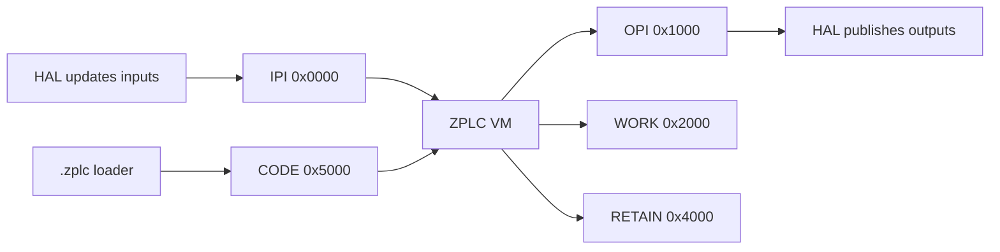

# Runtime ISA

The canonical source for this page is `firmware/lib/zplc_core/include/zplc_isa.h`.

In ZPLC v1.5.0, that public header defines the stable contract for:

- the VM memory layout
- reserved system registers
- valid opcode families
- shared type identifiers and limits
- the packed `.zplc` binary format

## What the header versions today

`zplc_isa.h` currently exposes these ISA contract constants:

- `ZPLC_VERSION_MAJOR = 1`
- `ZPLC_VERSION_MINOR = 0`

That is the **binary/ISA contract version**, not the full product marketing version.

## VM memory layout

The ISA reserves five logical regions with public bases and contract-defined sizes:

| Region | Base | Size | Canonical source |
|---|---:|---:|---|
| IPI (Input Process Image) | `0x0000` | `0x1000` (4 KiB) | `ZPLC_MEM_IPI_BASE`, `ZPLC_MEM_IPI_SIZE` |
| OPI (Output Process Image) | `0x1000` | `0x1000` (4 KiB) | `ZPLC_MEM_OPI_BASE`, `ZPLC_MEM_OPI_SIZE` |
| WORK | `0x2000` | configurable, default `0x2000` | `ZPLC_MEM_WORK_BASE`, `ZPLC_MEM_WORK_SIZE` |
| RETAIN | `0x4000` | configurable, default `0x1000` | `ZPLC_MEM_RETAIN_BASE`, `ZPLC_MEM_RETAIN_SIZE` |
| CODE | `0x5000` | configurable, default `0xB000` | `ZPLC_MEM_CODE_BASE`, `ZPLC_MEM_CODE_SIZE` |

## Reserved system registers

The last 16 bytes of IPI (`0x0FF0` through `0x0FFF`) are reserved for scheduler/runtime state.

| Register | Address | Purpose |
|---|---:|---|
| `ZPLC_SYS_CYCLE_TIME` | `0x0FF0` | last cycle execution time in microseconds |
| `ZPLC_SYS_UPTIME` | `0x0FF4` | system uptime in milliseconds |
| `ZPLC_SYS_TASK_ID` | `0x0FF8` | current task identifier |
| `ZPLC_SYS_FLAGS` | `0x0FF9` | runtime state flags |

Public flags defined today:

- `ZPLC_SYS_FLAG_FIRST_SCAN`
- `ZPLC_SYS_FLAG_WDG_WARN`
- `ZPLC_SYS_FLAG_RUNNING`

## Opcode families

The public `zplc_opcode_t` enum groups instructions into clear runtime-facing families:

| Family | Examples | Role |
|---|---|---|
| System | `OP_NOP`, `OP_HALT`, `OP_BREAK`, `OP_GET_TICKS` | basic control and debugging |
| Stack | `OP_DUP`, `OP_DROP`, `OP_SWAP`, `OP_OVER`, `OP_ROT` | stack manipulation |
| Indirect access | `OP_LOADI8`, `OP_LOADI16`, `OP_LOADI32`, `OP_STOREI8`, `OP_STOREI16`, `OP_STOREI32` | computed addressing |
| Strings | `OP_STRLEN`, `OP_STRCPY`, `OP_STRCAT`, `OP_STRCMP`, `OP_STRCLR` | safe `STRING` operations |
| Arithmetic | `OP_ADD`, `OP_SUB`, `OP_MUL`, `OP_DIV`, `OP_MOD` | integer and floating-point math |
| Logical / bitwise | `OP_AND`, `OP_OR`, `OP_XOR`, `OP_NOT`, `OP_SHL`, `OP_SHR`, `OP_SAR` | boolean and bit operations |
| Comparison | `OP_EQ`, `OP_NE`, `OP_LT`, `OP_LE`, `OP_GT`, `OP_GE`, `OP_LTU`, `OP_GTU` | control decisions |
| Jumps / calls | `OP_JMP`, `OP_JZ`, `OP_JNZ`, `OP_CALL`, `OP_RET`, `OP_JR`, `OP_JRZ`, `OP_JRNZ` | execution flow |
| Conversion | `OP_I2F`, `OP_F2I`, `OP_I2B`, `OP_EXT8`, `OP_EXT16`, `OP_ZEXT8`, `OP_ZEXT16` | type adaptation |
| Communication | `OP_COMM_EXEC`, `OP_COMM_STATUS`, `OP_COMM_RESET` | communication FB execution |

The ISA also fixes operand width by opcode range:

- `0x00-0x3F`: no operand
- `0x40-0x7F`: 8-bit operand
- `0x80-0xBF`: 16-bit operand
- `0xC0-0xFF`: 32-bit operand

## Public types and limits

The header also publishes limits that the toolchain and runtime share:

- `ZPLC_STACK_MAX_DEPTH` for the evaluation stack
- `ZPLC_CALL_STACK_MAX` for the call stack
- `ZPLC_MAX_BREAKPOINTS` for debug capacity
- IEC type IDs such as `ZPLC_TYPE_BOOL`, `ZPLC_TYPE_INT`, `ZPLC_TYPE_DINT`, `ZPLC_TYPE_REAL`, `ZPLC_TYPE_TIME`, and `ZPLC_TYPE_STRING`

For `STRING`, the ISA fixes a safe memory layout with:

- current length at offset `0`
- max capacity at offset `2`
- character data at offset `4`

## `.zplc` file contract

The `.zplc` binary format uses packed public structures from the same header:

- `zplc_file_header_t`
- `zplc_segment_entry_t`
- `zplc_task_def_t`
- `zplc_iomap_entry_t`
- `zplc_tag_entry_t`

Public segment identifiers defined today include:

- `ZPLC_SEG_CODE`
- `ZPLC_SEG_DATA`
- `ZPLC_SEG_BSS`
- `ZPLC_SEG_RETAIN`
- `ZPLC_SEG_IOMAP`
- `ZPLC_SEG_SYMTAB`
- `ZPLC_SEG_DEBUG`
- `ZPLC_SEG_TASK`
- `ZPLC_SEG_TAGS`

## Documentation rule for v1.5

When docs make claims about bytecode layout, stack limits, breakpoints, memory regions, or `.zplc` structure, those claims should come from `zplc_isa.h`.

Do not document an aspirational ISA that the public header does not define.

## Related pages

- [Runtime Overview](./index.md)
- [Memory Model](./memory-model.md)
- [Persistence & Retain Memory](./persistence.md)
- [Runtime API](../reference/runtime-api.md)
