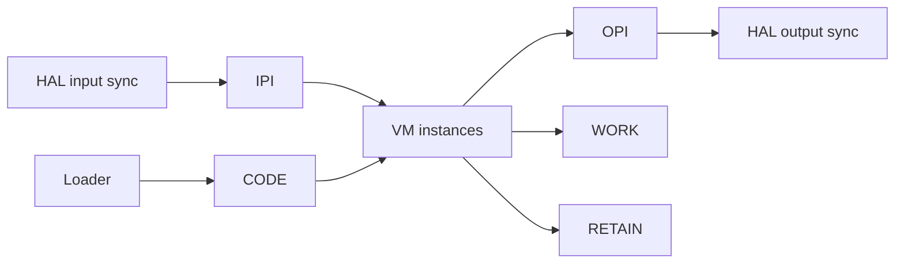

# Memory Model

The public memory contract is defined primarily by:

- `firmware/lib/zplc_core/include/zplc_isa.h`
- `firmware/lib/zplc_core/include/zplc_core.h`

## Logical memory regions

`zplc_isa.h` exposes five logical memory regions:

| Region | Base | Role |
|---|---:|---|
| IPI | `0x0000` | input process image |
| OPI | `0x1000` | output process image |
| WORK | `0x2000` | working memory |
| RETAIN | `0x4000` | retentive memory |
| CODE | `0x5000` | loaded bytecode |



## Shared vs private state

`zplc_core.h` makes a very important split explicit.

### Shared across VM instances

- IPI
- OPI
- work and retain address space
- loaded code segment

### Private per VM instance

- program counter (`pc`)
- stack pointer (`sp`)
- base pointer (`bp`)
- call depth
- flags and error state
- breakpoint table
- evaluation stack
- call stack

That is the architectural reason multitask scheduling can share process data without pretending every task has the same execution context.

## System registers inside IPI

`zplc_isa.h` reserves the last 16 bytes of IPI for system information, including:

- cycle time
- system uptime
- current task id
- runtime flags such as first-scan and scheduler-running state

That means user memory and runtime metadata are not mixed arbitrarily.

## Bounded memory expectations

The public headers also expose bounded limits such as:

- `ZPLC_STACK_MAX_DEPTH`
- `ZPLC_CALL_STACK_MAX`
- `ZPLC_MAX_BREAKPOINTS`
- configurable work, retain, and code sizes through `CONFIG_*` overrides

The Zephyr runtime README also documents representative configuration keys such as:

```kconfig
CONFIG_ZPLC_WORK_MEMORY_SIZE=8192
CONFIG_ZPLC_RETAIN_MEMORY_SIZE=4096
CONFIG_ZPLC_CODE_SIZE_MAX=4096
```

## Why this matters for docs

When documentation talks about memory safety, determinism, retain behavior, or stack limits,
those claims should be anchored to these public contracts.

Do not invent a second undocumented memory model in prose.
