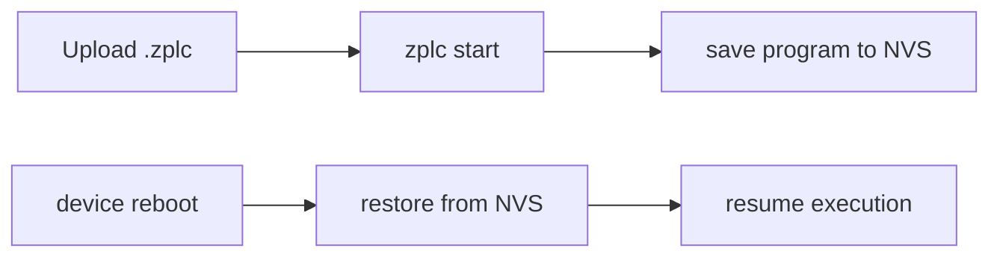

# Persistence & Retain Memory

Persistence in ZPLC has two distinct layers:

1. persistence of the deployed `.zplc` program
2. persistence of `RETAIN` data through the HAL contract

The canonical sources for this page are:

- `firmware/lib/zplc_core/include/zplc_hal.h`
- `firmware/lib/zplc_core/include/zplc_isa.h`
- `firmware/app/README.md`

## HAL persistence contract

The portable core relies on three public HAL functions:

- `zplc_hal_persist_save(...)`
- `zplc_hal_persist_load(...)`
- `zplc_hal_persist_delete(...)`

That is the right public boundary. The core should not assume one concrete flash, file, or browser storage API.

## Expected backend shape by platform

The HAL header comments describe the expected persistence mapping by platform:

| Platform | Expected backend |
|---|---|
| embedded | NVS / EEPROM |
| desktop/host | file-based storage |
| WASM | `localStorage` |

In the current repo, that abstract contract is backed by concrete platform code:

- Zephyr persistence lives in `firmware/lib/zplc_core/src/hal/zephyr/zplc_hal_zephyr.c`
- POSIX/host persistence lives in `firmware/lib/zplc_core/src/hal/posix/zplc_hal_posix.c`
- WASM persistence goes through the JS shim hooks in `firmware/lib/zplc_core/src/hal/wasm/zplc_hal_wasm.c`

That distinction matters: the **portable promise** is the HAL contract, while the **storage mechanics** stay platform-owned.

## Program persistence in the Zephyr reference runtime

The Zephyr runtime README documents this flow:



Public shell commands documented there include:

```bash
zplc persist info
zplc persist clear
```

According to `firmware/app/src/main.c`, startup restore currently works like this:

- the runtime tries to load a saved length key first
- if a persisted program exists, it loads the saved bytes
- if the payload starts with the `ZPLC` magic, it uses `zplc_sched_load()`
- otherwise it falls back to registering a single restored task with `zplc_sched_register_task()`

So the public documentation can honestly claim **automatic restore on boot**, but it should keep the implementation detail grounded in the current restore path.

## Retentive memory region

`zplc_isa.h` defines the logical RETAIN region as part of the VM contract:

- base: `0x4000`
- default size: `0x1000`
- configurable through `CONFIG_ZPLC_RETAIN_MEMORY_SIZE`

That means docs can safely claim that RETAIN is a first-class logical region in the runtime contract.

What changes by platform is how that region is physically backed.

## Host and browser considerations

For desktop/host runtimes, the current POSIX HAL implementation uses file-based persistence and writes through a temporary file plus atomic rename.

For WASM, the public HAL still exposes the same save/load/delete surface, but the actual persistence behavior depends on the browser-side JS bridge being present.

That is exactly the kind of difference the docs should make explicit:

- **same runtime contract**
- **different platform-owned persistence backend**

## Example declaration

```st
VAR RETAIN
    setpoint : REAL := 25.5;
    run_hours : UDINT;
END_VAR
```

## Documentation rule for v1.5

- when talking about embedded persistence, use the Zephyr reference runtime and NVS
- when talking about the portable core, describe the HAL contract rather than platform-specific internals
- when talking about `RETAIN`, anchor the claim in the ISA contract

## Related pages

- [Runtime ISA](./isa.md)
- [Hardware Abstraction Layer](./hal-contract.md)
- [Runtime API](../reference/runtime-api.md)
