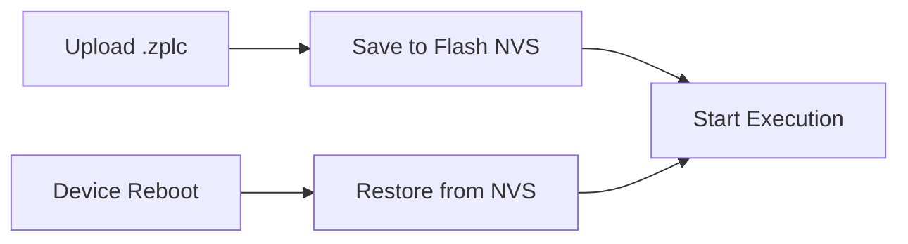

# Persistence & Retain Memory

ZPLC ensures that both your compiled logic and your critical machine variables survive a power cycle. This persistence model relies on two distinct layers:
1. Persistence of the deployed `.zplc` bytecode.
2. Persistence of `RETAIN` data.

## Platform Backends

The ZPLC runtime core relies on an abstract Hardware Abstraction Layer (HAL) for persistence operations. This allows the system to seamlessly adapt to the storage capabilities of different environments:

| Platform | Storage Backend |
|---|---|
| **Zephyr Hardware** | NVS (Non-Volatile Storage) on internal/external Flash in MCUs. |
| **Native Sim (Desktop)** | File-based storage directly on the host OS. |

## Program Persistence on Hardware

When a `.zplc` binary is uploaded from the IDE to a target board, the runtime saves it into non-volatile memory (NVS).



Upon boot, the runtime automatically checks NVS. If a valid ZPLC binary is found, it is automatically restored to memory and execution begins instantly without manual intervention.

## Retentive Memory (`RETAIN`)

ZPLC fully supports IEC 61131-3 `RETAIN` variables. This memory region is used to preserve critical operational state (such as setpoints, error counters, and machine running hours) across reboots.

**Example Implementation:**
```st
VAR RETAIN
    setpoint : REAL := 25.5;
    run_hours : UDINT;
END_VAR
```

These variables are placed in a designated memory sector by the ZPLC compiler. The runtime tracks updates to this region and persists it through the HAL, ensuring that even after a power outage, your process resumes exactly where it left off.
