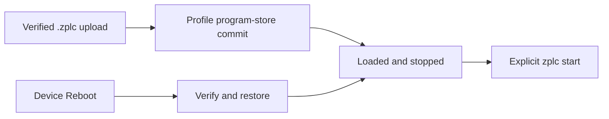

# Persistence & Retain Memory

For profiles with an enabled, operational program-store backend, ZPLC can
commit a verified deployed `.zplc` artifact transactionally. Restore publishes
the artifact as logically stopped/READY. Output behavior before execution is
target-profile-specific and requires recorded evidence. A human must explicitly
issue `zplc start`.

## Platform Backends

The ZPLC runtime core relies on an abstract Hardware Abstraction Layer (HAL) for persistence operations. This allows the system to seamlessly adapt to the storage capabilities of different environments:

| Platform | Storage Backend |
|---|---|
| **Zephyr profile** | Program-store backend when enabled and operational; NVS is one implementation, not a universal board guarantee. |
| **Native Sim (Desktop)** | File-based program-store used by host tests. |

## Program Persistence on Hardware

When a profile provides an operational program-store backend, a verified `.zplc`
load can be committed through that backend.

```mermaid
flowchart LR
  Load[Verified .zplc upload] --> Save[Profile program-store commit]
  Save --> Ready[Loaded and stopped]
  Boot[Device Reboot] --> Restore[Verify and restore]
  Restore --> Ready
  Ready --> Start[Explicit zplc start]
```

Upon boot, an enabled program store can provide a valid artifact for verification
and logical stopped/READY restore. Output behavior before execution is
target-profile-specific and requires recorded evidence. Deployment is complete
when the verified load completes; it never starts the machine. Start is a
separate, explicit human operation. Target, power-cut, HIL and electrical
evidence remain specific to the exact profile and have not been executed here.

## Retentive Memory (`RETAIN`)

ZPLC defines a `RETAIN` memory region and HAL persistence primitives. The POSIX
runtime has host-side persistence tests. Source-level `VAR RETAIN` and
`VAR_GLOBAL RETAIN` declarations are deliberately rejected: there is no
end-to-end allocation, restore, or qualified persistence contract for them yet.

Do not rely on `RETAIN` for recovery-critical state. The region and HAL
primitives are internal capabilities, not evidence of source-level or target
retention. Target, power-cut, and HIL evidence remain required for the exact
profile before a future supported retention workflow can make a commissioning
claim.
