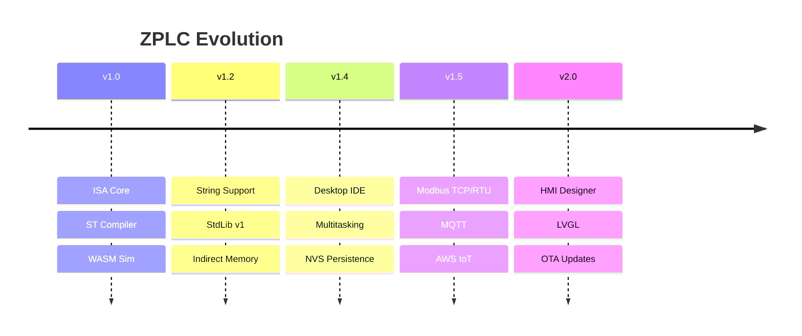

# Development Roadmap

This roadmap outlines the evolution of ZPLC from its core execution engine to a comprehensive industrial automation ecosystem.

## Vision: The 2026 Industrial Standard
ZPLC aims to be the most portable, deterministic, and engineer-friendly SoftPLC runtime. We prioritize "The Cabinet Test": robustness, efficiency, and zero fluff.

---

## 🟢 Released: Phase 1.0 - 1.4 (Stable)
**The Foundation of Industrial Control**

*   **ISA & VM**: 75 opcodes, 32-bit stack, IEEE 754 float support.
*   **IEC 61131-3 Support**: Full compiler for ST, LD, FBD, SFC, and IL.
*   **Standard Library**: 45+ functions including PID, Timers, and Math.
*   **Multitask Scheduler**: Priority-based cyclic and event execution.
*   **NVS Persistence**: Automatic program restore and retentive memory (RETAIN).
*   **Desktop IDE**: Cross-platform Electron application (Windows, macOS, Linux).
*   **WASM Simulation**: Cycle-accurate logic testing in the browser.

---

## 🟡 In Development: Phase 1.5 (Industrial Connectivity)
**Bridge to the Industrial Floor**

*   **Modbus RTU/TCP**: Native support for industrial sensors and actuators.
*   **MQTT v5.0**: Secure cloud connectivity with IIoT best practices.
*   **Sparkplug B**: Unified Namespace (UNS) compatibility for factory-scale data.
*   **AWS IoT Core**: Official SDK integration for cloud-managed hardware.
*   **Networking HAL**: Thread-safe process image access for concurrent protocol stacks.

---

## 🟠 Future: Phase 2.0 (Integrated HMI & Ecosystem)
**The Complete Human-Machine Interface**

*   **Internal HMI Designer**: Drag-and-drop UI composition inside the IDE.
*   **LVGL Support**: High-performance graphical output for STM32 and ESP32 displays.
*   **OTA Updates**: Secure, signed firmware and logic updates over WiFi/Ethernet.
*   **Diagnostic Tools**: Advanced logging, step-by-step debugging, and hardware tracing.
*   **Security Hardening**: Bytecode signing and Role-Based Access Control (RBAC).

---

## Technical Progress Timeline

