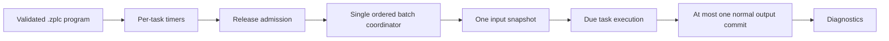

# Multitask Scheduler

ZPLC schedules configured PLC tasks through runtime-specific adapters. The current Zephyr path admits timer releases into one batch coordinator; the POSIX path supports repeatable host-side workflows. These are logical runtime contracts, not evidence of timing or physical-I/O behavior on a board.

## Task model

Tasks are declared in the project and compiled into the `.zplc` program.

| Property | Current meaning |
|---|---|
| **Type** | The current Zephyr scheduler admits `CYCLIC` tasks. It rejects `EVENT` tasks before loading. |
| **Interval** | Requested cyclic interval in milliseconds, not a measured cycle-time guarantee. |
| **Priority** | For Zephyr releases with the same release time, a lower numeric priority runs first. Task ID breaks a remaining tie. |
| **Entry point** | Program or function location in the compiled program. |

## Lifecycle

The scheduler loads task declarations, prepares its runtime queues, and reports state transitions such as `READY`, `RUNNING`, `PAUSED`, and `ERROR`. A program is admitted and validated before it is allowed to run. Logical execution budgets and runtime diagnostics are used to identify bounded-scan failures and overruns.

## Shared state

For each Zephyr due-set, timer callbacks only admit releases; they do not run PLC code. The coordinator orders admitted tasks by release time, priority, and task ID, then takes one input process-image snapshot. Due tasks run against shared runtime memory in that order. If no fault or control-plane closure occurs, the batch performs at most one normal output-process-image commit.

`STOP`, external pause, unregister, and scheduler faults close admission and drain in-flight coordinator work before returning. `STOP` and faults apply safe/off outputs; pause does not claim a new safe state. These guarantees describe the scheduler implementation and its host/native-sim tests. They do not establish WCET, jitter, electrical state, or board qualification.

## Diagnostics and evidence

Runtime diagnostics expose cycle counts, logical budget faults, process-image latch/commit counts, and timing-related observations. Their resolution, collection method, and meaning depend on the runtime and target profile. Native-sim evidence checks logical ordering and state transitions only. Measure WCET, jitter, deadline behavior, and physical outputs on the exact target/revision before relying on them operationally.
