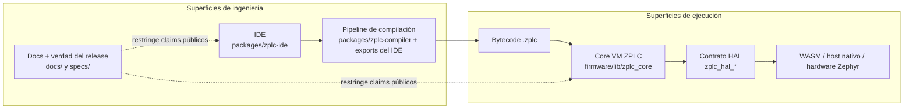
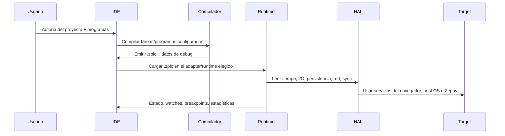

# Arquitectura del Sistema

ZPLC está dividido a propósito entre superficies de ingeniería y superficies de ejecución.

Esa separación no es decoración. Es la forma de proteger el comportamiento determinista del
runtime mientras el proyecto sigue ofreciendo IDE, compilador, desktop y documentación modernos.

## Arquitectura de un vistazo

## Límites principales del sistema

ZPLC v1.5.0 se entiende mucho mejor si lo pensás como cinco límites y no como una sola masa:

1. **límite de autoría** — los usuarios trabajan en el IDE y en archivos de configuración
2. **límite de compilación** — los distintos lenguajes convergen a un contrato `.zplc`
3. **límite de runtime** — el core C99 interpreta ese contrato de forma determinista
4. **límite de plataforma** — hardware, persistencia, timing, sockets y OS quedan detrás de la HAL
5. **límite de release** — los claims de docs y website quedan atados a fuentes y evidencia reales

## Componentes principales

### 1. El IDE (`packages/zplc-ide`)

El IDE es la superficie de ingeniería para usuarios y contributors.

Se encarga de:

- autoría textual para `ST` y `IL`
- autoría visual para `LD`, `FBD` y `SFC`
- configuración de proyectos mediante `zplc.json`
- workflows de compilación, simulación, despliegue y depuración
- selección de adapters entre simulación en navegador, simulación nativa en Electron y conexión a hardware

Al IDE le está permitido ser moderno, stateful y pesado en UI. Al runtime no. Ése es justamente el sentido de la separación.

### 2. El contrato del compilador

El compilador normaliza todos los caminos IEC reclamados hacia el mismo contrato bytecode/runtime.

- `LANGUAGE_WORKFLOW_SUPPORT` en el compilador del IDE hoy expone workflows visibles de release para `ST`, `IL`, `LD`, `FBD` y `SFC`
- los caminos visuales y alternativos convergen al mismo contrato del compilador/runtime
- la salida es bytecode `.zplc` más información de debug relacionada

Por eso ZPLC puede decir “un único core de ejecución, muchos caminos de autoría” sin vender humo.

### 3. El core runtime (`firmware/lib/zplc_core`)

El runtime es el límite de ejecución.

Sus headers públicos muestran tres ideas clave:

- existen regiones de memoria compartida para IPI, OPI, work, retain y code
- las instancias VM guardan el estado privado de ejecución por tarea
- las APIs del scheduler manejan registro, carga, control, estadísticas y sincronización

`zplc_core.h` documenta el modelo VM por instancias, y `zplc_scheduler.h` documenta la API
multitarea basada en conceptos IEC.

### 4. El contrato HAL

La HAL es el único puente permitido entre el core determinista y el mundo exterior.

`zplc_hal.h` autoriza implementaciones de plataforma para:

- timing (`zplc_hal_tick`, `zplc_hal_sleep`)
- I/O digital y analógica
- persistencia
- networking y sockets
- mutexes y sincronización
- logging e inicialización/shutdown

Si algo saltea ese límite, no es solo una mala decisión arquitectónica: también rompe portabilidad y contrato público.

### 5. Los runtimes objetivo

El mismo contrato del core aparece en distintos entornos de ejecución:

- **WASM** para simulación en navegador
- **runtime host nativo** para simulación nativa en Electron
- **aplicación runtime Zephyr** en `firmware/app` para hardware soportado

Esos targets son hermanos, no productos separados.

## Principios de funcionamiento

### Principio 1: autoría única, ejecución sobre un solo contrato runtime

Sea cual sea el punto de entrada del lenguaje, el sistema busca el mismo contrato downstream:
`.zplc` más los headers públicos del runtime.

### Principio 2: el código de plataforma no entra al core

El core no debe tocar registros de MCU, drivers Zephyr, APIs del navegador ni APIs desktop.
Todo eso pasa por la HAL o por la capa de adapters del runtime.

### Principio 3: la multitarea usa memoria compartida + estado VM privado

`zplc_core.h` describe explícitamente:

- regiones IPI/OPI/code compartidas
- coordinación compartida de work/retain por dirección
- PC/stack/call-stack privados por instancia VM

Ese modelo permite compartir datos de proceso entre tareas sin perder contexto de ejecución por tarea.

### Principio 4: los claims públicos están limitados por evidencia

El website y las docs son parte de la arquitectura del producto porque definen qué puede prometerse públicamente.

En v1.5.0, los claims públicos deben mantenerse alineados con:

- headers públicos del runtime
- manifiesto de placas soportadas
- exports reales del IDE/compilador/runtime
- artefactos de evidencia del release

## Flujo end-to-end

## A dónde seguir

- [Visión General de la Plataforma](/platform-overview) para el mapa del producto
- [Primeros Pasos](/getting-started) para el primer camino funcional
- [Visión General del Runtime](/runtime) para responsabilidades y subsistemas del runtime
- [Integración y Despliegue](/integration) para expectativas de despliegue en hardware soportado
