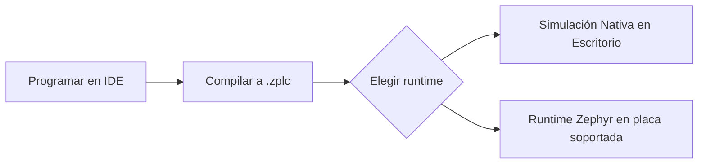

# Inicio Rápido

Utiliza esta página para validar el flujo de trabajo real de ZPLC v1.5.0. 
Cubre la instalación, la estructura del primer proyecto, la simulación nativa y el entorno de hardware soportado, sin prometer más de lo que el repositorio puede probar.

## Qué estás configurando

ZPLC v1.5.0 provee un entorno completo de programación industrial compuesto por dos partes principales:

- el **IDE** (Aplicación de escritorio)
- el **runtime** (runtime embebido en Zephyr RTOS y simulación nativa POSIX / SoftPLC)



## 1. Descargar e Instalar el IDE

El enfoque de la v1.5 son los binarios de release. No es necesario compilar el IDE desde el código fuente para usarlo.

1. Ve a la página de [GitHub Releases de ZPLC](https://github.com/eduardojvieira/ZPLC/releases).
2. Descarga el instalador para tu sistema operativo (Windows `.exe`, macOS `.dmg` o `.pkg`, Linux `.AppImage` o `.deb`).
3. Ejecuta el instalador para instalar el ZPLC IDE.

## 2. Configurar el Entorno Zephyr (Para Hardware)

Si planeas compilar y flashear hacia placas reales, en lugar de usar solo la simulación local, debes instalar Zephyr RTOS.

1. Instala el Zephyr SDK y sus dependencias siguiendo la [guía oficial de inicio de Zephyr](https://docs.zephyrproject.org/latest/develop/getting_started/index.html).
2. Asegúrate de tener la herramienta `west` disponible en tu línea de comandos.
3. Inicializa el workspace Zephyr de ZPLC:
   ```bash
   # Crear una carpeta para el workspace
   mkdir zplc-workspace && cd zplc-workspace
   
   # Inicializar con el manifiesto de ZPLC
   west init -m https://github.com/eduardojvieira/ZPLC --mr main
   west update
   ```
4. Exporta las variables del entorno de Zephyr (`source zephyr/zephyr-env.sh` en Linux/macOS, o `.venv\Scripts\activate` en Windows).

Ve el [Setup del Workspace Zephyr](../reference/zephyr-workspace-setup.md) para más detalles.

## 3. Conoce las placas soportadas

A la hora de este lanzamiento, las placas soportadas son:

| Placa | IDE ID | Target de Zephyr | Red |
|---|---|---|---|
| Raspberry Pi Pico (RP2040) | `rpi_pico` | `rpi_pico/rp2040` | Serial |
| Arduino GIGA R1 (STM32H747 M7) | `arduino_giga_r1` | `arduino_giga_r1/stm32h747xx/m7` | Serial |
| ESP32-S3 DevKitC | `esp32s3_devkitc` | `esp32s3_devkitc/esp32s3/procpu` | Wi-Fi |
| STM32F746G Discovery | `stm32f746g_disco` | `stm32f746g_disco` | Ethernet |
| STM32 Nucleo-H743ZI | `nucleo_h743zi` | `nucleo_h743zi` | Ethernet |

Consulta [Placas Soportadas](../reference/boards.md) para ver detalles técnicos de cada binario.

## 4. Crear el primer proyecto

Inicia la aplicación ZPLC IDE. La configuración del proyecto se almacena en `zplc.json`. Crea un nuevo proyecto "Blinky":

```json
{
  "name": "Blinky",
  "version": "1.0.0",
  "target": {
    "board": "esp32s3_devkitc"
  },
  "tasks": [
    {
      "name": "MainTask",
      "trigger": "cyclic",
      "interval_ms": 10,
      "priority": 1,
      "programs": ["main.sfc"]
    }
  ]
}
```

Para tu primer proyecto:
1. crea una tarea (task) cíclica.
2. asigna un archivo de programa (ej. `main.st` o `main.sfc`).
3. presiona **Compile** para generar el bytecode.
4. presiona **Start Simulation** para dar arranque a la lógica de forma local.

## 5. Validación en Simulación Nativa

Para probar la lógica sin hardware, utiliza la Simulación de Escritorio.

- El IDE incluye un runtime nativo conectado internamente (`window.electronAPI.nativeSimulation`).
- Dar click en `Start Simulation` corre el bytecode `.zplc` directamente en el procesador de tu PC mediante un runtime POSIX SoftPLC simulado.
- Puedes verificar el estado, observar variables via *Watch tables*, colocar breakpoints, o forzar valores (Forces).

## 6. Pasar al hardware soportado

Cuando te encuentres listo para mover tu código a una placa física:

1. Abre tu consola con el entorno Zephyr activo (Paso 2).
2. Compila la app base de firmware con el comando correspondiente (cambia el target por el tuyo):
   ```bash
   west build -b esp32s3_devkitc/esp32s3/procpu firmware/app --pristine
   ```
3. Flashea el firmware vía USB a tu microcontrolador:
   ```bash
   west flash
   ```
4. **Conecta desde el IDE**: 
   - Abre ZPLC IDE.
   - Selecciona tu placa y presiona **Connect**.
   - Ingresa el puerto Serie correcto de tu tarjeta.
   - Una vez que la conexión haya sido exitosa, presiona **Upload** para enviar tu bytecode `.zplc` a la memoria.

## Páginas Relacionadas

- [Features del IDE](../ide/features.md)
- [Soporte de Lenguajes](../languages/index.md)
- [Arquitectura del Sistema](../architecture/index.md)
- [Referencia del Runtime API](../runtime/stdlib.md)
- [Placas Soportadas](../reference/boards.md)
