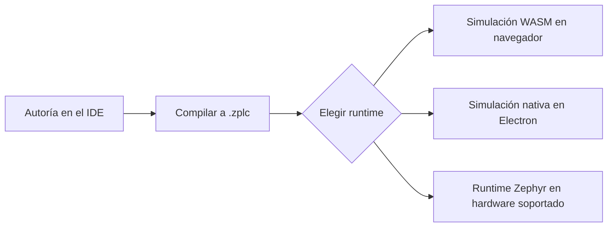

# Primeros Pasos

Usá esta página para validar el workflow real de ZPLC v1.5.0 desde un checkout limpio.
Cubre la instalación, la forma del primer proyecto, los caminos de simulación/runtime y la
ruta soportada de hardware sin inventar capacidades que el repositorio no pueda probar.

## Qué estás preparando

ZPLC v1.5.0 es un solo producto con cuatro superficies visibles para el release:

- el **sitio de documentación** (`docs/`)
- el **IDE** (`packages/zplc-ide`)
- el **compilador** (`packages/zplc-compiler` y exports del compilador del IDE)
- el **runtime** (runtime embebido con Zephyr más caminos host/nativos de simulación)



## 1. Instalá las dependencias del repositorio

```bash
bun install
```

Esto instala las dependencias del workspace para docs e IDE.

Si además vas a usar hardware embebido, asegurate de tener:

- un SDK/toolchain de Zephyr
- `west` disponible en el entorno
- el entorno de Zephyr activado con `ZEPHYR_BASE`

Mirá [Configuración del Workspace Zephyr](../reference/zephyr-workspace-setup.md) para la forma
canónica del workspace usada por las docs de v1.5.

## 2. Mirá primero qué placas están realmente soportadas

La única lista canónica de placas para v1.5 es:

- `firmware/app/boards/supported-boards.v1.5.0.json`

Al momento de esta reescritura, los targets publicados para el release son:

| Placa | IDE ID | Target Zephyr | Clase de red |
|---|---|---|---|
| Raspberry Pi Pico (RP2040) | `rpi_pico` | `rpi_pico/rp2040` | Enfoque serial |
| Arduino GIGA R1 (STM32H747 M7) | `arduino_giga_r1` | `arduino_giga_r1/stm32h747xx/m7` | Enfoque serial |
| ESP32-S3 DevKitC | `esp32s3_devkitc` | `esp32s3_devkitc/esp32s3/procpu` | Capacidad de red (Wi-Fi) |
| STM32F746G Discovery | `stm32f746g_disco` | `stm32f746g_disco` | Capacidad de red (Ethernet) |
| STM32 Nucleo-H743ZI | `nucleo_h743zi` | `nucleo_h743zi` | Capacidad de red (Ethernet) |

Usá [Placas Soportadas](../reference/boards.md) para los comandos de build y assets de soporte.

## 3. Validá las fuentes de verdad de docs sin hacer build del sitio

```bash
bun --cwd docs run validate:v1.5-docs
```

Ésta es la validación no-build correcta para la superficie documental. Verifica cobertura del
manifiesto canónico, paridad de slug EN/ES, frescura de páginas generadas y drift del resumen
de placas.

## 4. Levantá el IDE

Elegí la superficie de ingeniería que quieras usar:

### Workflow en navegador

```bash
bun --cwd packages/zplc-ide run dev
```

Usalo cuando quieras la iteración más rápida con simulación.

### Workflow desktop con Electron

```bash
bun --cwd packages/zplc-ide run electron:dev
```

Usalo cuando quieras el shell de Electron y el bridge de simulación nativa. El preload del
desktop expone `window.electronAPI.nativeSimulation`, y el IDE prefiere ese adapter cuando existe.

## 5. Creá un primer proyecto

El contrato del proyecto es un archivo `zplc.json` con al menos:

- nombre y versión del proyecto
- una placa objetivo
- una o más tareas
- uno o más archivos de programa asignados a cada tarea

El schema en `packages/zplc-ide/zplc.schema.json` hoy autoriza estos board IDs visibles para el release:

- `rpi_pico`
- `arduino_giga_r1`
- `stm32f746g_disco`
- `esp32s3_devkitc`
- `nucleo_h743zi`

La muestra `packages/zplc-ide/projects/blinky/zplc.json` muestra la forma básica:

```json
{
  "name": "Blinky",
  "version": "1.0.0",
  "target": {
    "board": "esp32s3_devkitc"
  },
  "tasks": [
    {
      "name": "MainTask",
      "trigger": "cyclic",
      "interval_ms": 10,
      "priority": 1,
      "programs": ["main.sfc"]
    }
  ]
}
```

Para un primer proyecto, mantenelo simple a propósito:

1. creá una tarea cíclica
2. asignale un archivo de programa
3. compilá a `.zplc`
4. validá primero en simulación

## 6. Elegí un camino de runtime

### Camino A — simulación en navegador

Usalo cuando quieras el loop de feedback más rápido.

- El IDE cae al adapter WASM cuando el bridge nativo de Electron no existe.
- Es ideal para iterar lógica, inspeccionar variables y depurar con breakpoints en navegador.
- Sirve muchísimo, pero **no** reemplaza la evidencia desktop o hardware para el sign-off del release.

### Camino B — simulación nativa desktop

Usalo cuando corrés la app desktop de Electron.

- El IDE crea un adapter de simulación nativa cuando existe `window.electronAPI.nativeSimulation`.
- Electron arranca una sesión host-side del runtime nativo a través del bridge IPC preload/main.
- Este camino te da una validación host más cercana al runtime real que la simulación solo WASM.

### Camino C — runtime en hardware

Usalo cuando necesitás un target Zephyr real.

- La aplicación runtime vive en `firmware/app`.
- La conexión hardware del IDE usa el adapter serial / workflow WebSerial para upload y debug vía shell.
- Los claims sobre placas con red siguen viniendo del manifiesto de placas soportadas y de la evidencia del release, no de marketing.

## 7. Ejecutá el primer proyecto en simulación

El workflow mínimo y honesto es:

1. abrir o crear un proyecto en el IDE
2. escribir lógica en `ST`, `IL`, `LD`, `FBD` o `SFC`
3. compilar el proyecto a `.zplc`
4. arrancar la simulación
5. inspeccionar watch values, breakpoints y estado de ejecución

El compilador del IDE exporta soporte de workflow para los cinco lenguajes visibles en el release
y los normaliza al mismo contrato bytecode/runtime.

## 8. Pasá a hardware soportado

Cuando estés listo para validar en embebido:

1. poné el repo dentro de un workspace Zephyr como se documenta en [Configuración del Workspace Zephyr](../reference/zephyr-workspace-setup.md)
2. compilá `firmware/app` con el comando canónico de la placa desde el manifiesto
3. flasheá usando el flujo apropiado para la placa (`west flash` en muchas placas, copia UF2 en flujos RP2040)
4. conectate desde el IDE y subí el programa `.zplc` compilado

Ejemplo de comando canónico de build:

```bash
west build -b rpi_pico/rp2040 firmware/app --pristine
```

## 9. Entendé qué cuenta como evidencia lista para release

En v1.5.0, la mera presencia de código no alcanza.

- las placas soportadas tienen que coincidir con el manifiesto
- los claims sobre lenguajes y workflow del IDE deben coincidir con los paquetes y adapters exportados
- los claims documentales deben mantenerse alineados con las [Fuentes de Verdad](../reference/source-of-truth.md)
- el smoke desktop y la validación hardware-in-the-loop siguen necesitando evidencia en `specs/008-release-foundation/artifacts/`

## Páginas relacionadas

- [Visión General de la Plataforma](../platform-overview/index.md)
- [Integración y Despliegue](../integration/index.md)
- [Arquitectura del Sistema](../architecture/index.md)
- [Visión General del Runtime](../runtime/index.md)
- [Placas Soportadas](../reference/boards.md)
