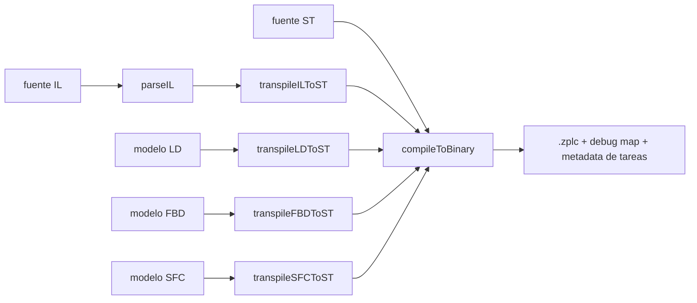

# Workflow del Compilador

La regla central del compilador en v1.5 es simple:

> hay **un solo contrato ejecutable de backend**, no cinco compiladores separados.

Eso se ve directo en `packages/zplc-ide/src/compiler/index.ts`.

## Pipeline canónico

## Qué hace `compileProject()`

1. normaliza a ST cuando hace falta
2. compila ese ST al backend compartido

Eso implica:

- `ST` entra directo
- `IL` se parsea y transpila a ST
- `LD`, `FBD` y `SFC` se cargan como modelos y luego se transpilan a ST

## Matriz declarada de soporte

El IDE exporta `LANGUAGE_WORKFLOW_SUPPORT` para `ST`, `IL`, `LD`, `FBD` y `SFC`, marcando `author`, `compile`, `simulate`, `deploy` y `debug` en `true`.

`languageWorkflow.test.ts` verifica esa matriz y además compila ejemplos canónicos de los cinco caminos.

## Salidas single-file y multi-task

La capa de compilación del IDE puede generar:

- binarios single-file con task segment automático
- binarios multi-task con bytecode concatenado, tareas y debug map combinado

## Biblioteca estándar

La fuente de verdad para funciones y bloques integrados es `packages/zplc-compiler/src/compiler/stdlib/index.ts`.

Ahí viven categorías como:

- temporizadores
- contadores
- strings
- funciones matemáticas y de sistema
- bloques de comunicación Modbus/MQTT/cloud

Ver [Biblioteca estándar de lenguajes](/languages/stdlib).

## Guía de release

Para v1.5.0, la documentación del compilador debería reclamar solo esto:

- la matriz de soporte está declarada y testeada
- las rutas visuales e IL convergen al mismo backend
- el resultado de compilación incluye `.zplc`, task metadata y debug maps

La aprobación humana final del workflow end-to-end sigue siendo parte de `REL-002`.
