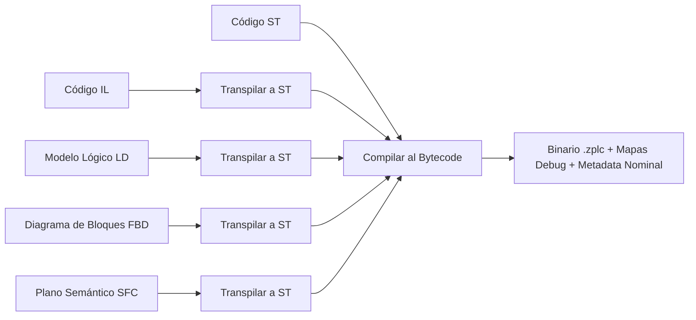

# Construcción y Compilador

ZPLC simplifica radicalmente los cuellos de botella programáticos en la automatización industrial al emplear un **único backend de compilar central** hacia toda la gama de lenguajes bajo el estándar IEC 61131-3.

## Tubería de Ejecución

ZPLC, distinto de las ingenierías redundantes donde persisten lenguajes y librerías compiladoras separadas, es altamente transpilador: toma el enfoque universal transpilar internamente las estructuras gráficas o modelo nativos al código principal Texto Estructurado (ST) permitiendo la universalización previo a generar o ejecutar opcodes de embutido.

## Homogeneidad Pura

Su estructura certificada asegura verdadera paridad equitativa a través de todos los editores integrados. Sabiendo que incluso un modelo basado en compuertas mediante un circuito Ladder (LD) termina corriendo o resolviéndose mediante la misma tubería de ensamblaje interna generalizada (ST), nunca padecerás escollos generacionales o funciones subyacentes carentes entre uno o diferentes editores funcionales en tus etapas.

## Proyectos Multitarea Consolidados

El compilador base genera asombrosamente más que el producto de ejecución simple `.zplc` . Consolidará todos recuadros multitarea que abarcan un ecosistema completo para el funcionamiento del ciclo:

1. **Unión de la Lógica Base (Bytecode Merged)**: Convergencia interlineal entre programas o lenguajes que funcionarán juntos.
2. **Ciclos Prioritarios (Metadatas)**: Ciclos base, disrupciones orientativas y el valor priorizado del `zplc.json`.
3. **Asignación Red/Red** Ruteos tag mediante MQTT o Modbus automatícamente inyectados a subred/dispositivos.
4. **Mapas Topográficos Mapped (Debug Maps)**. Vínculos artificiales y coordenadas ligadas a los opcodes en bruto para localizar visualmente con una extrema rigidez matemática y referencial hasta las propias sub-rutinas asíncronas, facultando debug por saltos detallados en tiempo de ejecución.

## Resolución Orgánica Integrada (Stdlib)

El proceso asimila explícitamente inclusiones primordiales y bibliotecas IEC Standard Library (`stdlib`). Permite ejecutar subconjuntos implementados muy profundamente hacia los ciclos RTOS a velocidad ininterrumpida sin penalidades funcionales complejas con recursos base como:
- Relojería Compleja (`TON`, `TOF`, `TP`)
- Contabilidades (`CTU`, `CTD`, `CTUD`)
- Gatillos de rebote físico o anclaje de registros biestables (`SR`, `RS`)
- Integraciones Modbus y Nubes integradas mediante subyugación IP asíncrona (`MB_READ_HREG`, `MQTT_PUBLISH`, etc.)

Asimismo como strings y manipulaciones en cadena con protección para buffer, delegándose sobre OPCODES del procesador asilados para no sufrir *overriding* o Memory leaks (`STRLEN`, `STRCPY`, etc.).
