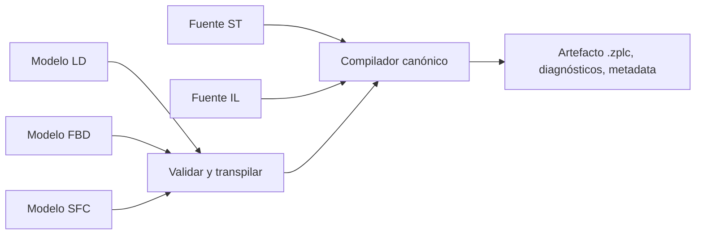

# Flujo del compilador

ZPLC usa un camino de compilador canónico para fuente y modelos visuales soportados.

## Camino rápido

1. Compilá el proyecto respaldado por carpeta.
2. Leé diagnósticos e identidad del artefacto producido.
3. Ejecutá tests temporales y simulación POSIX nativa sobre ese artefacto.
4. Recién después considerá el flujo humano separado de hardware.

## Tubería

```mermaid
flowchart LR
  ST[Fuente ST] --> Compile[Compilador canónico]
  IL[Fuente IL] --> Compile
  LD[Modelo LD] --> Transpile[Validar y transpilar]
  FBD[Modelo FBD] --> Transpile
  SFC[Modelo SFC] --> Transpile
  Transpile --> Compile
  Compile --> Artifact[Artefacto .zplc, diagnósticos, metadata]
```

## Alcance, no promesa de paridad

El backend compartido sirve sólo para funcionalidades aceptadas por los
contratos de editor, transpilador y compilador. No establece paridad universal
de lenguajes, runtimes ni debug idéntico. Usá la salida de compilación y
resultado de escenario del proyecto exacto como evidencia.

## Límite del artefacto

El artefacto se verifica antes de que el runtime lo cargue. Un compile host
exitoso no prueba flash, restore, timing ni salida de una placa. Esos claims
