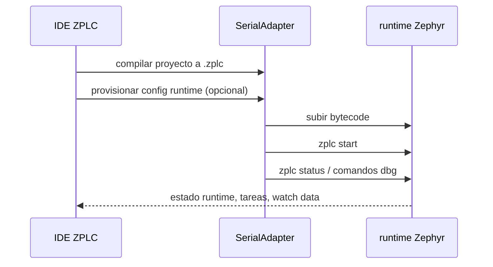
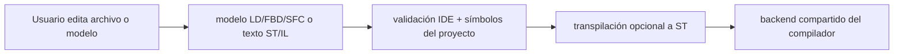

# Despliegue y Sesiones de Runtime

Esta página cubre las superficies reales de despliegue y ejecución que expone el IDE en v1.5.0.

## Tres targets prácticos de ejecución

| Target | Adapter principal | Uso típico |
|---|---|---|
| simulación WASM | `WASMAdapter` | validación rápida en browser |
| simulación nativa desktop | `NativeAdapter` | debugging host release-facing |
| controlador físico | `SerialAdapter` | carga, ejecución e inspección sobre hardware Zephyr |

## Workflow nativo desktop

La aplicación desktop es la única superficie del IDE que puede exponer el bridge de simulación nativa de Electron.

Eso está respaldado por:

- scripts Electron en `packages/zplc-ide/package.json`
- tipos del bridge en `packages/zplc-ide/src/types/index.ts`
- manejo de sesión nativa en `packages/zplc-ide/src/runtime/nativeAdapter.ts`

## Workflow en navegador

El camino web sigue siendo útil para:

- proyectos basados en File System Access API
- simulación rápida vía WASM
- sesiones serial/WebSerial cuando el navegador lo soporta

Pero NO reemplaza la evidencia desktop cuando un gate del release la exige explícitamente.

## Camino de despliegue a hardware

`SerialAdapter` se encarga de:

- la conexión serial
- la carga del bytecode
- la provisión de configuración del proyecto
- el polling de estado runtime
- los comandos de debug como pause, resume, step, peek, poke y force

## Ciclo de despliegue serial

## Configuración consciente de la placa

El IDE usa el manifiesto de placas soportadas para entender si una placa es:

- serial-focused
- Wi-Fi capable
- Ethernet capable

Eso impacta en target selection, configuración de red y expectativas de comunicación.

## Límite de release para claims de despliegue

Un claim de despliegue en v1.5 solo es creíble cuando coinciden:

1. la placa existe en `supported-boards.v1.5.0.json`
2. el IDE expone un flujo compatible
3. el runtime soporta realmente ese camino
4. el gate de evidencia no sigue pendiente de validación humana

## Comandos runtime relevantes

El README del runtime Zephyr documenta los contratos shell que el IDE usa:

- `zplc start`, `zplc stop`, `zplc reset`, `zplc status`
- `zplc dbg pause`, `resume`, `step`, `peek`, `poke`, `info`, `watch`
- `zplc sched status`, `zplc sched tasks`
- `zplc persist info`, `zplc persist clear`

## Orden correcto para troubleshooting

1. verificar la verdad del target
2. verificar la verdad del `zplc.json`
3. verificar qué adapter estás usando
4. verificar si el comportamiento ya está firmado o sigue pendiente en la matriz de release
*** Add File: /Users/eduardo/Documents/Repos/ZPLC/docs/i18n/es/docusaurus-plugin-content-docs/current/ide/editors.md
# Editores Visuales y de Texto

El IDE expone superficies de autoría text-first y model-first.

Eso importa porque el claim del release habla de **workflow soportado**, no de extensiones de archivo sueltas.

## Editores de texto

Las superficies text-first cubren:

- `ST`
- `IL`

Estos editores alimentan directamente el pipeline definido en `packages/zplc-ide/src/compiler/index.ts`.

## Editores respaldados por modelos

Las superficies model-first cubren:

- `LD`
- `FBD`
- `SFC`

El IDE mantiene parsers/modelos dedicados para esos lenguajes y luego los transpila a ST antes de generar bytecode.

## Arquitectura editorial

## Ladder Diagram (LD)

`LD` se edita como modelo y luego se normaliza por el camino de transpilation.

Lo importante para v1.5 es conservar:

- topología del rung
- bindings de símbolos
- mapeo determinista al contrato compartido de compilación

## Function Block Diagram (FBD)

`FBD` muestra clarísimo el límite IDE/compilador:

- el editor maneja ubicación de bloques y conexiones
- el transpiler convierte eso a una forma ST compilable
- el runtime sigue ejecutando `.zplc`, no un backend FBD separado

## Sequential Function Chart (SFC)

`SFC` se representa como modelo de pasos, transiciones y acciones.

El punto arquitectónico importante es:

- la autoría SFC está soportada en el IDE
- el comportamiento se normaliza antes de ejecutar
- el runtime sigue siendo bytecode-oriented

## Responsabilidades compartidas

Todos los editores tienen que alinearse con el mismo modelo de proyecto:

- acceso a símbolos del proyecto
- compilación por el backend compartido
- compatibilidad con debug maps cuando el workflow lo reclama
- comportamiento consistente al cambiar entre simulación y hardware

## Orden de lectura recomendado

1. esta página para las superficies de autoría
2. [Workflow del compilador](./compiler.md)
3. [Lenguajes y modelo de programación](/languages)
4. [Despliegue y sesiones de runtime](./deployment.md)
